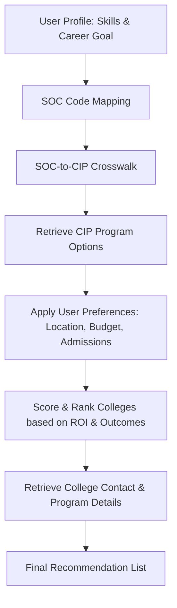
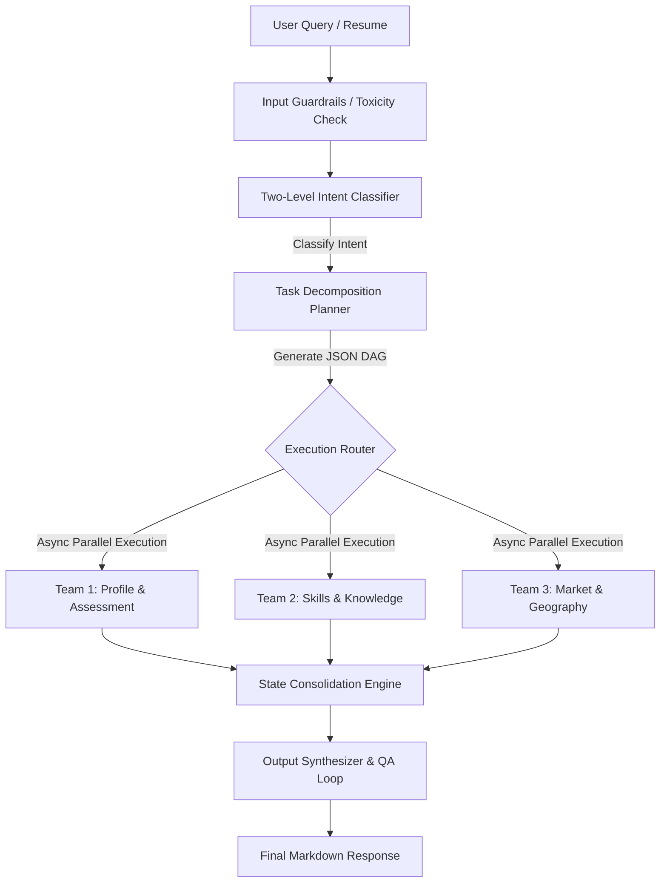
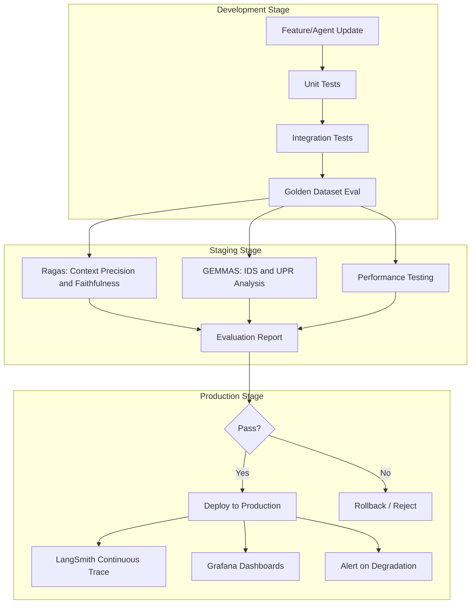

# Career Orchestrator System — Master Reference Document

> **Scope:** Complete inventory of Agents, Sub-Agents, Tools, Data Sources, Concepts, Memory Architecture, and Evaluation Framework for the 30+ Agent Career Guidance System.

---

## Table of Contents

| # | Section | Description |
|---|---------|-------------|
| **Part I** | Agent & Tools Inventory | All 30+ agents, sub-agents, tools, and data sources |
| **Part II** | Data Source Master List | 85+ sources with official URLs |
| **Part III** | Missing Terms & Concepts | Concepts not yet covered |
| **Part IV** | Memory Management Architecture | Full memory system design |
| **Part V** | Evaluation Framework | 50+ metrics across all layers |

---

---

# PART I — Agent & Tools Inventory

**Career Orchestrator System — Complete Agent, Sub-Agent, Tools & Data Sources List**

---

## I.1 Quick Reference — All Agent Names

| #   | Agent Name                                       | Team       |
| -----| --------------------------------------------------| ------------|
| 1   | Orchestrator Agent (Meta Supervisor)             | Meta       |
| 2   | General Hybrid Retriever Agent                   | Team 9     |
| 3   | O\*NET Occupation Deep Profiler Agent            | Team 2     |
| 3b  | Skills, Knowledge & Abilities Matcher Agent      | Team 2     |
| 3c  | Interest Profiler & Career Fit Agent (RIASEC)    | Team 2     |
| 4   | Task & Work Activity Breakdown Agent             | Team 2     |
| 4b  | BLS Economic & Compensation Agent                | Team 3     |
| 5   | Career Pathway & Transition Planner Agent        | Team 4     |
| 5b  | Related Occupations & Career Ladder Agent        | Team 4     |
| 6   | Real-time Job Market & Openings Agent            | Team 3     |
| 6b  | Education Credential Requirements (O\*NET) Agent | Team 5     |
| 7   | Education, Training & Credential Agent           | Team 5     |
| 7b  | Personal Career Match Agent                      | Team 4     |
| 8   | Location, COL & State Market Agent               | Team 6     |
| 9   | Company, Culture & Reviews Agent                 | Team 7     |
| 10  | Skills Gap & Upskilling Recommender Agent        | Team 2     |
| 11  | Future Trends & Automation Risk Agent            | Team 3     |
| 12  | Personalization & User Profile Agent             | Team 1     |
| 13  | Output Synthesizer & Visualizer Agent            | Team 9     |
| 14  | Quality Assurance & Fact-Checker Agent           | Team 9     |
| 15  | Web & Live Data Updater Agent                    | Team 3     |
| 16  | Resume Parser & Profile Extractor Agent          | Team 1     |
| 17  | ATS Resume Optimizer Agent                       | Team 1     |
| 18  | AI Mock Interview Agent                          | Team 1     |
| 19  | Interview Feedback & Scoring Agent               | Team 1     |
| 20  | Course & Learning Path Aggregator Agent          | Team 5     |
| 21  | Certification ROI Calculator Agent               | Team 5     |
| 22  | Financial Career Switch Feasibility Agent        | Team 6     |
| 23  | Visa & International Mobility Agent              | Team 6     |
| 24  | Mental Health & Wellbeing Fit Agent              | Team 8     |
| 25  | Social Network & Referral Strategy Agent         | Team 7     |
| 26  | Salary Negotiation Coach Agent                   | Team 7     |
| 27  | Freelance & Gig Economy Agent                    | Team 3     |
| 28  | Entrepreneurship & Startup Path Agent            | Team 4     |
| 29  | Veteran Career Transition Agent                  | Team 4     |
| 30  | Disability & Inclusive Career Agent              | Team 8     |
| 31  | Human-in-the-Loop Agent                          | Supporting |

---

## I.2 Meta Supervisor

| Level | Name | Role |
|-------|------|------|
| **Meta Supervisor** | Orchestrator Agent | Query understanding, planning, routing to teams, final decision |

---

## I.3 Overview

| Name | Count | Key Data Sources (URLs) |
|------|-------|-------------------------|
| Profile & Assessment | 5 | ONET Web Services (<https://services.onetcenter.org/>) · ONET Database (<https://www.onetcenter.org/database.html>) · USAJOBS API (<https://developer.usajobs.gov/>) · Lightcast Skills API (<https://api.emsidata.com/apis/skills>) · CareerOneStop API (<https://api.careeronestop.org/api-explorer/>) |
| Skills & Knowledge | 5 | ONET Web Services (<https://services.onetcenter.org/>) · ONET Interest Profiler (<https://onetinterestprofiler.org/>) · Lightcast Open Skills (<https://lightcast.io/open-skills>) · Lightcast Skills API (<https://api.emsidata.com/apis/skills>) · CareerOneStop Skills Matcher (<https://www.careeronestop.org/Toolkit/Skills/skills-matcher.aspx>) |
| Market & Economic Intelligence | 5 | BLS OEWS National (<https://www.bls.gov/oes/current/oes_nat.htm>) · BLS Projections (<https://www.bls.gov/emp/>) · USAJOBS API (<https://developer.usajobs.gov/>) · Indeed API (<https://indeed-indeed-v2.p.rapidapi.com>) · LinkedIn API (<https://www.linkedin.com/developers/apps>) · Oxford Automation Risk (<https://www.oxfordmartin.ox.ac.uk/publications/the-future-of-employment/>) · WEF Future of Jobs (<https://www.weforum.org/reports/the-future-of-jobs-report-2025/>) · Upwork Research (<https://www.upwork.com/research/future-workforce-report>) · Freelancer API (<https://developers.freelancer.com/>) · Numbeo API (<https://www.numbeo.com/api/>) |
| Career Pathways | 5 | ONET Web Services (<https://services.onetcenter.org/>) · BLS Projections (<https://www.bls.gov/emp/>) · SOC Code Crosswalk (<https://www.bls.gov/soc/2018/home.htm>) · Crunchbase API (<https://data.crunchbase.com/docs>) · SBA.gov (<https://www.sba.gov/>) · USAJOBS Veterans (<https://www.usajobs.gov/Veterans/>) · Military Crosswalk (<https://www.careeronestop.org/Veterans/JobSearch/military-skills-translator.aspx>) |
| Education & Training | 4 | College Scorecard API (<https://collegescorecard.ed.gov/data/>) · NCES College Navigator (<https://nces.ed.gov/collegenavigator/>) · Coursera Catalog (<https://www.coursera.org/about/partners>) · edX Course API (<https://www.edx.org/api/v1/catalog/search>) · Udemy API (<https://www.udemy.com/developers/affiliate/>) · Apprenticeship Finder (<https://www.apprenticeship.gov/apprenticeship-finder>) · Google Certificates (<https://grow.google/certificates/>) · Microsoft Learn (<https://learn.microsoft.com/en-us/training/>) |
| Location & Economic Geography | 3 | Numbeo API (<https://www.numbeo.com/api/>) · MIT Living Wage Calculator (<https://livingwage.mit.edu/>) · EPI Budget Calculator (<https://www.epi.org/resources/budget/>) · BLS OEWS State (<https://www.bls.gov/oes/current/oessrcst.htm>) · USCIS H-1B Data Hub (<https://www.uscis.gov/tools/reports-and-studies/h-1b-employer-data-hub>) · Canada NOC Database (<https://noc.esdc.gc.ca/>) · EU Blue Card (<https://www.eu-bluecard.com/countries/>) · OECD STAT (<https://stats.oecd.org/>) |
| Company & Culture | 3 | Glassdoor API (<https://www.glassdoor.com/developer/index.htm>) · LinkedIn API (<https://www.linkedin.com/developers/apps>) · Levels.fyi (<https://www.levels.fyi/t/software-engineer>) · Payscale (<https://www.payscale.com/research/US/Country=United_States/Salary>) · H1B Salary Database (<https://h1bdata.info/>) · Comparably (<https://www.comparably.com/>) |
| Wellness & Inclusion | 2 | Glassdoor API (<https://www.glassdoor.com/developer/index.htm>) · ONET Web Services (<https://services.onetcenter.org/>) · ADA National Network (<https://adata.org/>) · EEOC Data (<https://www.eeoc.gov/data>) · ODEP Disability (<https://www.dol.gov/agencies/odep>) |
| Quality & Synthesis | 3 | Internal: Qdrant · Elasticsearch · Neo4j · BLS OEWS (<https://www.bls.gov/oes/>) · ONET Web Services (<https://services.onetcenter.org/>) · Data.gov Workforce (<https://catalog.data.gov/dataset?tags=workforce>) |
| Infrastructure + HITL | 5 | Internal: Redis · LangGraph State · OpenTelemetry · Groq API · OpenAI API · Anthropic API |

---

## I.4 Profile & Assessment (5 Agents)

| # | Agent Name | Sub-Agents | Key Tools | Data Sources |
|---|------------|------------|-----------|--------------|
| **12** | **Personalization & User Profile Agent** | Profile Manager · Preference Tracker · History Analyzer | `get_user_profile()` `update_preferences()` `save_conversation()` `retrieve_history()` `analyze_patterns()` | Internal: PostgreSQL Profile Store · Redis Session Cache |
| **16** | **Resume Parser & Profile Extractor** | PDF Parser · DOCX Parser · OCR Processor · NER Extractor · Skill Detector | `parse_pdf()` `parse_docx()` `extract_text_ocr()` `extract_name()` `extract_contact()` `extract_education()` `extract_experience()` `extract_skills_ner()` `extract_certifications()` | User-uploaded files · ONET Web Services (<https://services.onetcenter.org/>) (skill taxonomy) · Lightcast Skills API (<https://api.emsidata.com/apis/skills>) |
| **17** | **ATS Resume Optimizer** | ATS Scanner · Keyword Extractor · Content Rewriter · Score Calculator | `analyze_ats_score()` `extract_jd_keywords()` `scan_resume_keywords()` `calculate_match_score()` `suggest_keyword_insertions()` `rewrite_bullet_points()` `optimize_formatting()` `generate_ats_report()` | ONET Web Services (<https://services.onetcenter.org/>) · USAJOBS API (<https://developer.usajobs.gov/>) · Indeed API (<https://indeed-indeed-v2.p.rapidapi.com>) · LinkedIn API (<https://www.linkedin.com/developers/apps>) |
| **18** | **AI Mock Interview Agent** | Question Generator · Difficulty Scaler · Role Matcher | `generate_behavioral_questions()` `generate_technical_questions()` `generate_role_specific_questions()` `set_difficulty_level()` `create_interview_timeline()` `get_o_net_tasks()` `generate_follow_ups()` | ONET Web Services (<https://services.onetcenter.org/>) · ONET Database (<https://www.onetcenter.org/database.html>) · CareerOneStop API (<https://api.careeronestop.org/api-explorer/>) |
| **19** | **Interview Feedback & Scoring Agent** | Response Evaluator · Scoring Engine · Improvement Planner | `evaluate_response()` `score_communication()` `score_technical_accuracy()` `score_problem_solving()` `identify_strengths()` `identify_weaknesses()` `generate_practice_plan()` `track_progress()` | Internal LLM Evaluator · ONET Web Services (<https://services.onetcenter.org/>) · User History Store |

---

## I.5 Skills & Knowledge (5 Agents)

| # | Agent Name | Sub-Agents | Key Tools | Data Sources |
|---|------------|------------|-----------|--------------|
| **3** | **O\*NET Occupation Deep Profiler** | O\*NET API Connector · Profile Aggregator · Data Normalizer | `get_occupation_profile()` `search_occupations()` `get_tasks()` `get_knowledge()` `get_skills()` `get_abilities()` `get_work_activities()` `get_work_context()` `get_technology_skills()` `get_tools_used()` `get_education_requirements()` | ONET Web Services (<https://services.onetcenter.org/>) · ONET Database (<https://www.onetcenter.org/database.html>) · MyNextMove (<https://www.mynextmove.org/>) |
| **3b** | **Skills, Knowledge & Abilities Matcher** | Skill Normalizer · Match Calculator · Gap Analyzer | `normalize_skills()` `match_skills_to_occupations()` `calculate_match_score()` `identify_matching_skills()` `identify_missing_skills()` `calculate_gap_percentage()` `rank_occupations_by_match()` `get_skill_importance()` `get_skill_level()` | ONET Web Services (<https://services.onetcenter.org/>) · Lightcast Open Skills (<https://lightcast.io/open-skills>) · Lightcast Skills API (<https://api.emsidata.com/apis/skills>) · CareerOneStop Skills Matcher (<https://www.careeronestop.org/Toolkit/Skills/skills-matcher.aspx>) |
| **3c** | **Interest Profiler & Career Fit (RIASEC)** | RIASEC Interpreter · Interest Mapper · Career Matcher | `calculate_riasec_scores()` `interpret_interests()` `map_interests_to_occupations()` `calculate_fit_score()` `get_top_career_fits()` `explain_fit_reasoning()` `get_alternative_interests()` | ONET Interest Profiler (<https://onetinterestprofiler.org/>) · ONET Web Services (<https://services.onetcenter.org/>) · MyNextMove (<https://www.mynextmove.org/>) |
| **4** | **Task & Work Activity Breakdown** | Task Extractor · Work Context Analyzer · Environment Classifier | `get_daily_tasks()` `get_work_activities()` `get_work_context()` `get_physical_demands()` `get_environmental_conditions()` `get_equipment_used()` `get_work_schedule()` `get_remote_work_possibility()` | ONET Web Services (<https://services.onetcenter.org/>) · ONET Database (<https://www.onetcenter.org/database.html>) · Official Site (<https://www.bls.gov/ooh/>) |
| **10** | **Skills Gap & Upskilling Recommender** | Gap Identifier · Priority Scorer · Learning Mapper | `analyze_skill_gaps()` `prioritize_skills_by_importance()` `calculate_time_to_learn()` `suggest_learning_order()` `recommend_resources()` `estimate_skill_attainment_time()` `track_skill_progress()` | ONET Web Services (<https://services.onetcenter.org/>) · Lightcast Open Skills (<https://lightcast.io/open-skills>) · Coursera Catalog (<https://www.coursera.org/about/partners>) · edX Course API (<https://www.edx.org/api/v1/catalog/search>) · Udemy API (<https://www.udemy.com/developers/affiliate/>) |

---

## I.6 Market & Economic Intelligence (5 Agents)

| #      | Agent Name                                | Sub-Agents                                                                 | Key Tools                                                                                                                                                                                                             | Data Sources                                                                                                                                                                                                                                                                                                                                        |
| --------| -------------------------------------------| ----------------------------------------------------------------------------| -----------------------------------------------------------------------------------------------------------------------------------------------------------------------------------------------------------------------| -----------------------------------------------------------------------------------------------------------------------------------------------------------------------------------------------------------------------------------------------------------------------------------------------------------------------------------------------------|
| **4b** | **BLS Economic & Compensation Agent**     | BLS OEWS Parser · OOH Scraper · Wage Calculator                            | `get_national_wages()` `get_metro_wages()` `get_state_wages()` `get_percentiles()` `get_employment_data()` `get_projections()` `calculate_wage_growth()` `get_industry_wages()` `get_education_requirements_bls()`    | BLS OEWS National (<https://www.bls.gov/oes/current/oes_nat.htm>) · BLS OEWS Metro (<https://www.bls.gov/oes/current/oessrcma.htm>) · BLS OEWS State (<https://www.bls.gov/oes/current/oessrcst.htm>) · BLS OEWS Industry (<https://www.bls.gov/oes/current/oessrci.htm>) · BLS Projections (<https://www.bls.gov/emp/>)                            |
| **6**  | **Real-time Job Market & Openings Agent** | USAJOBS Connector · Indeed Scraper · LinkedIn API Client · Tavily Searcher | `search_usajobs()` `search_indeed()` `search_linkedin()` `search_tavily()` `filter_remote_jobs()` `filter_location_jobs()` `get_job_details()` `deduplicate_results()` `get_salary_estimate()` `get_company_rating()` | USAJOBS API (<https://developer.usajobs.gov/>) · Indeed API (<https://indeed-indeed-v2.p.rapidapi.com>) · LinkedIn API (<https://www.linkedin.com/developers/apps>) · Adzuna API (<https://developer.adzuna.com/>) · RemoteOK (<https://remoteok.com/api>) · The Muse API (<https://www.themuse.com/developers/api/v2>)                             |
| **11** | **Future Trends & Automation Risk Agent** | Oxford Risk Calculator · BLS Trend Analyzer · WEF Report Reader            | `get_automation_risk_score()` `get_emerging_occupations()` `get_declining_occupations()` `get_growth_rate()` `get_ai_impact_score()` `get_skill_demand_trends()` `get_industry_trends()`                              | Oxford Automation Risk (<https://www.oxfordmartin.ox.ac.uk/publications/the-future-of-employment/>) · BLS Projections (<https://www.bls.gov/emp/>) · WEF Future of Jobs (<https://www.weforum.org/reports/the-future-of-jobs-report-2025/>) · Lightcast (<https://lightcast.io/>) · LinkedIn Economic Graph (<https://economicgraph.linkedin.com/>) |
| **27** | **Freelance & Gig Economy Agent**         | Platform Matcher · Rate Analyzer · Demand Forecaster                       | `get_upwork_rates()` `get_fiverr_demand()` `get_toptal_rates()` `search_freelance_gigs()` `calculate_hourly_rate()` `estimate_monthly_income()` `get_platform_recommendations()` `get_portfolio_suggestions()`        | Upwork Research (<https://www.upwork.com/research/future-workforce-report>) · Fiverr Index (<https://news.fiverr.com/fiverr-index/>) · Toptal Talent Market (<https://www.toptal.com/talent-market>) · Freelancer API (<https://developers.freelancer.com/>) · MBO Partners (<https://www.mbopartners.com/state-of-independence/>)                  |
| **15** | **Web & Live Data Updater Agent**         | Scheduled Refresher · On-demand Updater · Cache Manager                    | `refresh_bls_data()` `refresh_o_net_data()` `refresh_job_postings()` `refresh_col_data()` `update_cache()` `invalidate_cache()` `schedule_updates()` `check_data_freshness()`                                         | BLS OEWS (<https://www.bls.gov/oes/>) · ONET Web Services (<https://services.onetcenter.org/>) · USAJOBS API (<https://developer.usajobs.gov/>) · Numbeo API (<https://www.numbeo.com/api/>) · Lightcast (<https://lightcast.io/>)                                                                                                                  |

---

## I.7 Career Pathways (5 Agents)

| #      | Agent Name                                | Sub-Agents                                                              | Key Tools                                                                                                                                                                                                                               | Data Sources                                                                                                                                                                                                                                                                                                                                 |
| --------| -------------------------------------------| -------------------------------------------------------------------------| -----------------------------------------------------------------------------------------------------------------------------------------------------------------------------------------------------------------------------------------| ----------------------------------------------------------------------------------------------------------------------------------------------------------------------------------------------------------------------------------------------------------------------------------------------------------------------------------------------|
| **5**  | **Career Pathway & Transition Planner**   | Path Finder · Transition Mapper · Timeline Estimator                    | `find_transition_path()` `calculate_skill_gap()` `estimate_transition_timeline()` `identify_key_transitions()` `get_prerequisite_skills()` `get_education_requirements()` `get_certification_requirements()` `get_intermediate_roles()` | ONET Web Services (<https://services.onetcenter.org/>) · BLS Projections (<https://www.bls.gov/emp/>) · SOC Code Crosswalk (<https://www.bls.gov/soc/2018/home.htm>) · CareerOneStop API (<https://api.careeronestop.org/api-explorer/>) · Lightcast (<https://lightcast.io/>)                                                               |
| **5b** | **Related Occupations & Career Ladder**   | Related Occupations Finder · Career Ladder Mapper · Progression Tracker | `find_related_occupations()` `get_career_ladder()` `get_similarity_score()` `get_progression_levels()` `get_years_per_level()` `get_required_experience()` `get_common_transitions()`                                                   | ONET Web Services (<https://services.onetcenter.org/>) · ONET Database (<https://www.onetcenter.org/database.html>) · CareerOneStop API (<https://api.careeronestop.org/api-explorer/>)                                                                                                                                                      |
| **7b** | **Personal Career Match Agent**           | Multi-dimensional Matcher · Profile Analyzer · Preference Filter        | `match_personal_profile()` `calculate_skills_match()` `calculate_interest_fit()` `calculate_education_match()` `calculate_experience_match()` `calculate_preference_alignment()` `generate_match_breakdown()` `filter_by_preferences()` | ONET Web Services (<https://services.onetcenter.org/>) · Lightcast Open Skills (<https://lightcast.io/open-skills>) · ONET Interest Profiler (<https://onetinterestprofiler.org/>) · Internal User Profile Store                                                                                                                             |
| **28** | **Entrepreneurship & Startup Path Agent** | Market Gap Analyzer · Idea Generator · Funding Mapper                   | `analyze_market_gaps()` `generate_business_ideas()` `get_sba_resources()` `get_crunchbase_data()` `get_funding_sources()` `analyze_competition()` `calculate_startup_cost()` `get_mentorship_resources()`                               | Crunchbase API (<https://data.crunchbase.com/docs>) · SBA.gov (<https://www.sba.gov/>) · Pitchbook (<https://pitchbook.com/>) · BLS OEWS Industry (<https://www.bls.gov/oes/current/oessrci.htm>)                                                                                                                                            |
| **29** | **Veteran Career Transition Agent**       | MOS to SOC Mapper · Benefits Analyzer · Federal Pathways                | `convert_mos_to_soc()` `get_veteran_benefits()` `get_usajobs_veteran_pathways()` `get_gi_bill_benefits()` `get_voc_rehab_programs()` `get_transition_assistance()`                                                                      | USAJOBS Veterans (<https://www.usajobs.gov/Veterans/>) · DOL VETS (<https://www.dol.gov/agencies/vets>) · VA Career Resources (<https://www.benefits.va.gov/vow/emp.asp>) · Military Crosswalk (<https://www.careeronestop.org/Veterans/JobSearch/military-skills-translator.aspx>) · ONET Web Services (<https://services.onetcenter.org/>) |

---

## I.8 Education & Training (4 Agents)

| # | Agent Name | Sub-Agents | Key Tools | Data Sources |
|---|------------|------------|-----------|--------------|
| **7** | **Education, Training & Credential Agent** | College Matcher · Program Finder · Scholarship Mapper · Admission & Contact Resolver | `search_colleges()` `get_program_details()` `calculate_roi()` `get_graduation_rates()` `get_earnings_data()` `search_apprenticeships()` `get_scholarships()` `get_financial_aid()` `compare_programs()` `search_programs_by_cip()` `get_college_contact_details()` `match_cip_to_soc()` `get_tuition_ranges()` `get_admission_rates()` | College Scorecard API (<https://collegescorecard.ed.gov/data/>) · NCES College Navigator (<https://nces.ed.gov/collegenavigator/>) · Apprenticeship Finder (<https://www.apprenticeship.gov/apprenticeship-finder>) · BLS OEWS (<https://www.bls.gov/oes/>) |
| **20** | **Course & Learning Path Aggregator** | Coursera Connector · edX Connector · YouTube API Client · Course Mapper · Training Provider Matcher | `search_coursera()` `search_edx()` `search_youtube_learning()` `search_udemy()` `get_free_courses()` `get_paid_courses()` `map_skill_to_courses()` `create_learning_path()` `get_course_ratings()` `search_courses_by_skills()` `get_course_syllabi()` `get_training_providers()` | Coursera Catalog (<https://www.coursera.org/about/partners>) · edX Course API (<https://www.edx.org/api/v1/catalog/search>) · Udemy API (<https://www.udemy.com/developers/affiliate/>) · Khan Academy (<https://www.khanacademy.org>) · Google Certificates (<https://grow.google/certificates/>) · Microsoft Learn (<https://learn.microsoft.com/en-us/training/>) |
| **21** | **Certification ROI Calculator Agent** | Cost Analyzer · Salary Impact Calculator · Payback Period | `get_certification_cost()` `get_pre_cert_salary()` `get_post_cert_salary()` `calculate_roi_percentage()` `calculate_payback_period()` `compare_certifications()` `get_employer_benefits()` | BLS OEWS National (<https://www.bls.gov/oes/current/oes_nat.htm>) · College Scorecard API (<https://collegescorecard.ed.gov/data/>) · Glassdoor Salary (<https://www.glassdoor.com/Salaries/index.htm>) · Payscale (<https://www.payscale.com/research/US/Country=United_States/Salary>) · AWS Training (<https://aws.amazon.com/training/>) · IBM SkillsBuild (<https://skillsbuild.org/>) |
| **6b** | **Education Credential Requirements (O\*NET)** | O\*NET Education Parser · Training Mapper · Credential Lister | `get_minimum_education()` `get_required_training()` `get_credential_requirements()` `get_alternative_paths()` `get_licensing_requirements()` `get_experience_requirements()` | ONET Web Services (<https://services.onetcenter.org/>) · ONET Database (<https://www.onetcenter.org/database.html>) · Official Site (<https://www.bls.gov/ooh/>) · CareerOneStop API (<https://api.careeronestop.org/api-explorer/>) |

---

## I.9 Location & Economic Geography (3 Agents)

| # | Agent Name | Sub-Agents | Key Tools | Data Sources |
|---|------------|------------|-----------|--------------|
| **8** | **Location, COL & State Market Agent** | Numbeo API Client · COL Calculator · City Comparator | `get_col_index()` `get_rent_data()` `get_grocery_prices()` `get_utility_costs()` `get_transportation_costs()` `compare_cities()` `calculate_purchasing_power()` `get_safety_index()` `get_quality_of_life()` `get_state_market_data()` | Numbeo API (<https://www.numbeo.com/api/>) · MIT Living Wage Calculator (<https://livingwage.mit.edu/>) · EPI Budget Calculator (<https://www.epi.org/resources/budget/>) · BLS OEWS State (<https://www.bls.gov/oes/current/oessrcst.htm>) · Zillow Research Data (<https://www.zillow.com/research/data/>) · C2ER Cost of Living (<https://www.coli.org/>) |
| **22** | **Financial Career Switch Feasibility Agent** | Budget Analyzer · Cost Calculator · Risk Assessor | `calculate_transition_cost()` `calculate_living_expenses()` `calculate_bootcamp_cost()` `calculate_savings_shortfall()` `calculate_payback_period()` `calculate_roi_2_year()` `assess_risk_level()` `generate_savings_strategy()` | Numbeo API (<https://www.numbeo.com/api/>) · EPI Budget Calculator (<https://www.epi.org/resources/budget/>) · MIT Living Wage Calculator (<https://livingwage.mit.edu/>) · College Scorecard API (<https://collegescorecard.ed.gov/data/>) · BLS OEWS (<https://www.bls.gov/oes/>) |
| **23** | **Visa & International Mobility Agent** | Visa Matcher · Salary Threshold Checker · Country Comparator | `check_h1b_eligibility()` `get_canada_noc_code()` `get_australia_sol_status()` `get_eu_blue_card_threshold()` `get_uk_skilled_worker_status()` `compare_countries_by_salary()` `get_application_timeline()` `get_pr_eligibility()` | USCIS H-1B Data Hub (<https://www.uscis.gov/tools/reports-and-studies/h-1b-employer-data-hub>) · DOL H-1B Disclosure (<https://www.foreignlaborcert.doleta.gov/performancedata.cfm>) · Canada NOC Database (<https://noc.esdc.gc.ca/>) · Australia SOL (<https://immi.homeaffairs.gov.au/visas/working-in-australia/skill-occupation-list>) · EU Blue Card (<https://www.eu-bluecard.com/countries/>) · UK Skilled Worker SOC (<https://www.gov.uk/government/publications/skilled-worker-visa-eligible-occupations>) · OECD STAT (<https://stats.oecd.org/>) |

---

## I.10 Company & Culture (3 Agents)

| # | Agent Name | Sub-Agents | Key Tools | Data Sources |
|---|------------|------------|-----------|--------------|
| **9** | **Company, Culture & Reviews Agent** | Glassdoor Scraper · Review Analyzer · Culture Scorer | `get_glassdoor_rating()` `get_company_reviews()` `analyze_pros_cons()` `get_culture_score()` `get_ceo_rating()` `get_benefits_info()` `get_interview_experience()` `get_company_size()` | Glassdoor API (<https://www.glassdoor.com/developer/index.htm>) · LinkedIn Company Pages (<https://www.linkedin.com/company/>) · Comparably (<https://www.comparably.com/>) · Blind (<https://www.teamblind.com/>) · Fortune 500 (<https://fortune.com/fortune500/>) |
| **26** | **Salary Negotiation Coach Agent** | Market Analyzer · Script Generator · Alternative Ask Suggester | `get_market_benchmarks()` `calculate_offer_gap()` `generate_counter_offer()` `create_negotiation_script()` `suggest_alternatives()` `calculate_total_comp()` `get_equity_advice()` | BLS OEWS National (<https://www.bls.gov/oes/current/oes_nat.htm>) · Glassdoor Salary (<https://www.glassdoor.com/Salaries/index.htm>) · LinkedIn Salary (<https://www.linkedin.com/salary/>) · Levels.fyi (<https://www.levels.fyi/t/software-engineer>) · Payscale (<https://www.payscale.com/research/US/Country=United_States/Salary>) · H1B Salary Database (<https://h1bdata.info/>) |
| **25** | **Social Network & Referral Strategy Agent** | LinkedIn Connector · Outreach Generator · Relationship Manager | `find_connections()` `generate_outreach_message()` `create_follow_up_script()` `get_referral_strategy()` `identify_key_contacts()` `track_networking_progress()` `schedule_informational_interviews()` | LinkedIn API (<https://www.linkedin.com/developers/apps>) · LinkedIn Economic Graph (<https://economicgraph.linkedin.com/>) · Glassdoor API (<https://www.glassdoor.com/developer/index.htm>) |

---

## I.11 Wellness & Inclusion (2 Agents)

| # | Agent Name | Sub-Agents | Key Tools | Data Sources |
|---|------------|------------|-----------|--------------|
| **24** | **Mental Health & Wellbeing Fit Agent** | Stress Analyzer · WLB Scorer · Satisfaction Mapper | `get_work_life_balance_score()` `get_stress_level()` `get_job_satisfaction_score()` `get_work_hours()` `get_remote_flexibility()` `get_pressure_level()` `get_burnout_risk()` `get_support_resources()` | Glassdoor API (<https://www.glassdoor.com/developer/index.htm>) · ONET Web Services (<https://services.onetcenter.org/>) · Comparably (<https://www.comparably.com/>) · Indeed Hiring Lab (<https://www.hiringlab.org/>) |
| **30** | **Disability & Inclusive Career Agent** | ADA Guide · Accommodation Matcher · Inclusive Employer Finder | `get_ada_accommodations()` `filter_jobs_by_disability()` `get_inclusive_employers()` `get_eeoc_resources()` `get_disability_benefits()` `get_workplace_modifications()` `get_accessible_job_sites()` | ADA National Network (<https://adata.org/>) · EEOC Data (<https://www.eeoc.gov/data>) · ODEP Disability (<https://www.dol.gov/agencies/odep>) · USAJOBS (<https://www.usajobs.gov/>) · CareerOneStop API (<https://api.careeronestop.org/api-explorer/>) |

---

## I.12 Quality & Synthesis (3 Agents)

| # | Agent Name | Sub-Agents | Key Tools | Data Sources |
|---|------------|------------|-----------|--------------|
| **2** | **General Hybrid Retriever Agent** | Vector Searcher · Keyword Searcher · Graph Searcher · Reranker | `search_vector_stores()` `search_elasticsearch()` `search_neo4j()` `merge_results()` `rerank_by_relevance()` `rerank_by_freshness()` `rerank_by_source_authority()` `deduplicate_results()` `get_citations()` | Internal: Qdrant Vector DB · Elasticsearch · Neo4j Graph DB · All upstream agent outputs |
| **13** | **Output Synthesizer & Visualizer Agent** | Report Generator · Chart Builder · Diagram Creator | `generate_comprehensive_report()` `create_salary_charts()` `create_path_diagrams()` `create_comparison_tables()` `create_timeline_visuals()` `create_skill_gap_charts()` `format_markdown()` `generate_json_output()` | Aggregates outputs from all active agents in the pipeline |
| **14** | **Quality Assurance & Fact-Checker Agent** | Hallucination Detector · Citation Verifier · Consistency Checker | `detect_hallucinations()` `verify_citations()` `check_source_authority()` `check_consistency()` `calculate_confidence_score()` `validate_claims()` `cross_check_sources()` `generate_qa_report()` | BLS OEWS (<https://www.bls.gov/oes/>) · ONET Web Services (<https://services.onetcenter.org/>) · Data.gov Workforce (<https://catalog.data.gov/dataset?tags=workforce>) · All upstream source citations |

---

## I.13 Supporting & Infrastructure Agents

| # | Agent Name | Role | Key Tools | Data Sources |
|---|------------|------|-----------|--------------|
| **1** | **Supervisor / Orchestrator Agent** | Query classification, team routing, state management | `classify_intent()` `route_to_team()` `manage_state()` `handle_parallel_execution()` `final_decision()` `human_approval()` | Internal: LangGraph State · Thread Manager · Redis |
| **31** | **Human-in-the-Loop Agent** | High-stakes decision confirmation | `request_human_approval()` `pause_execution()` `resume_execution()` `collect_human_feedback()` | Internal: Checkpoint Store · User Notification Queue |
| **I1** | **Cache Manager Agent** | Manages Redis caching for performance | `get_from_cache()` `set_to_cache()` `invalidate_cache()` `calculate_ttl()` | Internal: Redis Cache |
| **I2** | **Logging & Monitoring Agent** | Tracks all agent activities | `log_action()` `track_latency()` `record_success_rate()` `alert_on_failure()` | Internal: OpenTelemetry · Grafana · PostgreSQL Audit Log |
| **I3** | **LLM Router Agent** | Routes to appropriate LLM based on task complexity | `select_groq_for_fast()` `select_gpt4o_for_complex()` `select_claude_for_safety()` | Groq API · OpenAI API · Anthropic API · LiteLLM Proxy |

---

## I.14 Summary Statistics

| Category | Count |
|----------|-------|
| **Total Specialist Agents** | 30 |
| **Meta Supervisor** | 1 |
| **Agent Teams** | 10 |
| **Total Sub-Agents** | 85+ |
| **Total Tools** | 250+ |
| **Supporting Agents** | 2 |
| **Infrastructure Agents** | 3 |
| **Unique Data Sources Used** | 85+ |

---

---

---

# PART II — Data Source Master List

**Career Orchestrator System — 85+ Sources with Official Links**

---

## II.A Salary & Wage Data (10 Sources)

| # | Source | URL | Type |
|---|--------|-----|------|
| 1 | BLS OEWS National | BLS OEWS National (<https://www.bls.gov/oes/current/oes_nat.htm>) | XLSX |
| 2 | BLS OEWS Metro Area | BLS OEWS Metro (<https://www.bls.gov/oes/current/oessrcma.htm>) | XLSX |
| 3 | BLS OEWS State-level | BLS OEWS State (<https://www.bls.gov/oes/current/oessrcst.htm>) | XLSX |
| 4 | BLS OEWS Industry-level | BLS OEWS Industry (<https://www.bls.gov/oes/current/oessrci.htm>) | XLSX |
| 5 | Levels.fyi | Levels.fyi (<https://www.levels.fyi/t/software-engineer>) | Web |
| 6 | Glassdoor Salary | Glassdoor Salary (<https://www.glassdoor.com/Salaries/index.htm>) | Web |
| 7 | H1B Salary Database | H1B Salary Database (<https://h1bdata.info/>) | CSV |
| 8 | LinkedIn Salary | LinkedIn Salary (<https://www.linkedin.com/salary/>) | Web |
| 9 | Payscale | Payscale (<https://www.payscale.com/research/US/Country=United_States/Salary>) | API |
| 10 | Salary.com | Salary.com (<https://www.salary.com/research/salary>) | Web |

---

## II.B Job Postings & Labor Demand (13 Sources)

| # | Source | URL | Type |
|---|--------|-----|------|
| 11 | USAJOBS API | USAJOBS API (<https://developer.usajobs.gov/>) | REST API |
| 12 | Indeed Job Search | Indeed API (<https://indeed-indeed-v2.p.rapidapi.com>) | API |
| 13 | LinkedIn Jobs | LinkedIn API (<https://www.linkedin.com/developers/apps>) | OAuth API |
| 14 | CareerOneStop Job Finder | CareerOneStop API (<https://api.careeronestop.org/api-explorer/>) | REST API |
| 15 | Adzuna API | Adzuna API (<https://developer.adzuna.com/>) | REST API |
| 16 | The Muse API | The Muse API (<https://www.themuse.com/developers/api/v2>) | API |
| 17 | RemoteOK | RemoteOK (<https://remoteok.com/api>) | JSON |
| 18 | We Work Remotely | We Work Remotely (<https://weworkremotely.com/remote-jobs.rss>) | RSS |
| 19 | GitHub Jobs | GitHub Jobs (<https://jobs.github.com/positions.json>) | JSON |
| 20 | Dice.com | Dice.com (<https://www.dice.com/jobs>) | Scrape |
| 21 | Hired.com | Hired.com (<https://hired.com/x/explore-salary-data>) | Web |
| 22 | AngelList / Wellfound | AngelList / Wellfound (<https://wellfound.com/jobs>) | Web |
| 22b | Tavily Search API | Tavily (<https://tavily.com/>) | REST API |

---

## II.C Occupation, Skills & Career Data (10 Sources)

| # | Source | URL | Type |
|---|--------|-----|------|
| 23 | O\*NET Web Services | ONET Web Services (<https://services.onetcenter.org/>) | REST API |
| 24 | O\*NET Database Download | ONET Database (<https://www.onetcenter.org/database.html>) | SQLite |
| 25 | MyNextMove | MyNextMove (<https://www.mynextmove.org/>) | Web |
| 26 | O\*NET Interest Profiler | ONET Interest Profiler (<https://onetinterestprofiler.org/>) | Web |
| 27 | CareerOneStop Skills Matcher | CareerOneStop Skills Matcher (<https://www.careeronestop.org/Toolkit/Skills/skills-matcher.aspx>) | Web |
| 28 | Lightcast / EMSI | Lightcast Open Skills (<https://lightcast.io/open-skills>) | API |
| 29 | EMSI Skills API | Lightcast Skills API (<https://api.emsidata.com/apis/skills>) | API |
| 30 | Skills-ML (Open Source) | [Skills-ML (Open Source) (https://github.com/workforce-data-initiative/skills-ml)](https://github.com/workforce-data-initiative/skills-ml) | Library |
| 31 | SOC Code Crosswalk | SOC Code Crosswalk (<https://www.bls.gov/soc/2018/home.htm>) | XLSX |
| 32 | Military Crosswalk | Military Crosswalk (<https://www.careeronestop.org/Veterans/JobSearch/military-skills-translator.aspx>) | Web |

> **Note:** Lightcast (formerly Emsi Burning Glass) — comprehensive labor market analytics, including Career Coach Careers API (RESTful, JSON format).

---

## II.D Education, Certifications & Training (11 Sources)

| #  | Source                 | URL                                                  | Type     |
|----|------------------------|------------------------------------------------------|----------|
| 33 | College Scorecard API  | College Scorecard API (<https://collegescorecard.ed.gov/data/>)                | REST API |
| 34 | NCES College Navigator | NCES College Navigator (<https://nces.ed.gov/collegenavigator/>)                | Web      |
| 35 | Coursera Catalog       | Coursera Catalog (<https://www.coursera.org/about/partners>)              | API      |
| 36 | edX Course API         | edX Course API (<https://www.edx.org/api/v1/catalog/search>)            | API      |
| 37 | Udemy API              | Udemy API (<https://www.udemy.com/developers/affiliate/>)          | API      |
| 38 | Khan Academy           | Khan Academy (<https://www.khanacademy.org>)                          | Web      |
| 39 | Apprenticeship.gov     | Apprenticeship Finder (<https://www.apprenticeship.gov/apprenticeship-finder>) | Web      |
| 40 | Google Certificates    | Google Certificates (<https://grow.google/certificates/>)                    | Web      |
| 41 | AWS Training           | AWS Training (<https://aws.amazon.com/training/>)                     | Web      |
| 42 | Microsoft Learn        | Microsoft Learn (<https://learn.microsoft.com/en-us/training/>)          | Web      |
| 43 | IBM SkillsBuild        | IBM SkillsBuild (<https://skillsbuild.org/>)                             | Web      |

---

## II.E Cost of Living & Economic Geography (8 Sources)

| # | Source | URL | Type |
|---|--------|-----|------|
| 44 | Numbeo API | Numbeo API (<https://www.numbeo.com/api/>) | REST API |
| 45 | EPI Family Budget Calculator | EPI Budget Calculator (<https://www.epi.org/resources/budget/>) | Web |
| 46 | NerdWallet COL Calculator | NerdWallet COL Calculator (<https://www.nerdwallet.com/cost-of-living-calculator>) | Web |
| 47 | Zillow Research Data | Zillow Research Data (<https://www.zillow.com/research/data/>) | CSV |
| 48 | MIT Living Wage Calculator | MIT Living Wage Calculator (<https://livingwage.mit.edu/>) | Web |
| 49 | C2ER Cost of Living | C2ER Cost of Living (<https://www.coli.org/>) | CSV |
| 50 | BestPlaces COL | BestPlaces COL (<https://www.bestplaces.net/cost-of-living/>) | Web |
| 50b | NCcareers.org | NCcareers.org (<https://nccareers.org/>) | Web |

**Source Notes:**
- **MIT Living Wage Calculator** — Food, housing, transportation, medical care, child care, taxes by household type.
- **EPI Family Budget Calculator** — Covers 3,143 U.S. counties, 613 HUD FMR metro areas, 10 family types (1-2 adults, 0-4 children).

---

## II.F Labor Market Trends & Projections (10 Sources)

| # | Source | URL | Type |
|---|--------|-----|------|
| 51 | BLS Employment Projections | BLS Projections (<https://www.bls.gov/emp/>) | XLSX |
| 52 | Projections Central | Projections Central (<https://projectionscentral.org/Projections/LongTerm>) | Download |
| 53 | WEF Future of Jobs | WEF Future of Jobs (<https://www.weforum.org/reports/the-future-of-jobs-report-2025/>) | PDF |
| 54 | McKinsey Global Institute | McKinsey Global Institute (<https://www.mckinsey.com/featured-insights/future-of-work>) | PDF |
| 55 | Oxford AI Automation Risk | Oxford Automation Risk (<https://www.oxfordmartin.ox.ac.uk/publications/the-future-of-employment/>) | Dataset |
| 56 | Lightcast Labor Analytics | Lightcast (<https://lightcast.io/>) | API |
| 57 | LinkedIn Economic Graph | LinkedIn Economic Graph (<https://economicgraph.linkedin.com/>) | Reports |
| 58 | Indeed Hiring Lab | Indeed Hiring Lab (<https://www.hiringlab.org/>) | Web |
| 59 | Data.gov Workforce | Data.gov Workforce (<https://catalog.data.gov/dataset?tags=workforce>) | CSV |
| 60 | JOLTS | JOLTS (<https://www.bls.gov/jlt/>) | XLSX |

---

## II.G Company Intelligence (8 Sources)

| # | Source | URL | Type |
|---|--------|-----|------|
| 61 | Glassdoor API | Glassdoor API (<https://www.glassdoor.com/developer/index.htm>) | API |
| 62 | LinkedIn Company Pages | LinkedIn Company Pages (<https://www.linkedin.com/company/>) | Web |
| 63 | Crunchbase API | Crunchbase API (<https://data.crunchbase.com/docs>) | REST API |
| 64 | Pitchbook | Pitchbook (<https://pitchbook.com/>) | API |
| 65 | Comparably | Comparably (<https://www.comparably.com/>) | Web |
| 66 | Blind | Blind (<https://www.teamblind.com/>) | Web |
| 67 | Fortune 500 | Fortune 500 (<https://fortune.com/fortune500/>) | CSV |
| 67b | Polywork | Polywork (<https://www.polywork.com/>) | Web |

- **Glassdoor** — Reviews, salary data, interview questions from current/past employees.
- **Crunchbase** — Funding, growth, key leadership data; especially strong for startups.

---

## II.H Veterans & Inclusion Data (8 Sources)

| # | Source | URL | Type |
|---|--------|-----|------|
| 68 | DOL VETS | DOL VETS (<https://www.dol.gov/agencies/vets>) | Web |
| 69 | VA Career Resources | VA Career Resources (<https://www.benefits.va.gov/vow/emp.asp>) | Web |
| 70 | USAJOBS Veterans | USAJOBS Veterans (<https://www.usajobs.gov/Veterans/>) | Web |
| 71 | ADA National Network | ADA National Network (<https://adata.org/>) | Web |
| 72 | EEOC Data | EEOC Data (<https://www.eeoc.gov/data>) | CSV |
| 73 | ODEP Disability | ODEP Disability (<https://www.dol.gov/agencies/odep>) | Web |
| 73b | Veterans.gov | Veterans.gov (<https://www.veterans.gov/>) | Web |
| 73c | ADA.gov | ADA.gov (<https://www.ada.gov/>) | Web |

---

## II.I Freelance & Gig Economy (5 Sources)

| # | Source | URL | Type |
|---|--------|-----|------|
| 74 | Upwork Research | Upwork Research (<https://www.upwork.com/research/future-workforce-report>) | PDF |
| 75 | Fiverr Index | Fiverr Index (<https://news.fiverr.com/fiverr-index/>) | Web |
| 76 | Toptal Talent Market | Toptal Talent Market (<https://www.toptal.com/talent-market>) | Web |
| 77 | Freelancer.com API | Freelancer API (<https://developers.freelancer.com/>) | API |
| 78 | MBO Partners | MBO Partners (<https://www.mbopartners.com/state-of-independence/>) | PDF |

---

## II.J International & Global Mobility (7 Sources)

| # | Source | URL | Type |
|---|--------|-----|------|
| 79 | USCIS H-1B Data | USCIS H-1B Data Hub (<https://www.uscis.gov/tools/reports-and-studies/h-1b-employer-data-hub>) | CSV |
| 80 | DOL H-1B Disclosure | DOL H-1B Disclosure (<https://www.foreignlaborcert.doleta.gov/performancedata.cfm>) | XLSX |
| 81 | Australia SOL | Australia SOL (<https://immi.homeaffairs.gov.au/visas/working-in-australia/skill-occupation-list>) | Web |
| 82 | Canada NOC Database | Canada NOC Database (<https://noc.esdc.gc.ca/>) | Web |
| 83 | EU Blue Card Info | EU Blue Card (<https://www.eu-bluecard.com/countries/>) | Web |
| 84 | UK Skilled Worker SOC | UK Skilled Worker SOC (<https://www.gov.uk/government/publications/skilled-worker-visa-eligible-occupations>) | PDF |
| 85 | OECD STAT | OECD STAT (<https://stats.oecd.org/>) | CSV |

---

## II.K Environmental & Air Quality Data (5 Sources)

| # | Source | URL | Type |
|---|--------|-----|------|
| 86 | OpenAQ Portal | OpenAQ Portal (<https://openaq.org/>) | REST API |
| 87 | IQAir AirVisual API | IQAir AirVisual API (<https://www.iqair.com/air-pollution-api-guide>) | JSON API |
| 88 | WHO Air Quality Database | WHO Air Quality Database (<https://www.who.int/data/gho/data/themes/air-pollution>) | CSV / JSON |
| 89 | Numbeo Pollution Index | Numbeo Pollution Index Portal (<https://www.numbeo.com/pollution/>) | Web / API |
| 90 | US EPA AirData | US EPA AirData (<https://www.epa.gov/outdoor-air-quality-data>) | CSV / API |

---

## II.L Data Source Summary

| Category | Count | Primary Use |
|----------|-------|-------------|
| Salary & Wage Data | 10 | Compensation analysis, negotiation |
| Job Postings & Demand | 13 | Real-time job search, market demand |
| Occupation & Skills | 10 | O\*NET profiling, skill matching |
| Education & Training | 11 | Course recommendations, certifications |
| Cost of Living | 8 | Relocation analysis, purchasing power |
| Labor Market Trends | 10 | Future projections, automation risk |
| Company Intelligence | 8 | Culture analysis, employer research |
| Veterans & Inclusion | 8 | Veteran transition, ADA compliance |
| Freelance & Gig | 5 | Freelance opportunities, rates |
| International Mobility | 7 | Visa eligibility, global job search |
| Environmental & Air Quality | 5 | Relocation health & environmental safety |
| **TOTAL** | **95+** | |

---

---

# PART III — Missing Terms & Concepts

---

## III.1 AI Orchestration Concepts

| Term | Definition | Why It Matters |
|------|------------|----------------|
| **AI Orchestrator** | Professional designing & optimizing hybrid human-AI workflows | Distinct career role with 56% wage premium |
| **Agent Orchestration** | Managing multiple AI agents working together, not just prompting | 82% of executives expect AI agents in workforce within 18 months |
| **Process Engineering** | Rebuilding workflows with AI agents as first-class workers | Automating broken processes causes 40% of AI project failures |
| **Human-Agent Collaboration** | Workflows where humans and AI work with clear handoffs | Orchestrators must identify which tasks require human judgment |
| **Agent Team Building** | Coordinating specialized agents: dividing labor, managing handoffs | Agent ecosystems need orchestration like human teams |
| **Cultural Calibration** | Aligning AI agent responses with brand voice and company culture | Must use region-specific, empathetic phrasing |
| **Governance Architecture** | Setting autonomy boundaries and compliance checks for AI agents | Business decisions, not just technical questions |
| **Systems Choreography** | Ensuring agents sync properly with existing systems and colleagues | Streamlines handoffs to cut processing time |

---

## III.2 Agent System Architecture Terms

| Term | Definition |
|------|------------|
| **Agentic System** | LLM-powered system with reasoning, planning, memory, and self-correction |
| **Complexity Identification Mechanism** | Distinguishes simple vs. complex queries to minimize latency |
| **ReAct Architecture** | Reasoning agent using Chain-of-Thought to decompose queries into sub-tasks |
| **Plan and Execute Agent** | Architecture with separate replan module to assess task completion quality |
| **Memory Processing Module** | Filters chat history for content relevant to current query |
| **Task Decomposition Planner** | Generates nested sub-task lists, grouping async-executable tasks |
| **Self-Inspiring Planning** | Considers previously explored states in Tree of Thought while planning |
| **Reflective Processing** | System reviews and improves its own outputs |
| **A2A Protocol** | Agent-to-Agent protocol (Google/Linux Foundation) for agent communication |
| **MCP Server** | Model Context Protocol server for agent tools and context |
| **Agent Skill** | Domain-specific capability loaded into an agent's context |

---

## III.3 Personality & Psychometric Assessments (Missing)

| Assessment | Description | Use Case |
|------------|-------------|----------|
| **MBTI (16 Personalities)** | Myers-Briggs Type Indicator for personality types | Career fit based on personality traits |
| **HIGH5 Strengths Assessment** | Identifies top 5 strengths to leverage at work | Strengths-based career matching |
| **DISC Behavioral Assessment** | Dominance, Influence, Steadiness, Conscientiousness | Work style and collaboration understanding |
| **Big Five Model** | Extraversion, Friendliness, Conscientiousness, Neuroticism, Openness | APA-standard personality assessment |
| **Strengths Profile** | Video interview-based strengths analysis | Snapshot of strengths, weaknesses, skills to develop |

---

## III.4 Recommendation System Terms

| Term | Definition |
|------|------------|
| **Conversational Recommendation System (CRS)** | System providing recommendations through dialogue |
| **Cold-start Problem** | New users with no interaction history (GNNs address via network effects) |
| **Filter Bubbles** | Users limited to specific industries/roles — system should expose diverse opportunities |
| **Signal Integration** | Combining LLM and GNN capabilities for better recommendations (STAR system, LinkedIn) |
| **Graph Neural Networks (GNN)** | Neural networks on graph-structured data; captures relationships, mitigates cold-start |
| **Adaptive Sampling** | Dynamic sampling strategy for training efficiency |
| **Version Management** | Managing multiple model versions in production |

---

## III.5 Hybrid Human-AI Team Concepts

| Term | Definition |
|------|------------|
| **I-shaped Professional** | Deep expertise in a single vertical — traditional model being reshaped |
| **T-shaped Professional** | Deep domain expertise + broad strategic capabilities — new orchestrator role |
| **Strategic Acumen** | Ability to see the whole chess board, not just individual pieces |
| **Data Fluency** | Interpreting data from human and AI activities |
| **Human-Centric Leadership** | Empathy, influence, complex stakeholder management |

---

## III.6 Multi-Agent Implementation Terms

| Term | Definition |
|------|------------|
| **LangGraph** | Framework for building stateful, multi-agent applications |
| **RAG (Retrieval-Augmented Generation)** | LLM generation with external knowledge retrieval |
| **Ractor Actor Model** | Actor-based concurrency model for multi-agent coordination |
| **LiteLLM Proxy** | Proxy routing LLM calls to different providers |

---

## III.7 Additional Concepts to Add

| Term | Category | Why Add |
|------|----------|---------|
| **Role Readiness Score** | Assessment | Real-time career readiness tied to skills, CV, and tasks |
| **Job Application Tracker** | Workflow | Track: Saved → Applied → Interview → Offered |
| **Gamified Execution** | Engagement | Daily streaks, XP, Rank, Level, Weekly Quests |
| **Voice-Enabled Mock Interviews** | Interview Prep | Practice with AI scoring on clarity, structure, content |
| **Multi-modal Fusion** | ML Model | Deep learning combining interests, abilities, career trends |
| **Fuzzy Logic** | AI Method | Processing fuzzy/ambiguous user information |

---

## III.8 New Agents to Add

| Agent Name | Function |
|------------|----------|
| **Personality Assessment Agent** | Administer MBTI, HIGH5, DISC, Big Five assessments |
| **Role Readiness Scorer Agent** | Calculate and track real-time readiness scores |
| **Application Tracker Agent** | Manage job application pipeline |
| **Voice Interview Agent** | Conduct voice-enabled mock interviews with scoring |
| **Learning Playlist Generator** | Create personalized learning playlists from multiple providers |
| **Strengths Profile Agent** | Video-based strengths assessment and analysis |

---

## III.9 New Data Sources to Add

| Source | URL | Type | Use |
|--------|-----|------|-----|
| **FutureLearn FLx** | Official Site (<https://partners.futurelearn.com/>) | Learning Platform | Course recommendations |
| **Viblio AI** | (Partner integration) | Skills Assessment | Strengths Profile, Big Five |

---

## III.10 Architecture Patterns to Add

| Pattern | Description |
|---------|-------------|
| **Two-Level Intent Detection** | Role-based (static) + per-message (dynamic) intent classification |
| **UI Generation via Tool Calls** | Model expresses UI intent through tool calls; orchestrator owns rendering contract |
| **Full Conversation History** | No sliding window — full context on every call |
| **Agent Loop** | Send prompt → receive response → decide → act → repeat |

---

## III.11 Missing Components Summary

| Category | Items Missing | Priority |
|----------|---------------|----------|
| **Concepts** | AI Orchestrator, Agent Orchestration, Process Engineering, Human-Agent Collaboration | High |
| **Assessments** | MBTI, HIGH5, DISC, Big Five, Strengths Profile | High |
| **Architecture** | Complexity Identification, ReAct, Plan/Execute, A2A Protocol | Medium |
| **Recommendation** | GNN, Signal Integration, Cold-start, Filter Bubbles | Medium |
| **Metrics** | Role Readiness Score, First Token Latency | Medium |
| **New Agents** | Personality Assessment, Role Readiness Scorer, Voice Interview | Medium |
| **Implementation** | LangGraph, Ractor, LiteLLM Proxy | Low |

---

## III.12 Cost of Living & Pollution Index Calculations

Location-wise decision making and relocation analysis use the following mathematical formulas, weight distribution tables, and components.

### A. Cost of Living (COL) Index Calculation

COL Index measures target city affordability compared to the baseline city (**New York City = 100**).

#### 1. Components & Weight Distribution (The Basket of Goods)

| Component | Description | Weight ($W_i$) |
|-----------|-------------|----------------|
| **Housing & Rent** | 1-3 bedroom apartments (City center vs outside) | **39.5%** |
| **Groceries** | Food items (milk, bread, rice, eggs, meat, fruits, veg) | **30.0%** |
| **Restaurants** | Mid-range and budget dining out costs | **15.0%** |
| **Utilities** | Electricity, heating/cooling, water, garbage, internet | **8.5%** |
| **Transportation** | One-way tickets, monthly passes, gasoline price | **7.0%** |

#### 2. Mathematical Formula

Let $P_{i, \text{Target}}$ be the average price of item $i$ in the target city, and $P_{i, \text{NYC}}$ be the average price of the same item in New York City. The Cost of Living Index (Excl. Rent) is calculated as:

$$\text{COLI}_{\text{Excl. Rent}} = \left( \frac{\sum (P_{i, \text{Target}} \times W_i)}{\sum (P_{i, \text{NYC}} \times W_i)} \right) \times 100$$

When **Rent** is included, the **Cost of Living Plus Rent Index (COLPRI)** is:

$$\text{COLPRI} = \frac{(\text{COLI}_{\text{Excl. Rent}} \times 0.605) + (\text{Rent Index} \times 0.395)}{100} \times 100$$

#### 3. Real-world Conversion Example (COLA)
If a software developer moves from Austin, TX to San Francisco:
*   $\text{Current Salary}$ = $100,000
*   $\text{COLI}_{\text{Austin}}$ = 120
*   $\text{COLI}_{\text{SF}}$ = 180

$$\text{COL-Adjusted Salary} = \text{Current Salary} \times \left( \frac{\text{COLI}_{\text{SF}}}{\text{COLI}_{\text{Austin}}} \right) = \$100,000 \times \left( \frac{180}{120} \right) = \$150,000$$

---

### B. Pollution (POL) Index Calculation

Pollution (POL) Index aggregates physical environmental factors, survey data, and Air/Water Quality scores. The score ranges from **0 (Cleanest) to 100 (Most Polluted)**.

#### 1. Input Parameters

| Parameter | Primary Source | Weight ($WP_i$) |
|-----------|----------------|-----------------|
| **Air Quality (PM2.5 / PM10)** | WHO, EPA, Local Sensor Networks | **40%** |
| **Water Quality & Accessibility** | User surveys + municipal health reports | **25%** |
| **Garbage & Cleanliness** | User perception surveys | **15%** |
| **Noise & Light Pollution** | Decibel mapping + satellite night-light indexes | **10%** |
| **Green Spaces & Parks** | Urban planning data | **10%** |

#### 2. Calculation Logic & Formula

Surveys use negative and positive feedback values saved in the score range $[-2, +2]$, where:
*   $-2$ = Very Dissatisfied (Highly Polluted)
*   $+2$ = Very Satisfied (Extremely Clean)

Average satisfaction score $S$ is calculated as:

$$S = \sum (\text{Response}_k \times W_k)$$

The $S$ score is scaled to the Pollution score using an exponential penalization formula:

$$\text{POL Index} = 100 - \left( \frac{S + 2}{4} \times 100 \right)$$

If industrial pollution or PM2.5 levels exceed safety standards, a threshold modifier is applied:

$$\text{POL}_{\text{Final}} = \min\left(100, \text{POL Index} \times (1 + k \cdot \text{AQI}_{\text{exceed}})\right)$$
*(where $k \approx 0.05$ and $\text{AQI}_{\text{exceed}}$ represents days PM2.5 exceeded WHO limits).*

---

### C. Local Purchasing Power Index (LPPI)

LPPI measures the quantity of consumer goods locals can buy with their net salary:

$$\text{LPPI} = \left( \frac{\text{Average Local Net Salary} / \text{COLPRI}_{\text{Target}}}{\text{Average NYC Net Salary} / \text{COLPRI}_{\text{NYC}}} \right) \times 100$$

| LPPI Range | Purchasing Power Capability | Recommendation Engine Action |
|------------|-----------------------------|------------------------------|
| **> 120** | Extremely High (Excellent) | Highly Recommend (High savings potential) |
| **80 - 120** | Moderate / Standard | Stable move (Relocation is financially neutral) |
| **< 60** | Low Purchasing Power | Recommend negotiation or suggest alternative city |

---

### D. Relocation Wellness & Feasibility Score (RWS)

The Location Agent and Financial Feasibility Agent compute the aggregate **Relocation Wellness Score**:

$$\text{RWS} = (0.4 \times \text{LPPI}) - (0.3 \times \text{COLPRI}) - (0.2 \times \text{POL Index}) + (0.1 \times \text{Safety Index})$$

*   **RWS > 50**: Relocation is highly feasible and recommended.
*   **RWS < 20**: Warning flags triggered (low savings or high pollution health risk).

---

## III.13 USA College Programs, Course Mapping & Contact Details

This section outlines the integration and matching architecture for USA college programs, online courses, training pathways, and institutional contact details within the Career Orchestrator.

### A. US Higher Education Data Model (IPEDS & College Scorecard)

To recommend academic programs, the orchestrator digests datasets from the **National Center for Education Statistics (NCES) IPEDS** database and **College Scorecard**, using the following schema:

| Entity | Attributes | Primary Source |
|---|---|---|
| **Institution Profile** | UnitID, OPEID, Name, City, State, ZIP, Latitude/Longitude, Region, Control (Public/Private Non-profit/Private For-profit) | IPEDS / College Scorecard |
| **Contact Details** | Institutional Website (URL), Financial Aid Website (URL), Net Price Calculator (URL), General Phone Number, Physical Mailing Address, Admissions Email | IPEDS Directory Data |
| **Academic Programs** | CIP Code (Classification of Instructional Programs - 2, 4, or 6 digit), Program Name, Degree Level (Undergrad Certificate, Associate, Bachelor, Post-grad Certificate, Master, Doctoral) | IPEDS Completions / Scorecard |
| **Affordability Metrics** | In-state Tuition, Out-of-state Tuition, Average Net Price by Income Level ($0-30k, $30-48k, $48-75k, $75-110k, $110k+), Cohort Default Rate (CDR) | College Scorecard |
| **Student Outcomes** | Admission Rate, SAT/ACT Median Scores, Graduation Rate (150% normal time), Retention Rate, Median Graduate Earnings (1, 2, and 5 years post-grad), Median Graduate Debt | College Scorecard / Treasury |

### B. Program Match Agent Logic

The **College Program Matcher** (a specialized sub-agent under Agent #7) matches candidate profiles to college programs using a multi-step semantic and rule-based heuristic:



#### 1. Skill/Occupation-to-CIP Mapping
The system maps SOC codes to CIP codes using the NCES SOC-to-CIP crosswalk. For example:
- **Software Developers (SOC 15-1252.00)** maps to **Computer Science (CIP 11.0701)** and **Computer Software Engineering (CIP 11.0201)**.

#### 2. Ranking Algorithm (Outcome-based ROI)
The matching agent ranks recommended programs using an **Education ROI Score (ERS)**:

$$\text{ERS} = \frac{\text{Expected Earnings (5-Year Post-Grad)} - \text{Baseline Occupation Salary}}{\text{Total Tuition Cost} + \text{Median Debt}} \times \text{Graduation Rate}$$

- Programs with a score $< 1.0$ indicate high-risk investments, while scores $> 3.0$ are highly recommended.

### C. Training, Online Courses & Syllabus Integration

For candidates seeking online courses, bootcamps, or vocational training instead of traditional college degrees, the **Course & Learning Path Aggregator Agent (#20)** maps skill gaps to online course catalogs using the following APIs:

| Platform | Target Content | Integration API |
|---|---|---|
| **Coursera** | Professional Certificates, Specializations, and Courses | [Coursera Catalog API](https://www.coursera.org/about/partners) |
| **edX** | MicroMasters, Professional Certificates, and Courses | [edX Course Catalog API](https://www.edx.org/api/v1/catalog/search) |
| **Udemy** | Skill-specific hands-on developer/business tutorials | [Udemy Affiliate REST API](https://www.udemy.com/developers/affiliate/) |
| **Apprenticeship.gov** | Registered local apprenticeships (on-the-job training + class) | [Apprenticeship Finder REST API](https://www.apprenticeship.gov/apprenticeship-finder) |

### D. Schema for Institution Contact & Admission Details

When presenting recommendations, the UI renders direct contact details retrieved by the agent:

```json
{
  "institution": {
    "unit_id": "166027",
    "name": "Harvard University",
    "address": "Massachusetts Hall, Cambridge, MA 02138",
    "phone": "+1 (617) 495-1000",
    "website": "https://www.harvard.edu",
    "admissions_website": "https://college.harvard.edu/admissions",
    "net_price_calculator": "https://college.harvard.edu/financial-aid/net-price-calculator",
    "tuition": {
      "in_state": 57246,
      "out_of_state": 57246,
      "average_net_price": 18030
    },
    "matched_program": {
      "cip_code": "11.0701",
      "program_name": "Computer Science",
      "degree_level": "Bachelor's Degree",
      "graduation_rate": 0.98,
      "median_earnings_3yr_post_grad": 145000,
      "admissions_email": "college@fas.harvard.edu"
    }
  }
}
```

---

## III.14 Orchestrator & Intent Classifier Architecture

This section details the internal mechanics, routing logic, and data flow of the **Meta Supervisor / Orchestrator Agent (Agent #1)** and its **Intent Classifier Module**.

### A. Architectural Overview & Workflow

The Orchestrator is the central entry point of the Career Orchestrator. It acts as a **Dynamic Router** and **Task Decomposition Engine** that translates natural language queries into a structured execution DAG (Directed Acyclic Graph).



---

### B. Two-Level Intent Classification Engine

To avoid routing failures, the orchestrator runs a **Two-Level Intent Classification** process:

1. **Static Level (Intent Type Mapping)**:
   Classifies the query into one of 8 major intent domains:
   - `career_discovery` (interests & fit)
   - `skill_gap_analysis` (profile vs target role)
   - `labor_market_intel` (salary, trends)
   - `relocation_feasibility` (COL, geography)
   - `resume_ats_optimization` (ATS check)
   - `mock_interview` (role-play prep)
   - `academic_pathway` (colleges, online courses)
   - `fallback_chitchat` (off-topic filtering)

2. **Dynamic Level (Extraction of Variables & Constraints)**:
   Extracts named entities and conditional constraints using regex and NER (Named Entity Recognition):
   - **Location constraints** (e.g., "Chicago", "Remote")
   - **Experience parameters** (e.g., "3 years")
   - **Financial parameters** (e.g., "$95K salary offer", "$10K tuition budget")
   - **Skill strings** (e.g., "Python", "SQL")
   - **Target SOC/CIP codes** (derived via crosswalk lookup)

---

### C. DAG Task Decomposition & Execution Plan

Once intent and variables are classified, the Orchestrator generates a dependency task tree.

#### Dependency Plan Schema
```json
{
  "query_intent": "relocation_feasibility",
  "entities": {
    "current_salary": 85000,
    "current_location": "Texas",
    "target_location": "Chicago",
    "target_role": "Data Scientist"
  },
  "dag": [
    {
      "task_id": "profile_parse",
      "agent": "resume_parser_profile_extractor",
      "payload": {},
      "depends_on": []
    },
    {
      "task_id": "salary_comparison",
      "agent": "bls_economic_compensation_agent",
      "payload": {"locations": ["Texas", "Chicago"], "role": "Data Scientist"},
      "depends_on": []
    },
    {
      "task_id": "col_analysis",
      "agent": "location_col_state_market_agent",
      "payload": {"from": "Texas", "to": "Chicago"},
      "depends_on": []
    },
    {
      "task_id": "financial_verdict",
      "agent": "financial_career_switch_feasibility_agent",
      "payload": {},
      "depends_on": ["salary_comparison", "col_analysis"]
    },
    {
      "task_id": "resume_ats_opt",
      "agent": "ats_resume_optimizer_agent",
      "payload": {"target_role": "Data Scientist"},
      "depends_on": ["profile_parse"]
    }
  ]
}
```

#### Parallelism Strategy
- **Tasks with empty `depends_on` lists** (e.g., `profile_parse`, `salary_comparison`, `col_analysis`) are dispatched to worker threads immediately in parallel.
- **Dependent tasks** (e.g., `financial_verdict`, `resume_ats_opt`) block and wait for their parent nodes to resolve and write to the LangGraph state.

---

### D. Dynamic Replanning & Error Recovery

If a specialist agent fails (e.g., USAJOBS API timeout or empty search result), the Orchestrator interceptor triggers a **Re-planning Node**:
1. It analyzes the error message.
2. It generates a fallback task (e.g., replacing `search_usajobs()` with a general web search via `search_tavily()`).
3. It updates the DAG in the graph state, bypassing the failed node to ensure graceful degradation instead of system crashes.

---

---

---

# PART IV — Memory Management Architecture

---

## IV.1 Memory Types & Classification

### A. Human-Inspired Memory Tiers

| Memory Type | Description | Career System Use Case |
|-------------|-------------|------------------------|
| **Short-Term Memory (STM)** | Real-time conversation data within a session | Current discussion, recent questions, immediate follow-ups |
| **Mid-Term Memory (MTM)** | Topic-based summaries persisting across sessions | Career topic clusters, skill development progress |
| **Long-Term Persona Memory (LPM)** | Persistent user profiles with fixed + evolving attributes | User profile, career goals, certifications, job applications |

### B. Four-Tier Cognitive Memory Architecture

| Tier | Name | Backend | TTL | Use Case |
|------|------|---------|-----|----------|
| **0** | HotCache | LRU RAM | 5 min | Frequently accessed preferences, recent skills |
| **1** | Working Memory | InMemory | 1 hour | Current session context, active career planning |
| **2** | Episodic Memory | Vector DB | Session | Conversation history, specific advice given |
| **3** | Semantic Memory | Permanent Store | Permanent | Long-term knowledge base, learned skills, career paths |

> Facts are promoted to Tier 0 (HotCache) automatically on each retrieval — zero-latency access for most-used data.

---

## IV.2 LangGraph Persistence Layer

### A. Checkpoint System

| Component | Function |
|-----------|----------|
| **Checkpointer** | Saves graph state as snapshots after each node execution (super-step) |
| **Thread** | Identified by `thread_id` — primary key for retrieving checkpoints per conversation |
| **StateSnapshot** | Values, next nodes, config, metadata, creation time, parent checkpoint, task info |
| **Store Interface** | Holds info shared across threads (cross-conversation memory) |

### B. Capabilities Enabled by Persistence

| Capability | Description |
|------------|-------------|
| **Conversational Memory** | Carries prior messages across turns within the same thread |
| **Human-in-the-Loop** | Inspects and updates state before resuming execution |
| **Time Travel** | Replays or forks execution from earlier checkpoints |
| **Fault Tolerance** | Restarts from last successful checkpoint after failure |

### C. Checkpointer Storage Options

| Storage | Use Case |
|---------|----------|
| **InMemorySaver** | Local development and tests |
| **SqliteSaver** | Lightweight production persistence |
| **PostgresSaver** | Production — durability, scalability, concurrency |
| **MongoDB** | Persistent memory and state management |

> Without persistence, an agent workflow is fragile. If a process stops or a node fails, the graph has no durable record of where it was.

---

## IV.3 Hierarchical Memory Updating

### A. STM to MTM Update

- **FIFO** principle based on dialogue chain
- When STM queue is full, oldest dialogue page transfers to MTM
- Pages grouped by topic using semantic relevance scoring

### B. MTM to LPM Update

- **Segmented page organization** strategy
- `segment_i = {page_i | F_score(page_i, segment_i) > threshold}`
- `F_score = cos(embedding_s, embedding_p) + Jaccard(K_s, K_p)`
- **Heat-based replacement:** `Heat = alpha * N_visit + beta * L_interaction + gamma * R_recency`

### C. Knowledge Distillation & Consolidation

| Mechanism | Description |
|-----------|-------------|
| **Smart Summarization** | LLM generates concise factual summaries from episodic entries |
| **Experience Distillation** | Agent learns reusable workflows from interactions |
| **Skill Distillation** | Extracts patterns for efficient future execution |
| **Consolidation Engine** | ADD / UPDATE / OVERWRITE / SKIP with full audit trail |

---

## IV.4 Advanced Memory Features

### A. Intelligent Decay Mechanism

```
Utility Score S(Mi) = alpha * R_i + beta * E_i + gamma * U_i

  R_i = exp(-lambda * delta_t)            -- Recency (exponential decay)
  E_i = cosine_similarity(v_i, v_task)    -- Task relevance
  U_i = User-assigned utility             -- 0 = forget, N = retain permanently
```

| Decay Mode | Application |
|------------|-------------|
| **Linear** | Predictable, gradual forgetting |
| **Exponential** | Rapid initial decay, slower over time |
| **Anchored** | Slower decay for confirmed/reinforced memories |

### B. Memory Retrieval Strategies

| Strategy | Description |
|----------|-------------|
| **Semantic Retrieval** | Vector-based similarity search across memory tiers |
| **Hybrid Retrieval** | Vector + Full-text + Graph + Recency signals combined |
| **Recency-Aware Injection** | Facts stamped with age so agent picks current value on conflict |
| **Adaptive Query Expansion** | LLM rewrites weak queries into synonymous phrasings (recall@5: 0.42 to 0.92) |

### C. Event-Based Memory (Hindsight Pattern)

| Concept | Implementation |
|---------|----------------|
| **Event Logging** | Structured events: `event_type`, `payload`, `timestamp` |
| **Derived Skills** | Skills inferred from projects and actions, not user claims |
| **Skill Evolution** | Repeated usage reinforces skills |
| **Confidence Scoring** | Incremented by confirmations, decays on contradiction |

> **Key Insight:** Skills should come from what users actually *do*, not what they *say*. This grounds career advice in documented activities.

---

## IV.5 User-Centric Memory Interface

### A. Design Principles

| Principle | Application |
|-----------|-------------|
| **Transparency** | Users see what the agent remembers and why |
| **Control** | Users intervene to correct flaws or preserve critical info |
| **Simplicity** | Complex operations abstracted into simple visual interactions |

### B. Interface Actions

| Action | Function |
|--------|----------|
| **Retain / Pin** | Sets U_i high — memory will not be forgotten |
| **Forget / Strike-through** | Sets U_i = 0 — marks for deletion/consolidation |
| **Consolidate / Abstract** | Transfers core facts to semantic knowledge base |

---

## IV.6 Multi-Agent Memory Sharing

### A. Memory Governance Types

| Type | Description |
|------|-------------|
| **Agent-Local Memory** | Private to individual agent |
| **Shared Institutional Memory** | State common across agents |
| **Archive Memory** | Long-term preservation |
| **Project-Continuity Memory** | Context across project phases |

### B. Memory Selection Regimes

| Regime | Description |
|--------|-------------|
| **Ungoverned Persistence** | All memories retained automatically |
| **Constitutional / Hybrid** | Rule-based filtering |
| **Automatic Metric-Based** | Relevance/threshold scoring |
| **Human-Ratified** | User/team approval before sharing |

---

## IV.7 Career-Specific Memory Components

### A. User Profile Memory

| Component | Content | Update Frequency |
|-----------|---------|------------------|
| **Static Attributes** | Name, education, certifications | Rarely |
| **User Knowledge Base** | Facts from past interactions | Incremental |
| **User Traits** | Evolving interests, habits, preferences | Continuous |
| **Career History** | Roles, employers, tenure | On job change |
| **Skill Inventory** | Verified (from projects) vs. self-declared | Event-based |

### B. Career-Specific Events to Log

| Event Type | Payload Example | Derived Insight |
|------------|-----------------|-----------------|
| `project_added` | `{"title":"Sentiment Analysis", "tech":["Python","ML"]}` | Skills verification |
| `internship_applied` | `{"role":"Data Scientist", "result":"rejected"}` | Application patterns |
| `career_goal_updated` | `{"target":"ML Engineer", "timeline":"18 months"}` | Goal tracking |
| `course_completed` | `{"name":"NLP Specialization", "platform":"Coursera"}` | Learning progress |
| `certification_earned` | `{"name":"AWS Certified ML", "date":"2026-07"}` | Credential tracking |
| `salary_negotiation` | `{"offer":120000, "counter":135000, "result":"accepted"}` | Negotiation patterns |

---

## IV.8 Technical Implementation

### A. Memory Storage Providers

| Provider | Use Case | Notes |
|----------|----------|-------|
| **Redis** | Episodic, Working, Hot Cache | High-performance, in-memory |
| **SQLite** | Episodic store, audit logging | Zero-dependency, lightweight |
| **Neo4j** | Fact graph, relationship memory | Graph-based skill/career relationships |
| **pgvector** | Semantic store | PostgreSQL with vector search |
| **MongoDB** | Persistent state & profiles | Document storage |
| **Qdrant** | Vector store for semantic retrieval | Production vector database |

### B. Memory Management API

| Function | Description |
|----------|-------------|
| `memory.distill_all()` | Triggers experience + skill distillation |
| `memory.add_skill()` | Adds learned skill to memory |
| `memory.add_experience()` | Records interaction experience |
| `memory.search()` | Hybrid search across all memory tiers |
| `memory.consolidate()` | Resolves contradictions, archives low-utility memories |
| `memory.forget_user()` | GDPR-compliant data deletion |
| `memory.get_event_timeline()` | Reconstructs user history for traceability |

### C. Memory System Benchmarks

| Metric | Target |
|--------|--------|
| **LOCOMO Accuracy** | 87.79% (PowerMem benchmark) |
| **AppWorld Pass Rate** | 39% (+62.5% improvement) |
| **Search p95 Latency** | < 1.44 seconds (-91.6%) |
| **Token Efficiency** | ~0.9k vs 26k baseline (-96.5%) |
| **F1 Score Improvement** | +49.11% (MemoryOS benchmark) |

---

## IV.9 Memory Management Checklist

| Component | Status |
|-----------|--------|
| **LangGraph Checkpointer** | Required for stateful workflows |
| **Thread-based Session Management** | Required for conversational continuity |
| **Short-Term Memory** | Current session context |
| **Mid-Term Memory** | Topic clusters from past sessions |
| **Long-Term Persona Memory** | User profile, preferences, history |
| **Intelligent Decay** | Automated pruning of low-utility memories |
| **Human-in-the-Loop Interface** | User control over memory retention/forgetting |
| **Event-Based Skill Derivation** | Skills inferred from actions, not claims |
| **Memory Consolidation** | Automatic summarization and distillation |
| **Multi-Agent Memory Sharing** | Cross-agent shared institutional memory |
| **Audit Trail & Provenance** | Full history for debugging and trust |
| **Temporal Fact Validity** | valid_from / valid_until for time-bound data |

---

---

# PART V — Evaluation Framework

---

## V.1 Fundamental Evaluation Principles

| Principle | Description |
|-----------|-------------|
| **Beyond Outcome-Only Metrics** | Process-level diagnostics are essential — final output correctness alone is insufficient for multi-agent systems |
| **Process vs. Outcome** | Systems with 2.1% accuracy difference can show 12.8% collaboration quality difference and 80% more redundant reasoning paths |
| **Continuous Evaluation** | Evaluation pipelines must be integrated into CI/CD |
| **Observability as Foundation** | Distributed tracing for agent systems is a production requirement |

---

## V.2 Agent-Level Evaluation Metrics

### A. Response Quality

| Metric | Description | Target | Tools |
|--------|-------------|--------|-------|
| **Context Precision** | Accuracy of retrieved context for RAG | > 0.85 | Ragas, LangSmith |
| **Faithfulness** | Responses grounded in retrieved context | > 0.90 | Ragas, TruLens |
| **Answer Relevancy** | How well response addresses the query | > 0.85 | Ragas, OpenAI Evals |
| **Hallucination Rate** | % responses with ungrounded claims | < 5% | QA Agent, TruLens |
| **Grounding Accuracy** | Response grounded in factual sources | > 90% | Ragas, Galileo |
| **Coherence** | Logical flow and consistency | > 0.85 | LLM-as-Judge |
| **Factual Accuracy** | % verified claims against source data | > 90% | QA Agent |

### B. Retrieval Metrics

| Metric | Description | Target | Tools |
|--------|-------------|--------|-------|
| **Precision@K** | Correct documents in top-K retrieved | > 85% | Ragas |
| **Recall@K** | Relevant documents in top-K | > 80% | Ragas |
| **Context Recall** | % relevant context retrieved | > 80% | Ragas |
| **Grounding Score** | Response alignment with retrieved context | > 0.85 | TruLens |
| **Embedding Accuracy** | Vector embedding correctness | > 90% | Custom |
| **Hybrid Retrieval Precision** | Combined search precision | > 85% | Custom |

### C. Agent Performance

| Metric | Description | Target | Tools |
|--------|-------------|--------|-------|
| **Task Success Rate** | % tasks completed correctly | > 85% | Custom |
| **Latency P95** | Response time at 95th percentile | < 8 sec | OpenTelemetry |
| **First Token Latency** | Time to first response token | < 1 sec | Perf testing |
| **Token Efficiency** | Tokens used per task | Optimize | LangSmith |
| **Throughput** | Tasks processed per minute | > 10/min | Custom |
| **Error Rate** | % failed executions | < 5% | Custom |

---

## V.3 Multi-Agent Collaboration Metrics

### A. GEMMAS Framework

| Metric | Description | Target | Formula |
|--------|-------------|--------|---------|
| **Information Diversity Score (IDS)** | Semantic variation in inter-agent messages; higher = unique contributions | > 0.75 | `sum(w_ij * (1 - SS[i,j])) / sum(w_ij)` |
| **Unnecessary Path Ratio (UPR)** | Redundant reasoning paths; lower = efficient collaboration | < 20% | `1 - (P_necessary / P_all)` |

> Systems with identical accuracy can show 80% UPR difference, revealing hidden collaboration inefficiencies.

### B. Collaboration Quality

| Metric | Description | Target |
|--------|-------------|--------|
| **Agent Contribution Diversity** | % agents providing unique info | > 70% |
| **Redundancy Rate** | % repeated reasoning across agents | < 20% |
| **Coordination Efficiency** | Task completion per communication round | > 85% |
| **Idle Agent Ratio** | % agents not contributing meaningfully | < 15% |

---

## V.4 Career Recommendation Metrics

### A. Recommendation Quality

| Metric | Description | Target |
|--------|-------------|--------|
| **Precision** | % recommended careers accepted/relevant | > 75% |
| **Recall** | % relevant careers captured | > 70% |
| **F1-Score** | Harmonic mean of precision and recall | > 0.72 |
| **AUC-ROC** | Ability to distinguish good/bad matches | > 0.80 |
| **Role Readiness Score** | Real-time career readiness | > 70% |
| **Match Accuracy** | % matched occupations correct | > 80% |

### B. User Satisfaction & Engagement

| Metric | Description | Target |
|--------|-------------|--------|
| **Career Match Satisfaction** | Thumbs-up rate on career suggestions | > 75% |
| **Interview Question Relevance** | User feedback on mock interview quality | > 80% |
| **Resume ATS Score Improvement** | Before/after optimization delta | > 30% |
| **User Retention Rate** | Return users vs. new users | > 60% |
| **Session Duration** | Average time per session | > 5 min |
| **Conversation Completion Rate** | % users completing full career plan | > 70% |

---

## V.5 Evaluation Tools

### A. Primary Tools

| Tool | Use Case | Key Features |
|------|----------|--------------|
| **LangSmith** | LLM tracing, evaluation, debugging | Agent traces, automated eval, CI/CD integration |
| **Ragas** | RAG pipeline evaluation | Faithfulness, context precision, answer relevancy |
| **GEMMAS** | Multi-agent collaboration analysis | IDS, UPR, graph-based process metrics |
| **TruLens** | LLM evaluation and monitoring | Feedback functions, grounding checks |
| **Galileo** | Agent observability & evaluation | Custom evaluators, Luna models |
| **OpenTelemetry** | Distributed tracing | End-to-end trace visualization |
| **Grafana / Prometheus** | Infrastructure monitoring | Dashboards, alerts, latency tracking |
| **Inspect AI** | Agent benchmarking harness | Versioned task suites, reproducible runs |

### B. Custom Evaluation Components

| Component | Purpose | Implementation |
|-----------|---------|----------------|
| **Golden Dataset** | Ground truth for accuracy testing | Manually curated career QA pairs |
| **QA & Fact-Checker Agent (#14)** | Self-critique, hallucination detection | Built-in system agent |
| **Performance Test Suite** | Latency, throughput, token efficiency | pytest + custom scripts |
| **Bias Detection Pipeline** | Fairness, privacy checks | Red teaming exercises |
| **Guardrail Validation** | Safety constraints, response filters | NeMo Guardrails |

---

## V.6 Evaluation Pipeline Architecture



**Key Integration Points:**
1. **CI/CD Pipeline** — Automated evaluation runs on every PR
2. **Continuous Monitoring** — LangSmith + OpenTelemetry in production
3. **Alerting** — Grafana alerts on metric degradation
4. **A/B Testing** — Compare model versions before full rollout

---

## V.7 Regulatory & Governance Evaluation

### A. Compliance Metrics

| Metric | Description | Requirement |
|--------|-------------|-------------|
| **Audit Trail Completeness** | % actions logged | 100% |
| **Citation Accuracy** | % claims with verifiable sources | > 95% |
| **Source Authority Score** | % from authoritative domains | > 90% |
| **Data Privacy Compliance** | GDPR/CCPA checks | Pass |
| **Bias Detection Score** | Demographic fairness | Equitable |
| **Red Team Vulnerability** | Adversarial attack resistance | > 90% pass |

### B. Governance Framework

| Component | Implementation |
|-----------|----------------|
| **Policy Enforcement** | RBAC, prompt/tool permissioning |
| **Risk Controls** | Guardrails, safety constraints (NeMo Guardrails) |
| **Incident Response** | Monitoring, alerting, rollback plans |
| **Change Management** | Versioned evaluations, rollback procedures |

---

## V.8 Evaluation Metrics Summary Matrix

| Category | Metrics | Tools | Frequency |
|----------|---------|-------|-----------|
| **Response Quality** | Faithfulness, Relevancy, Hallucination | Ragas, TruLens, QA Agent | Each request |
| **Collaboration Quality** | IDS, UPR, Redundancy Rate | GEMMAS, Custom | Per agent run |
| **Agent Performance** | Latency, Token Efficiency, Success Rate | OpenTelemetry, Grafana | Continuous |
| **Retrieval Quality** | Precision@K, Recall@K, Grounding | Ragas, TruLens | Per query |
| **User Satisfaction** | Match Score, Retention, Satisfaction | Custom analytics | Per session |
| **Career Prediction** | Precision, Recall, F1-Score | ML evaluation | Model updates |
| **Regulatory Compliance** | Audit, Citations, Bias | Custom checks | Continuous |

---

## V.9 Evaluation Implementation Checklist

- [ ] **LangSmith** integrated for tracing and evaluation
- [ ] **Ragas** configured for RAG pipeline evaluation
- [ ] **GEMMAS** metrics (IDS, UPR) tracked for multi-agent collaboration
- [ ] **Golden Dataset** created with ground truth for accuracy testing
- [ ] **Performance test suite** built (latency, throughput, token efficiency)
- [ ] **CI/CD integration** with automated eval gates
- [ ] **OpenTelemetry + Grafana** dashboards operational
- [ ] **QA & Fact-Checker Agent (#14)** actively verifying outputs
- [ ] **Bias detection pipeline** established
- [ ] **Governance framework** (RBAC, guardrails) in place
- [ ] **Audit trail** logging all agent decisions and citations
- [ ] **Incident response plan** defined with rollback procedures

---

> **Total Evaluation Metrics: 50+** covering response quality, collaboration quality, agent performance, retrieval quality, user satisfaction, career prediction accuracy, and regulatory compliance.
