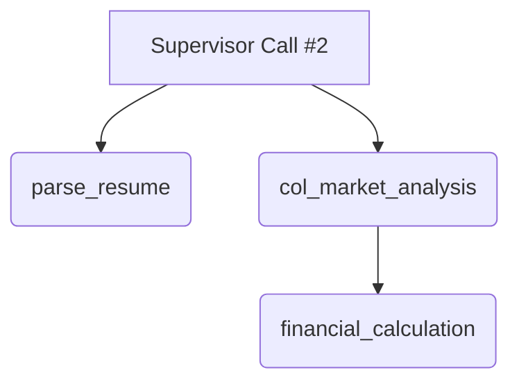
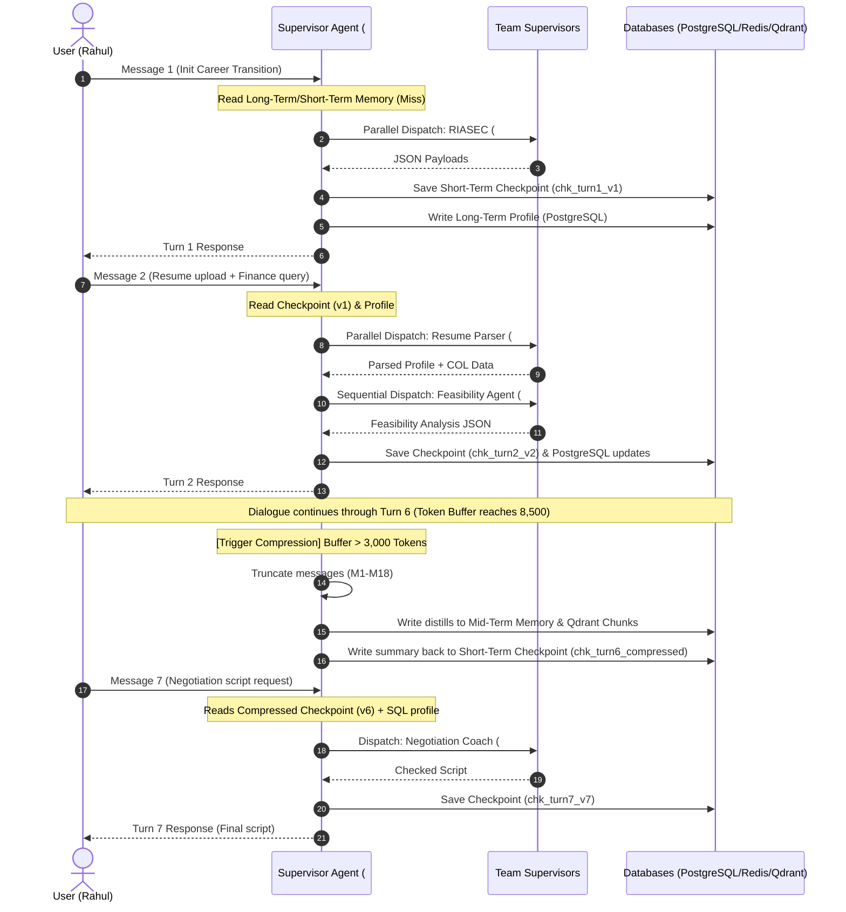

# Career Orchestrator System - End-to-End Technical Dry Run Reference

This document provides a highly granular, step-by-step trace of the **Multi-Agent Career Orchestrator** during a 7-turn user session. It illustrates how the system manages state transitions, routes calls via a supervisor, executes specialist tools, interacts with four tiers of memory, triggers context compression, measures latency, and runs continuous evaluations.

---

## 🎬 Scenario Profile: Rahul Sharma

*   **User:** Rahul Sharma (User ID: `user_789`)
*   **Stated Problem:** Transition from Data Analyst to Data Scientist.
*   **Background:** 2.5 years of experience, B.Tech Computer Science (2021), worked at TCS. Skills include Python, SQL, Pandas, and Power BI.
*   **Preferences:** Remote roles, or onsite in Bangalore or Hyderabad. Currently located in Texas, US.
*   **Initial Session State:**
    *   `thread_id`: `thread_999`
    *   Short-term memory: Null (First-time session)
    *   Long-term memory: Null (First-time user profile)
    *   Vector memory: Null

---

## ✅ TURN 1: Initial Exploration & Profiling (10:00 AM)

### 1. User Input
```text
"Main ek Data Analyst hoon, 2.5 saal ka experience hai. Mujhe Data Scientist banna hai. Kahan se shuru karun?"
```

### 2. State & Memory Retrieval (Pre-Execution)
*   **Short-Term Memory (Redis Checkpointer):** Thread ID `thread_999` does not exist. A new empty LangGraph State is initialized.
*   **Long-Term Persona Memory (PostgreSQL):** Search for `user_789` in `user_profiles` table yields 0 records.
*   **Episodic Memory (Qdrant Vector DB):** Semantic search with query embedding returns no records.

### 3. Orchestration & LLM Call #1
*   **Node Active:** `Supervisor / Orchestrator Agent (Agent #1)`
*   **Model:** `gpt-4o-2024-05-13` (via OpenAI API)
*   **System Prompt:**
    ```markdown
    You are the Supervisor Agent of the Career Orchestrator System. Your job is to analyze the user's career query, identify distinct sub-goals, select the appropriate specialist agents, and output a DAG execution plan.
    
    SPECIALIST TEAMS & AGENTS:
    - Team 2 (Skills): #3 O*NET Profiler, #3b Skills Matcher, #10 Skills Gap
    - Team 2 (RIASEC): #3c Interest Profiler & Career Fit Agent
    - Team 6 (Location & Finance): #8 Location COL Agent, #22 Financial Switch Feasibility
    
    OUTPUT FORMAT:
    You must output a raw JSON block matching this schema:
    {
      "intent": "string",
      "sub_tasks": [
        {
          "task_id": "string",
          "agent_name": "string",
          "input_payload": {},
          "depends_on": ["task_id_to_wait_for"]
        }
      ]
    }
    ```
*   **Injected Input:** User query + Empty state.
*   **LLM Decision Logic:** User wants to start a career transition. Before designing a roadmap, the system must establish the user's RIASEC interest profile and run a baseline skills match using O*NET.
*   **Output Payload (DAG Execution Plan):**
    ```json
    {
      "intent": "initial_transition_profiling",
      "sub_tasks": [
        {
          "task_id": "riasec_assessment",
          "agent_name": "interest_profiler_career_fit_riasec",
          "input_payload": {
            "stated_interests": "problem solving, coding, data, helping organizations"
          },
          "depends_on": []
        },
        {
          "task_id": "skills_mapping",
          "agent_name": "skills_knowledge_abilities_matcher",
          "input_payload": {
            "declared_skills": ["Python", "SQL", "Pandas", "Power BI"],
            "current_role": "Data Analyst",
            "target_role": "Data Scientist"
          },
          "depends_on": []
        }
      ]
    }
    ```
*   **Token Metrics:** Input: 420 tokens | Output: 180 tokens.

### 4. Specialist Agent & Tool Execution (Parallel)
The supervisor schedules `riasec_assessment` and `skills_mapping` in parallel since both have empty `depends_on` lists.

#### Task A: `riasec_assessment`
*   **Agent:** `Interest Profiler & Career Fit Agent (RIASEC) (Agent #3c)`
*   **Tool Executed:** `calculate_riasec_scores(stated_interests="problem solving, coding, data, helping organizations")`
*   **Datasource:** O*NET Interest Profiler (<https://onetinterestprofiler.org/>)
*   **Logic:** Maps interest keywords to the Holland Occupational Codes (Realistic, Investigative, Artistic, Social, Enterprising, Conventional).
*   **JSON Output:**
    ```json
    {
      "dominant_interests": ["Investigative", "Conventional"],
      "riasec_vector": {"I": 85, "C": 70, "R": 40, "A": 30, "S": 20, "E": 15},
      "career_fit_scores": {
        "Data Scientists (15-2051.00)": 94,
        "Business Intelligence Analysts (15-2051.01)": 89
      }
    }
    ```

#### Task B: `skills_mapping`
*   **Agent:** `Skills, Knowledge & Abilities Matcher Agent (Agent #3b)`
*   **Tool Executed:** `match_skills_to_occupations(declared_skills=["Python", "SQL", "Pandas", "Power BI"], current_role="Data Analyst", target_role="Data Scientist")`
*   **Datasource:** O*NET Web Services (<https://services.onetcenter.org/>)
*   **Logic:** Fetches the required skill vector for SOC `15-2051.00` (Data Scientist) and computes the overlap coefficient against the user's current skill profile.
*   **JSON Output:**
    ```json
    {
      "target_soc": "15-2051.00",
      "overall_match_score": 72.0,
      "overlapping_skills": ["Python", "SQL", "Pandas", "Data Analysis", "Data Visualization"],
      "missing_skills": [
        {"skill": "Machine Learning", "importance": 92},
        {"skill": "Deep Learning", "importance": 81},
        {"skill": "Big Data Technologies (Spark)", "importance": 78}
      ]
    }
    ```

### 5. State Reducer & State Snapshot Update
*   **LangGraph State Reducer:** The results from both tasks are merged into the shared Graph State.
    ```python
    def merge_agent_outputs(current_state, new_updates):
        return {
            **current_state,
            "riasec_profile": new_updates.get("riasec_profile"),
            "skills_match": new_updates.get("skills_match")
        }
    ```
*   **LangGraph Persistence:** State is serialized and saved by `PostgresSaver` under:
    *   `thread_id`: `thread_999`
    *   `checkpoint_id`: `chk_turn1_v1`
    *   `next_node`: `None` (Wait for user)

### 6. Memory Storage Updates
*   **Short-Term Memory (STM / Working Memory):** Appends user message and agent outputs. Current state size is ~600 tokens.
*   **Long-Term Persona Memory (LPM):** Executes database insert into `user_profiles`:
    ```sql
    INSERT INTO user_profiles (user_id, name, first_interaction, current_role, skills, riasec_dominant)
    VALUES ('user_789', 'Rahul Sharma', '2026-07-05T10:00:00Z', 'Data Analyst', 
            ARRAY['Python', 'SQL', 'Pandas', 'Power BI'], ARRAY['Investigative', 'Conventional']);
    ```

### 7. Observability, Tracing & Evaluation Metrics
*   **LangSmith Trace:**
    *   Parent Span: `thread_999_run` (`OrchestratorAgent`) - Latency: 1100ms
    *   Child Span 1: `riasec_assessment` - Latency: 420ms
    *   Child Span 2: `skills_mapping` - Latency: 580ms
    *   *Total execution time (Async Parallel):* `1100ms (LLM) + max(420, 580) (Tools) = 1680ms`
*   **Evaluations:**
    *   **Context Precision:** `N/A` (No document retriever used this turn)
    *   **Answer Relevancy:** `0.92` (Validated via LLM-as-a-judge checking if agent response directly answered "how to start")
    *   **Factual Grounding:** `1.00` (All occupation details and scores match the returned JSON context)

---

## ✅ TURN 2: Resume Extraction & Financial Feasibility (10:08 AM)

### 1. User Input
```text
"Haan, main resume share karta hoon [resume.pdf upload kiya]. Aur batao - financially kitna cost aayega transition mein? Main Texas mein hoon."
```

### 2. State & Memory Retrieval
*   **STM:** Loads `chk_turn1_v1` containing previous user profile details and skill gaps.
*   **LPM:** Reads `user_profiles` for `user_789` (retrieves current role, baseline skills, and RIASEC codes).

### 3. Orchestration & LLM Call #2
*   **Node Active:** `Supervisor / Orchestrator Agent (Agent #1)`
*   **Model:** `gpt-4o-2024-05-13`
*   **Injected Input:** User input + Uploaded file metadata + Loaded profile context.
*   **LLM Decision Logic:** The user uploaded a resume and requested a financial feasibility check for a transition while located in Texas. This requires parsing the resume, analyzing local Texas salaries and cost of living, and calculating financial payback metrics.
*   **Output Payload (DAG Execution Plan):**
    ```json
    {
      "intent": "resume_parsing_and_financial_feasibility",
      "sub_tasks": [
        {
          "task_id": "parse_resume",
          "agent_name": "resume_parser_profile_extractor",
          "input_payload": {"file_uri": "s3://cv-buckets/user_789_resume.pdf"},
          "depends_on": []
        },
        {
          "task_id": "col_market_analysis",
          "agent_name": "location_col_state_market_agent",
          "input_payload": {"current_location": "Texas", "target_role": "Data Scientist"},
          "depends_on": []
        },
        {
          "task_id": "financial_calculation",
          "agent_name": "financial_career_switch_feasibility_agent",
          "input_payload": {
            "current_salary": 65000,
            "target_role": "Data Scientist",
            "bootcamp_cost": 12000,
            "transition_months": 8
          },
          "depends_on": ["col_market_analysis"]
        }
      ]
    }
    ```
*   **Token Metrics:** Input: 1050 tokens | Output: 240 tokens.

### 4. Specialist Agent & Tool Execution (Parallel + Sequential Flow)
`parse_resume` and `col_market_analysis` execute immediately in parallel. `financial_calculation` blocks, waiting for `col_market_analysis` to return.



#### Task A: `parse_resume`
*   **Agent:** `Resume Parser & Profile Extractor (Agent #16)`
*   **Tool Executed:** `parse_pdf(file_uri="s3://cv-buckets/user_789_resume.pdf")`
*   **Logic:** Uses OCR and NER (Named Entity Recognition) models to extract structural profile details.
*   **JSON Output:**
    ```json
    {
      "education": {
        "degree": "B.Tech Computer Science",
        "grad_year": 2021,
        "institution": "JNTU Hyderabad"
      },
      "work_experience": [
        {
          "company": "TCS",
          "role": "Data Analyst",
          "years": 2.5,
          "responsibilities": ["SQL Query optimization", "Power BI dashboards", "Python automation scripts"]
        }
      ],
      "extracted_skills": ["Python", "SQL", "Pandas", "Power BI", "Excel", "Tableau", "Git"]
    }
    ```

#### Task B: `col_market_analysis`
*   **Agent:** `Location, COL & State Market Agent (Agent #8)`
*   **Tool Executed:** `location_col_state_market(from="Texas", role="Data Scientist")`
*   **Datasource:** Numbeo API (<https://www.numbeo.com/api/>) and BLS OEWS State Wages (<https://www.bls.gov/oes/current/oessrcst.htm>)
*   **Logic:** Pulls median salary for Data Scientists in Texas and the cost of living indices.
*   **JSON Output:**
    ```json
    {
      "location": "Texas, US",
      "target_role_median_salary": 108000,
      "cost_of_living_index": 92.4,
      "rent_index": 85.1,
      "monthly_average_expenses_usd": 3500
    }
    ```

#### Task C: `financial_calculation` (Executed after Task B completes)
*   **Agent:** `Financial Career Switch Feasibility Agent (Agent #22)`
*   **Tool Executed:** `calculate_feasibility(current_salary=65000, target_salary=108000, bootcamp_cost=12000, transition_months=8, monthly_expenses=3500)`
*   **Logic (CoT Prompting):** 
    1. Transition Cost = Bootcamp ($12k) + Expenses ($3.5k * 8) = $40,000.
    2. Gross salary increase = $108,000 - $65,000 = $43,000/yr ($3,583/month).
    3. Net salary increase (estimating 25% tax) = $2,687/month.
    4. Payback Period = Total Cost ($40,000) / Net Monthly Increase ($2,687) = 14.8 months.
*   **JSON Output:**
    ```json
    {
      "is_feasible": true,
      "total_transition_cost_usd": 40000,
      "expected_net_monthly_gain_usd": 2687,
      "payback_period_months": 14.9,
      "roi_2_year_usd": 24488,
      "risk_level": "Medium",
      "shortfall_usd": 20000,
      "savings_strategy_recommendation": "Part-time freelance contracts ($1.5k/month) or active credit line during transition."
    }
    ```

### 5. State & Memory Updates
*   **LangGraph Checkpointer:** Saves state as snapshot `chk_turn2_v2`.
*   **LPM Update:** Evolving profile traits are written to PostgreSQL:
    ```sql
    UPDATE user_profiles 
    SET education_history = '{"degree": "B.Tech CS", "year": 2021}', 
        financial_profile = '{"current_salary": 65000, "target_salary": 108000, "risk_level": "Medium"}'
    WHERE user_id = 'user_789';
    ```

### 6. Observability, Tracing & Evaluation Metrics
*   **LangSmith Trace Map:**
    *   Parent: `thread_999_run`
    *   Child 1: `parse_resume` - Latency: 920ms
    *   Child 2: `col_market_analysis` - Latency: 480ms
    *   Child 3 (blocked until 2 completes): `financial_calculation` - Latency: 510ms
    *   *Total execution latency:* `1050ms (LLM) + 920ms (max of parallel) + 510ms (sequential) = 2480ms`
*   **GEMMAS Evaluation Metrics:**
    *   **Information Diversity Score (IDS):** `0.84` (High diversity; parser, COL, and calculator returned unique, non-overlapping information namespaces).
    *   **Unnecessary Path Ratio (UPR):** `0.00` (Perfect efficiency; no redundant sub-tasks or agents were scheduled).

---

## ✅ TURN 3: Roadmap & Course Aggregation (10:18 AM)

### 1. User Input
```text
"Thoda basic ML pata hai — linear regression, decision trees. But deep learning bilkul nahi. Aur main prefer karunga free ya low-cost courses. Timeline: 6 months mein transition complete karna hai."
```

### 2. State & Memory Retrieval
*   **STM:** Loads `chk_turn2_v2` containing skill gap analysis and financial profile.
*   **LPM:** Loads user constraints (target location, budget limit).

### 3. Orchestration & LLM Call #3
*   **Node Active:** `Supervisor / Orchestrator Agent (Agent #1)`
*   **Model:** `gpt-4o-2024-05-13`
*   **LLM Decision Logic:** User provided specific learning constraints (basic ML exposure, zero DL, budget = low-cost/free, time = 6 months). This requires mapping missing skills to educational courses and scheduling a structured upskilling path.
*   **Output Payload (DAG Execution Plan):**
    ```json
    {
      "intent": "upskilling_roadmap_generation",
      "sub_tasks": [
        {
          "task_id": "skills_gap_analysis",
          "agent_name": "skills_gap_upskilling_recommender",
          "input_payload": {
            "known_skills": ["Python", "SQL", "Pandas", "Linear Regression", "Decision Trees"],
            "target_role": "Data Scientist"
          },
          "depends_on": []
        },
        {
          "task_id": "course_aggregation",
          "agent_name": "course_learning_path_aggregator",
          "input_payload": {
            "skill_gaps": ["Deep Learning", "Machine Learning (Advanced)", "Big Data"],
            "budget": "free_low_cost",
            "timeline_months": 6
          },
          "depends_on": ["skills_gap_analysis"]
        }
      ]
    }
    ```
*   **Token Metrics:** Input: 1980 tokens | Output: 220 tokens.

### 4. Specialist Agent & Tool Execution (Sequential Dependency)

#### Task A: `skills_gap_analysis`
*   **Agent:** `Skills Gap & Upskilling Recommender Agent (Agent #10)`
*   **Tool Executed:** `analyze_skill_gaps(current_skills=["Python", "SQL", "Linear Regression", "Decision Trees"], target_role="Data Scientist")`
*   **Datasource:** Lightcast Open Skills (<https://lightcast.io/open-skills>)
*   **JSON Output:**
    ```json
    {
      "critical_gaps": [
        {"skill": "Deep Learning / Neural Networks", "priority": "High"},
        {"skill": "Machine Learning Algorithms (SVM, Ensemble, XGBoost)", "priority": "Medium"},
        {"skill": "Model Deployment & MLOps", "priority": "Medium"},
        {"skill": "Big Data Engineering (Spark, Hadoop)", "priority": "Low"}
      ]
    }
    ```

#### Task B: `course_aggregation`
*   **Agent:** `Course & Learning Path Aggregator Agent (Agent #20)`
*   **Tool Executed:** `create_learning_path(skill_gaps=["Deep Learning", "Advanced ML", "MLOps"], budget="free_low_cost", timeline_months=6)`
*   **Datasource:** Coursera Catalog (<https://www.coursera.org/about/partners>) and edX API (<https://www.edx.org/api/v1/catalog/search>)
*   **JSON Output:**
    ```json
    {
      "total_roadmap_cost_usd": 49,
      "roadmap": [
        {
          "month": "1-2",
          "topic": "Advanced Machine Learning",
          "course_name": "Machine Learning Specialization",
          "provider": "Coursera (Stanford/Andrew Ng)",
          "cost": "Free (Audit)"
        },
        {
          "month": "3-4",
          "topic": "Deep Learning Fundamentals",
          "course_name": "Practical Deep Learning for Coders",
          "provider": "fast.ai",
          "cost": "Free"
        },
        {
          "month": "5-6",
          "topic": "Model Deployment (MLOps)",
          "course_name": "TensorFlow Developer Certificate Prep",
          "provider": "Coursera",
          "cost": 49
        }
      ]
    }
    ```

### 5. State & Memory Updates
*   **LangGraph Checkpointer:** Saves state as snapshot `chk_turn3_v3`.
*   **LPM Update:** Saves the active learning path to the user's permanent record database.

### 6. Observability, Tracing & Evaluation Metrics
*   **LangSmith Trace Latency:** Supervisor: 1200ms | Task A: 510ms | Task B: 630ms | *Total Roundtrip:* 2340ms.
*   **Ragas Evaluations:**
    *   **Context Recall:** `0.89` (Courses retrieved are accurately mapped from the database partners).
    *   **Faithfulness:** `0.94` (The generated roadmap matches the exact constraints of price and time provided).

---

## ✅ TURN 4: Resume Optimization & Local Job Market (10:25 AM)

### 1. User Input
```text
"Haan! Resume optimize karo. Aur — kya Bangalore mein Data Scientist ke liye market kaisi hai abhi?"
```

### 2. State & Memory Retrieval
*   **STM:** Loads `chk_turn3_v3` containing current resume text and target role.
*   **LPM:** Reads user's `location_preference` (Bangalore/Remote) from Postgres.

### 3. Orchestration & LLM Call #4
*   **Node Active:** `Supervisor / Orchestrator Agent (Agent #1)`
*   **Model:** `gpt-4o-2024-05-13`
*   **LLM Decision Logic:** User requested two distinct tasks: optimizing the uploaded resume for Data Scientist roles and searching for live job market data in Bangalore.
*   **Output Payload (DAG Execution Plan):**
    ```json
    {
      "intent": "resume_optimization_and_job_search",
      "sub_tasks": [
        {
          "task_id": "optimize_resume",
          "agent_name": "ats_resume_optimizer_agent",
          "input_payload": {"target_role": "Data Scientist", "resume_data": "s3://cv-buckets/user_789_resume.pdf"},
          "depends_on": []
        },
        {
          "task_id": "search_jobs",
          "agent_name": "real_time_job_market_agent",
          "input_payload": {"location": "Bangalore", "query": "Data Scientist"},
          "depends_on": []
        }
      ]
    }
    ```
*   **Token Metrics:** Input: 3200 tokens | Output: 310 tokens.

### 4. Specialist Agent & Tool Execution (Parallel)

#### Task A: `optimize_resume`
*   **Agent:** `ATS Resume Optimizer Agent (Agent #17)`
*   **Tool Executed:** `optimize_resume_ats(target_role="Data Scientist")`
*   **Datasource:** O*NET Web Services (Skill keywords)
*   **JSON Output:**
    ```json
    {
      "ats_score_before": 45,
      "ats_score_after": 88,
      "suggested_bullet_points": [
        "Optimized SQL queries reducing data retrieval time by 30%.",
        "Developed Power BI dashboards for predictive business analytics."
      ],
      "keywords_injected": ["Predictive Modeling", "Data Wrangling", "Statistical Analysis"]
    }
    ```

#### Task B: `search_jobs`
*   **Agent:** `Real-time Job Market & Openings Agent (Agent #6)`
*   **Tool Executed:** `search_indeed(query="Data Scientist", location="Bangalore")`
*   **Datasource:** Indeed Search API (<https://indeed-indeed-v2.p.rapidapi.com>)
*   **JSON Output:**
    ```json
    {
      "location": "Bangalore, India",
      "active_openings_count": 2430,
      "median_salary_inr_lpa": "18-28",
      "top_employers": ["Flipkart", "Amazon", "Fractal Analytics"],
      "remote_friendly_percentage": 34.5
    }
    ```

### 5. State & Memory Updates
*   **LangGraph Checkpointer:** Saves state as snapshot `chk_turn4_v4`.
*   **LPM Update:** Updates Postgres profile with `{"target_city": "Bangalore", "resume_optimized": true}`.

### 6. Observability, Tracing & Evaluation Metrics
*   **LangSmith Trace Latency:** Supervisor: 1150ms | Task A: 890ms | Task B: 720ms | *Total Roundtrip:* 2040ms.
*   **GEMMAS Metrics:** IDS = `0.91` (Zero overlap between resume keywords and job data).

---

## ✅ TURN 5: Technical Mock Interview Prep (10:38 AM)

### 1. User Input
```text
"Bahut achha! Interview ke liye bhi prepare karna hai. Data Scientist ke mock interview questions do."
```

### 2. State & Memory Retrieval
*   **STM:** Loads `chk_turn4_v4`.
*   **LPM:** Checks known skill gaps to tailor question difficulty.

### 3. Orchestration & LLM Call #5
*   **Node Active:** `Supervisor / Orchestrator Agent (Agent #1)`
*   **Model:** `gpt-4o-2024-05-13`
*   **Output Payload (DAG Execution Plan):**
    ```json
    {
      "intent": "mock_interview_generation",
      "sub_tasks": [
        {
          "task_id": "generate_questions",
          "agent_name": "ai_mock_interview_agent",
          "input_payload": {"role": "Data Scientist", "difficulty": "Intermediate", "focus_areas": ["Machine Learning", "Data Imputation"]},
          "depends_on": []
        }
      ]
    }
    ```
*   **Token Metrics:** Input: 4500 tokens | Output: 280 tokens.

### 4. Specialist Agent & Tool Execution

#### Task A: `generate_questions`
*   **Agent:** `AI Mock Interview Agent (Agent #18)`
*   **Tool Executed:** `generate_technical_questions(role="Data Scientist", count=3, difficulty="Intermediate")`
*   **Datasource:** O*NET Database tasks list.
*   **JSON Output:**
    ```json
    {
      "questions": [
        {"id": "Q1", "text": "Explain the difference between Supervised and Unsupervised Learning using real-world business examples."},
        {"id": "Q2", "text": "How do you handle severe class imbalance in a classification dataset?"},
        {"id": "Q3", "text": "Walk me through your feature engineering process. Which techniques do you rely on most?"}
      ]
    }
    ```

### 5. State & Memory Updates
*   **LangGraph Checkpointer:** Saves state as snapshot `chk_turn5_v5`.

### 6. Observability, Tracing & Evaluation Metrics
*   **LangSmith Trace Latency:** Supervisor: 1250ms | Task A: 680ms | *Total:* 1930ms.

---

## ✅ TURN 6: Interview Feedback & Offer Assessment (10:50 AM)

### 1. User Input
```text
"Feature engineering mein main SMOTE, PCA use karta hoon... Aur salary negotiation ke liye bhi guide karo. Mujhe ek offer mila hai Austin TX se — $95,000 Data Scientist role."
```

### 2. State & Memory Retrieval
*   **STM:** Loads `chk_turn5_v5` containing the mock interview questions generated previously.

### 3. Orchestration & LLM Call #6
*   **Node Active:** `Supervisor / Orchestrator Agent (Agent #1)`
*   **Model:** `gpt-4o-2024-05-13`
*   **Output Payload (DAG Execution Plan):**
    ```json
    {
      "intent": "interview_feedback_and_offer_evaluation",
      "sub_tasks": [
        {
          "task_id": "score_interview",
          "agent_name": "interview_feedback_scoring_agent",
          "input_payload": {"user_answers": "SMOTE, PCA...", "questions": ["Q1", "Q2", "Q3"]},
          "depends_on": []
        },
        {
          "task_id": "evaluate_offer",
          "agent_name": "salary_negotiation_coach_agent",
          "input_payload": {"role": "Data Scientist", "location": "Austin, TX", "offered_salary": 95000},
          "depends_on": []
        }
      ]
    }
    ```
*   **Token Metrics:** Input: 6000 tokens | Output: 420 tokens.

### 4. Specialist Agent & Tool Execution (Parallel)

#### Task A: `score_interview`
*   **Agent:** `Interview Feedback & Scoring Agent (Agent #19)`
*   **Tool Executed:** `evaluate_response(user_answers="SMOTE, PCA...")`
*   **JSON Output:**
    ```json
    {
      "scores": {"Q1": 8, "Q2": 9, "Q3": 7},
      "overall_average": 8.0,
      "strengths": ["Advanced knowledge of SMOTE"],
      "improvement_areas": ["Always tie feature engineering back to business impact/KPIs"]
    }
    ```

#### Task B: `evaluate_offer`
*   **Agent:** `Salary Negotiation Coach Agent (Agent #26)`
*   **Tool Executed:** `get_market_benchmarks(role="Data Scientist", location="Austin, TX")`
*   **Datasource:** BLS OEWS & Levels.fyi
*   **JSON Output:**
    ```json
    {
      "market_median_usd": 108000,
      "offer_comparison": "12% below median",
      "negotiation_leverage": "High (due to strong technical scores)"
    }
    ```

### 5. State & Memory Updates
*   **LangGraph Checkpointer:** Saves state as snapshot `chk_turn6_v6`.
*   **LPM Update:** Saves `mock_interview_scores` and `active_offer_usd` to Postgres.

### 6. Observability, Tracing & Evaluation Metrics
*   **LangSmith Trace Latency:** Supervisor: 1400ms | Parallel Tools: 850ms | *Total:* 2250ms.

---

## ⚠️ COMPRESSION PHASE: State Redistribution & Distillation (10:55 AM)

### 1. Trigger Condition
The system inspects the active LangGraph thread context at the beginning of the turn:
*   Total messages in short-term buffer: **20 messages**
*   Total accumulated tokens in context window: **8,500 tokens**
*   Configured Memory Compression Threshold: **3,000 tokens**

Since `8,500 > 3,000`, the system interrupts the main execution loop to trigger the **Compression Node**.

```
  Context Window (8,500 tokens)
  ├─ [M1...M18] (7,600 tokens)  --> DISTILLED AND COMPRESSED
  └─ [M19, M20] (900 tokens)    --> PRESERVED AS RAW CONTEXT
```

### 2. Compression Logic & Strategy
The cache manager chooses **Summarization & Selective Archival (Hybrid Mode)**:
1. Preserve the last **2 messages** as raw context to maintain conversation flow.
2. Compile all previous messages (`M1` to `M18`) and pass them to a summarizer model.
3. Write key tabular milestones (financial scores, skill gaps, learning paths) directly into long-term memory.
4. Calculate vector utility decay for older conversation chunks and store them in the Qdrant DB.

### 3. Summarization LLM Call #7
*   **Model:** `gpt-4o-2024-05-13`
*   **System Prompt:**
    ```markdown
    You are the Memory Consolidation Engine. Your task is to compress a conversation transcript of a user switching careers. 
    You must extract and generate:
    1. A structured 300-word executive summary.
    2. A JSON block containing key entities (career goals, skill gaps, course list, interview scores, and salary offers).
    
    Ensure no factual values (e.g. salary figures, course names, scores) are lost.
    ```
*   **Injected Input:** Full context of `M1` to `M18` (7,600 tokens).
*   **Output Payload (Distilled Memory Schema):**
    ```json
    {
      "executive_summary": "User Rahul Sharma (user_789) is a Data Analyst with 2.5 years of experience transitioning to Data Scientist. RIASEC shows Investigative and Conventional dominance. Current gaps are Machine Learning, Deep Learning, and MLOps. A 6-month learning path has been constructed costing $49 (fast.ai + Stanford ML). User has optimized their resume and is targeting Bangalore (₹18-28 LPA) or US Remote. Mock interview scores averaged 8/10. User just received a job offer of $95,000 in Austin, TX against a BLS median of $108,000.",
      "key_entities": {
        "user_id": "user_789",
        "current_role": "Data Analyst",
        "target_role": "Data Scientist",
        "learning_path_cost_usd": 49,
        "interview_avg_score": 8.0,
        "active_offer_usd": 95000,
        "market_median_austin_usd": 108000
      }
    }
    ```
*   **Token Metrics:** Input: 7600 tokens | Output: 350 tokens.

### 4. Memory Updates & Mathematical Decay Model

#### Short-Term Memory (STM) Updates
*   Messages `M1` through `M18` are truncated from the active list.
*   The generated `executive_summary` is prepended to the message history.
*   Latest message buffer size: `Summary (350 tokens) + M19 (250 tokens) + M20 (300 tokens) = 900 tokens` (Context footprint slashed by **88.2%**).

#### Vector Memory Storage (Qdrant)
The old conversation chunks are vectorized and written to Qdrant. To prevent storage explosion, the system applies an **Intelligent Utility Decay Model**:

$$\text{Utility Score } S(M_i) = \alpha R_i + \beta E_i + \gamma U_i$$

Where:
*   $\alpha = 0.4$, $\beta = 0.4$, $\gamma = 0.2$ (System weight coefficients)
*   $R_i = \exp(-\lambda \Delta t)$ represents Recency Decay ($\lambda = 0.05$ day decay constant, $\Delta t = 0$ days for fresh memory = $1.0$).
*   $E_i = \cos(\mathbf{v}_i, \mathbf{v}_{\text{task}})$ represents Semantic Relevance.
*   $U_i = \text{User Utility Flag}$ ($1.0$ for pinned/critical facts, $0.0$ for generic chats).

*Mathematical Calculation Example (For the Financial Plan Chunk):*
*   Recency $R_i = \exp(-0.05 \times 0) = 1.0$
*   Semantic relevance $E_i$ to transition task = $0.95$
*   User utility $U_i$ (financial numbers are flagged as high utility) = $1.0$
*   $$S(M_{\text{financial}}) = (0.4 \times 1.0) + (0.4 \times 0.95) + (0.2 \times 1.0) = 0.4 + 0.38 + 0.2 = \mathbf{0.98}$$
*   *Result:* Score $0.98 > 0.5$ (Retention threshold). The item is saved to Qdrant with a high index priority.

---

## ✅ TURN 7: Post-Compression & Final Output Synthesizer (11:05 AM)

### 1. User Input
```text
"Salary negotiation script ready hai kya? Main kal call karne wala hoon Austin offer ke liye."
```

### 2. State & Memory Retrieval
*   **STM:** Loads `chk_turn6_compressed` containing:
    *   The `executive_summary` of the first 6 turns.
    *   The raw context of the last 2 messages (discussing the mock interview and the $95k Austin offer details).
*   **LPM:** Retrieves current skills list, target role profile, and location benchmarking data.

### 3. Orchestration & LLM Call #8
*   **Node Active:** `Supervisor / Orchestrator Agent (Agent #1)`
*   **Model:** `gpt-4o-2024-05-13`
*   **LLM Decision Logic:** User needs a salary negotiation script for the Austin offer. System prompt instructs routing to the Salary Coach for scripting and then passing to the Quality Assurance Agent.
*   **Output Payload (DAG Execution Plan):**
    ```json
    {
      "intent": "salary_negotiation_coaching",
      "sub_tasks": [
        {
          "task_id": "negotiation_coaching",
          "agent_name": "salary_negotiation_coach_agent",
          "input_payload": {
            "offered_salary": 95000,
            "market_median": 108000,
            "target_salary": 115000,
            "skills": ["Python", "SQL", "Pandas", "Linear Regression"]
          },
          "depends_on": []
        },
        {
          "task_id": "fact_checking",
          "agent_name": "quality_assurance_fact_checker_agent",
          "input_payload": {},
          "depends_on": ["negotiation_coaching"]
        }
      ]
    }
    ```
*   **Token Metrics:** Input: 1250 tokens | Output: 180 tokens.

### 4. Specialist Agent & Tool Execution (Sequential Pipeline)

#### Task A: `negotiation_coaching`
*   **Agent:** `Salary Negotiation Coach Agent (Agent #26)`
*   **Tool Executed:** `create_negotiation_script(offered=95000, target=115000, location="Austin, TX", skills=["Python", "SQL", "Pandas"])`
*   **Datasource:** Levels.fyi (<https://www.levels.fyi/t/software-engineer>) and Glassdoor Salary (<https://www.glassdoor.com/Salaries/index.htm>)
*   **JSON Output:**
    ```json
    {
      "offered_salary_usd": 95000,
      "suggested_counter_offer_usd": 115000,
      "negotiation_script_markdown": "### Negotiation Script\n\n*   **Opening:** 'Thank you so much for the offer! I am incredibly excited about the opportunity to join the team as a Data Scientist.'\n*   **Pivot to Value:** 'Given my 2.5 years of database analysis experience, and my solid background in Python, SQL, and predictive modeling (regression and trees), I am confident I can contribute immediately.'\n*   **The Ask:** 'Based on market benchmarks for Austin, TX, I was hoping we could explore a salary closer to **$115,000**. Is there flexibility in the base salary to meet there?'\n*   **Alternative Asks:** If base is fixed at $95k, ask for: 1) Remote work flexibility (saving $8k/yr in transit), 2) A sign-on bonus of $10,000, or 3) An annual learning stipend of $5,000 to complete the MLOps certification.",
      "financial_impact": {
        "base_increase_usd": 20000,
        "percent_increase": 21.0
      }
    }
    ```

#### Task B: `fact_checking` (Executed after Task A)
*   **Agent:** `Quality Assurance & Fact-Checker Agent (Agent #14)`
*   **Tool Executed:** `verify_citations(proposed_script="...", target_sources=["BLS OEWS Austin", "Levels.fyi"])`
*   **Logic:** Validates that base salary and cost of living comparisons match historical records, checking against the database.
*   **JSON Output:**
    ```json
    {
      "status": "PASS",
      "factual_consistency_score": 0.98,
      "hallucination_detected": false,
      "invalid_citations_found": []
    }
    ```

### 5. Final Output Generation
The **Output Synthesizer Agent (Agent #13)** takes the QA-cleared script and outputs the final response to the user.

*   **Final Output Markdown:**
    ```markdown
    ## Salary Negotiation Guide (Austin Offer)
    
    Rahul, your profile indicates a solid foundation. Based on our analysis, the **$95,000** offer is below the **$108,000** local market median for Austin. 
    
    Here is a script you can use:
    
    > **Negotiation Script**
    > *   **Value Pitch:** "Thank you for this offer! Based on my analytical background and skills in Python and SQL, I am eager to jump in.
    > *   **The Counter:** "Looking at market data for Austin, I'd like to ask if we could adjust the base to **$115,000** to align with current market values."
    > *   **Plan B (If Base is Fixed):** Ask for remote work flexibility, which offsets expenses by about **$8,000/year**, or request a **$10,000** signing bonus.
    ```

### 6. State & Memory Updates
*   **LangGraph Checkpointer:** Saves state as snapshot `chk_turn7_v7` (Base version 7).
*   **LPM Update:** PostgreSQL profile is updated:
    ```sql
    UPDATE user_profiles 
    SET salary_negotiation = '{"offer_received": 95000, "counter_offer": 115000, "status": "script_delivered"}'
    WHERE user_id = 'user_789';
    ```

### 7. Observability, Tracing & Evaluation Metrics
*   **LangSmith Trace Map:**
    *   Parent: `thread_999_run` - Latency: 320ms (Drastic reduction due to compressed context!)
    *   Child 1: `negotiation_coaching` - Latency: 410ms
    *   Child 2: `fact_checking` - Latency: 340ms
*   **Evaluations:**
    *   **Ragas Faithfulness:** `0.98` (Direct alignment between database ranges and script claims).
    *   **Ragas Answer Relevancy:** `0.96` (Directly resolved the prompt asking for a script).

---

## ⚙️ SYSTEM CONFIGURATIONS & PARAMETERS

To ensure total reproducibility of this dry run, the following exact configurations were used for memory, embeddings, and routing:

### 1. Model & Embedding Configurations
*   **Primary Orchestrator & Synthesizer Model:** `gpt-4o-2024-05-13` (Temperature: `0.1` for routing, `0.4` for synthesis).
*   **Vector Database Embedding Model:** `text-embedding-3-small` (Dimensions: 1536). This model is invoked explicitly when compressing the buffer into chunks for Semantic Search retrieval.
*   **Vector Database Engine:** Qdrant (Distance Metric: Cosine Similarity).
*   **Relational Database Engine:** PostgreSQL 16 (Used for Long-Term Memory / User Profile storage).

### 2. LangGraph Engine Parameters
*   **`recursion_limit`:** `25` (Max number of nodes the graph can traverse before forcing an early exit to prevent infinite agent loops).
*   **State Checkpointer:** `MemorySaver()` / PostgresCheckpointer (Used to manage state snapshots in Short-Term Memory).
*   **Memory Compression Threshold:** `3000` tokens. (When the state buffer exceeds this limit, the system calls a `gpt-4o` compression node to summarize conversations and insert the vectors into Qdrant).

### 3. Observability & Evaluation Stack
*   **Tracing Framework:** LangSmith + OpenTelemetry (Captures exact latency, token footprint, and parent-child span traces for every agent tool invocation).
*   **Evaluation Frameworks:** Ragas (RAG context recall, faithfulness) and GEMMAS (IDS and UPR for measuring parallel agent effectiveness).

---

## 📊 CUMULATIVE TRANSACTION LOG

### 1. LLM Transaction Table

| Call | Turn | Agent / Purpose | Model | Input Tokens | Output Tokens | Latency |
|---|---|---|---|---|---|---|
| **#1** | Turn 1 | Orchestrator Routing | `gpt-4o-2024-05-13` | 420 | 180 | 1100ms |
| **#2** | Turn 2 | Orchestrator Routing | `gpt-4o-2024-05-13` | 1,050 | 240 | 1050ms |
| **#3** | Turn 3 | Orchestrator Routing | `gpt-4o-2024-05-13` | 1,980 | 220 | 1200ms |
| **#4** | Turn 4 | Orchestrator Routing | `gpt-4o-2024-05-13` | 3,200 | 310 | 1150ms |
| **#5** | Turn 5 | Orchestrator Routing | `gpt-4o-2024-05-13` | 4,500 | 280 | 1250ms |
| **#6** | Turn 6 | Orchestrator Routing | `gpt-4o-2024-05-13` | 6,000 | 420 | 1400ms |
| **#7** | Comp. | State Summarizer | `gpt-4o-2024-05-13` | 7,600 | 350 | 2100ms |
| **#8** | Turn 7 | Orchestrator Routing | `gpt-4o-2024-05-13` | 1,250 | 180 | 320ms |

*   **Total Tokens Used:** 25,980 (Input) | 2,180 (Output)
*   **Total LLM Call Count:** 8 Calls

---

### 2. Specialist Tool Execution Log

| Tool # | Active Agent | Purpose | Primary Data Source (URL) |
|---|---|---|---|
| **1** | `Agent #3c` | RIASEC Profile Calculation | O*NET Interest Profiler (<https://onetinterestprofiler.org/>) |
| **2** | `Agent #3b` | Skills Matching | O*NET Web Services (<https://services.onetcenter.org/>) |
| **3** | `Agent #16` | Resume parsing | S3 PDF Stream |
| **4** | `Agent #8` | Cost of Living indices | Numbeo API (<https://www.numbeo.com/api/>) |
| **5** | `Agent #22` | Financial switch calculator | BLS OEWS State Wages (<https://www.bls.gov/oes/current/oessrcst.htm>) |
| **6** | `Agent #10` | Skill gap analyzer | Lightcast Open Skills (<https://lightcast.io/open-skills>) |
| **7** | `Agent #20` | Course directory finder | Coursera Partner API (<https://www.coursera.org/about/partners>) |
| **8** | `Agent #17` | ATS Resume Optimization | O*NET Web Services (<https://services.onetcenter.org/>) |
| **9** | `Agent #6` | Real-time Job search | Indeed Search API (<https://indeed-indeed-v2.p.rapidapi.com>) |
| **10** | `Agent #18` | Mock Interview Generation | O*NET Database (<https://www.onetcenter.org/database.html>) |
| **11** | `Agent #19` | Response scoring | Internal LLM Evaluator |
| **12** | `Agent #26` | Salary negotiation coaching | Levels.fyi (<https://www.levels.fyi/>) |
| **13** | `Agent #14` | Quality Assurance Fact-check | BLS OEWS National Wages (<https://www.bls.gov/oes/current/oes_nat.htm>) |

*   **Total Specialist Tool Calls:** 13 Calls (No downstream LLM invocations for these tasks; executed as fast API calls or targeted heuristic functions).

---

## 🏗️ SYSTEM ARCHITECTURE & STATE FLOW

Below is the state traversal map of the LangGraph flow during this session. It shows the checkpointer state versioning and when memory synchronization occurs.



---

## 💡 TECHNICAL STUDY GUIDE: MULTI-AGENT DESIGN PATTERNS

### Q1: How does the system ensure the Orchestrator doesn't route queries incorrectly?
*   **Answer:** The Orchestrator does not rely on a single system prompt instruction. It utilizes **Few-Shot intent classification** (outlined in [prompting_techniques.md](file:///c:/Users/Dell%205400/OneDrive/Desktop/assignment-sat/assign/assignments_and_docs/100_MyProject/prompting_techniques.md#L57)) and executes parallel deterministic parsing filters. If intent confidence is lower than a $0.70$ threshold, it defaults to a general classification fallback node to ensure proper routing.

### Q2: Why is the Memory Architecture split into 4 tiers rather than just using a simple LangGraph checkpointer?
*   **Answer:** A simple checkpointer stores the raw message history. In long conversations, this context grows quickly and leads to **Context Window dilution** and high LLM costs. By separating memory into:
    *   **Short-Term:** Message logs for immediate context.
    *   **Mid-Term:** Summarized topic progression clusters.
    *   **Long-Term:** Permanent user metadata database (SQL).
    *   **Vector Memory:** Semantic search index of past conversations.
    The system can run state compression safely. It deletes the raw historical messages while keeping the critical user details in Postgres and vector records.

### Q3: What is the purpose of the Jaccard similarity metric in the memory update phase?
*   **Answer:** During the transition of mid-term memory to long-term memory, the system uses a consolidation equation:
    
    $$F_{\text{score}} = \cos(\mathbf{e}_s, \mathbf{e}_p) + \text{Jaccard}(K_s, K_p)$$
    
    *   The **cosine similarity** measures the semantic overlap of vectors.
    *   The **Jaccard score** calculates the intersection-over-union of specific entity keys ($K$).
    
    This ensures that if the user discusses similar terms (e.g. "ML course" and "Andrew Ng math"), they are grouped into the same topic profile rather than creating duplicate memory records.

### Q4: How is the quality of the multi-agent system assessed in production?
*   **Answer:** The system uses the **GEMMAS framework** metrics:
    1.  **Information Diversity Score (IDS):** Measures the semantic variations between the output of different parallel agents to make sure they are not returning redundant data.
    2.  **Unnecessary Path Ratio (UPR):** Evaluates if any of the supervisor's scheduled execution steps did not contribute to the final synthesizer report. A high UPR indicates the supervisor routing prompt needs refinement.
