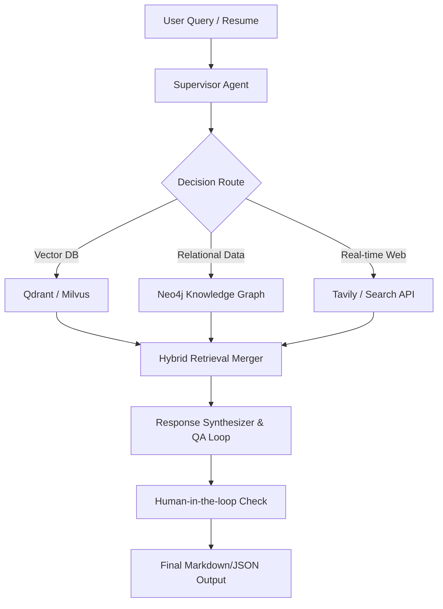

- **LangGraph architecture** ko complex level pe le gaya (hierarchical supervisor, multiple retrievers, knowledge graph, tools, memory, synthesizer, QA loop)

---

### 1. Updated & Expanded Knowledge Base Sources (Publicly Available)

| Platform / Source                     | Data Type                                                    | Ingestion Method         | Update Frequency | **Official Website**                                                                                                                              |
| ---------------------------------------| --------------------------------------------------------------| --------------------------| ------------------| ---------------------------------------------------------------------------------------------------------------------------------------------------|
| **BLS OEWS**                          | Wages, employment by location                                | Download XLSX/CSV        | Yearly           | [https://www.bls.gov/oes/](https://www.bls.gov/oes/)                                                                                              |
| **BLS Occupational Outlook Handbook** | Job outlook, duties, education                               | Scrape / structured      | Every 2 years    | [https://www.bls.gov/ooh/](https://www.bls.gov/ooh/)                                                                                              |
| **O*NET Database + Web Services**     | Skills, tasks, abilities, interests, related occupations     | Full DB + API            | Quarterly        | [https://www.onetcenter.org/database.html](https://www.onetcenter.org/database.html) • [https://www.onetonline.org/](https://www.onetonline.org/) |
| **CareerOneStop + Web API**           | Training, certifications, local resources, skill matching    | API + Download           | Regular          | [https://www.careeronestop.org/](https://www.careeronestop.org/)                                                                                  |
| **USAJOBS.gov**                       | Federal job descriptions & openings                          | API                      | Daily            | [https://www.usajobs.gov/](https://www.usajobs.gov/)                                                                                              |
| **Indeed + LinkedIn**                 | Private job postings                                         | Scraping (ethical)       | Frequent         | [https://www.indeed.com/](https://www.indeed.com/) • [https://www.linkedin.com/jobs](https://www.linkedin.com/jobs)                               |
| **Glassdoor**                         | Company reviews, salary transparency, culture                | Scraping / aggregated    | Regular          | [https://www.glassdoor.com/](https://www.glassdoor.com/)                                                                                          |
| **Apprenticeship.gov**                | Registered apprenticeship programs                           | Scrape / structured      | Regular          | [https://www.apprenticeship.gov/](https://www.apprenticeship.gov/)                                                                                |
| **NCcareers.org** (North Carolina)    | State-specific careers, assessments, local outlook, training | Scrape + structured      | Regular          | [https://nccareers.org/](https://nccareers.org/)                                                                                                  |
| **MyNextMove.org**                    | Interest profiler, career exploration, green jobs            | Structured + O*NET based | Regular          | [https://www.mynextmove.org/](https://www.mynextmove.org/)                                                                                        |
| **College Scorecard**                 | College costs, earnings, graduation rates, debt              | API + Download           | Yearly           | [https://collegescorecard.ed.gov/](https://collegescorecard.ed.gov/)                                                                              |
| **Projections Central**               | State & national long-term occupational projections          | Download                 | Every 2 years    | [https://projectionscentral.org/](https://projectionscentral.org/)                                                                                |
| **NCES College Navigator**            | Detailed college search, outcomes                            | Structured               | Regular          | [https://nces.ed.gov/collegenavigator/](https://nces.ed.gov/collegenavigator/)                                                                    |
| **Tavily** (Web Updater)              | Real-time jobs, news, trends                                 | API                      | Real-time        | [https://tavily.com/](https://tavily.com/)                                                                                                        |

**Extra Public Sources (Optional but Powerful):**
- O*NET Interest Profiler → https://onetinterestprofiler.org/
- BLS Employment Projections → https://www.bls.gov/emp/
- Data.gov Workforce datasets

---


#### **Detailed Agent List (Expanded & Complex)**

| #   | Agent / Team Name                          | Role & Responsibility                                                | Data Sources Used                                             | Priority | Tools / Capabilities               |
| -----| --------------------------------------------| ----------------------------------------------------------------------| ---------------------------------------------------------------| ----------| ------------------------------------|
| 1   | **Supervisor / Orchestrator Agent**        | Query samajhna, plan banana, sahi agents route karna, final decision | All agents + memory                                           | Must     | Planner, Router, State Manager     |
| 2   | **General Hybrid Retriever Agent**         | Cross-domain semantic + keyword search                               | All Vector Stores + Knowledge Graph                           | Must     | Hybrid Search, Reranker            |
| 3   | **O*NET & Skills Deep-Dive Agent**         | Detailed skills, tasks, abilities, interests, related occupations    | O*NET DB + MyNextMove + Interest Profiler                     | High     | O*NET Web Services                 |
| 4   | **BLS Economic & Compensation Agent**      | Wages (all percentiles), growth, projections                         | BLS OEWS + OOH + Projections Central                          | High     | Salary Calculator, Percentile Tool |
| 5   | **Career Pathway & Transition Planner**    | Skill gap analysis, career ladders, transition paths                 | O*NET + Knowledge Graph + CareerOneStop                       | High     | Graph Query, Path Finder           |
| 6   | **Real-time Job Market & Openings Agent**  | Current openings, demand signals, remote/hybrid trends               | USAJOBS + Indeed + LinkedIn + Tavily                          | High     | Live Job Search Tool               |
| 7   | **Education, Training & Credential Agent** | Best colleges, courses, certifications, ROI, apprenticeships         | College Scorecard + NCES + CareerOneStop + Apprenticeship.gov | High     | ROI Calculator, Program Matcher    |
| 8   | **Location, COL & State Market Agent**     | State/metro specific data, cost of living, local demand              | BLS + NCcareers.org + Projections Central + Public COL data   | High     | Location Comparator                |
| 9   | **Company, Culture & Reviews Agent**       | Company deep-dive, culture fit, salary transparency                  | Glassdoor + Web reviews + Tavily                              | Medium   | Review Analyzer                    |
| 10  | **Skills Gap & Upskilling Recommender**    | Current skills → target role gap + learning path                     | O*NET + CareerOneStop + MyNextMove                            | High     | Gap Analyzer                       |
| 11  | **Future Trends & Automation Risk Agent**  | Emerging jobs, declining roles, AI/automation impact                 | Web (Tavily) + Public reports + BLS                           | Medium   | Trend Forecaster                   |
| 12  | **Personalization & User Profile Agent**   | Maintain user history, preferences, resume insights, goals           | Conversation Memory + User Profile Store                      | High     | Long-term Memory                   |
| 13  | **Output Synthesizer & Visualizer Agent**  | Combine all outputs, create coherent answer + charts/paths           | All specialist outputs                                        | Must     | Chart Generator, Path Diagram      |
| 14  | **Quality Assurance & Fact-Checker Agent** | Hallucination check, source citation, consistency                    | All retrieved data + Web verification                         | Must     | Self-Critique, Citation Verifier   |
| 15  | **Web & Live Data Updater Agent**          | Real-time refresh of jobs, news, policy changes                      | Tavily + Browser tools                                        | Medium   | Scheduled / On-demand Update       |

**Total: 15 Agents** (1 Supervisor + 14 Specialists) organized in **Teams** for better scalability.

---

### 3. Advanced Complexity Features (Production Level)

- **Hierarchical Supervision** — Meta Supervisor + Sub-Supervisors per team
- **Multiple Vector Stores** (O*NET Vector, BLS Vector, Job Postings Vector, Education Vector, State Vector)
- **Knowledge Graph Layer** (Neo4j or similar) — for career transitions, skill prerequisites, "related occupations"
- **Hybrid Retrieval** (Vector + Keyword + Graph)
- **Tool Calling Agents** — Tavily, code interpreter (salary math, charts), graph queries
- **Persistent Memory** — User profile, past conversations, saved career plans
- **Human-in-the-Loop** — High-stakes decisions (big career change, loans) pe human confirmation
- **Self-Critique + Reflection Loop** — QA Agent har final output check karega
- **Citations & Confidence Scores** — Har answer mein sources + confidence
- **Multi-modal Output** — Text + Salary charts + Career path diagrams + Comparison tables
- **Evaluation Framework** — Built-in metrics for answer quality

---
**✅ O*NET Data Based Specialized Agents (Detailed)**

O*NET data bahut rich hai — isme **skills, tasks, abilities, interests (RIASEC), knowledge, work context, related occupations, education requirements** sab kuch hai. 

Isliye maine **6 powerful O*NET-centric agents** design kiye hain jo sirf O*NET data pe heavy focus karte hain. Yeh agents aapke bade multi-agent system mein alag-alag ya combined use ho sakte hain.

### O*NET Based Agents List

| # | Agent Name | Primary O*NET Data Used | Key Capabilities | Example Queries / Use Cases | Integration with Other Agents |
|---|------------|--------------------------|------------------|-----------------------------|-------------------------------|
| **1** | **O*NET Occupation Deep Profiler Agent** | Full occupation profile (tasks, knowledge, skills, abilities, work activities, work context, technology skills, tools used) | Kisi bhi occupation ka **complete detailed profile** deta hai | "Software Developer ka full O*NET profile batao"<br>"Electrician ke daily tasks aur tools kya hain?" | Supervisor → ye agent → Synthesizer |
| **2** | **Skills, Knowledge & Abilities Matcher Agent** | Skills, Knowledge, Abilities domains + importance & level ratings | User ke paas jo skills hain unko match karta hai occupations se + gap batata hai | "Mere paas Python, SQL, Data Analysis hai — kaunsi jobs best match hongi?"<br>"Data Analyst se Data Scientist mein skill gap kya hai?" | Skills Gap Agent + Career Pathway Agent ke saath kaam karta hai |
| **3** | **Interest Profiler & Career Fit Agent** (RIASEC Based) | Interests (Realistic, Investigative, Artistic, Social, Enterprising, Conventional) + O*NET Interest Profiler data | User ke interests ke hisaab se best fitting occupations suggest karta hai | "Mujhe problem solving aur research pasand hai — kaunsi careers fit hongi?"<br>"RIASEC test ke baad career suggestions do" | MyNextMove data + Personalization Agent ke saath |
| **4** | **Task & Work Activity Breakdown Agent** | Tasks, Work Activities, Work Context (physical, social, environmental) | Occupation ke **day-to-day tasks**, tools, technology aur work environment detail mein batata hai | "Project Manager ke typical daily tasks kya hote hain?"<br>"Remote work wali jobs mein work context kaisa hota hai?" | Job Search Agent + Company Culture Agent ke saath |
| **5** | **Related Occupations & Career Ladder Agent** | Related Occupations, Career Pathways, Education & Experience Requirements | Ek occupation se related/d similar jobs + career progression paths banata hai | "Marketing Manager se related aur better paying roles kaun si hain?"<br>"Nurse se Nurse Practitioner tak ka career path dikhao" | Career Pathway Planner + Transition Agent ke saath |
| **6** | **Education, Training & Credential Requirements Agent** (O*NET Focused) | Education, Training, Experience, Credentials, Licensing requirements | Occupation ke liye **minimum education, training, certifications** aur alternative paths batata hai | "Data Scientist banne ke liye minimum degree kya chahiye?"<br>"Electrician banne ke liye apprenticeship + license details do" | Education & Training Team + College Scorecard Agent ke saath |


### Bonus: O*NET Agents ka Flow Example

```
User: "Mujhe creative aur helping wali job chahiye jisme problem solving ho"
    ↓
Supervisor Agent
    ↓
Interest Profiler Agent (RIASEC match) 
    + 
Skills Matcher Agent
    ↓
O*NET Deep Profiler Agent (top 3 occupations ka full profile)
    ↓
Related Occupations Agent (career growth paths)
    ↓
Synthesizer + Visualizer Agent (final nice report + diagram)
```

---

---


**✅ O*NET Based Agents — Query Input & Response Output (JSON Format)**

Yeh raha har agent ka **realistic example** with proper JSON structure. Main ne har agent ke liye **ek practical use-case** choose kiya hai.

---

### 1. O*NET Occupation Deep Profiler Agent

**Input (JSON)**
```json
{
  "agent_name": "onet_occupation_deep_profiler",
  "query": "Software Developers ka complete O*NET profile chahiye",
  "occupation": "Software Developers",
  "soc_code": "15-1252.00",
  "include_sections": ["tasks", "knowledge", "skills", "abilities", "work_activities", "work_context", "technology_skills", "tools_used"],
  "user_id": "user_789",
  "request_id": "req_001"
}
```

**Output (JSON)**
```json
{
  "agent_name": "onet_occupation_deep_profiler",
  "occupation": "Software Developers",
  "soc_code": "15-1252.00",
  "summary": "Software developers create computer applications and systems. They analyze user needs and design, test, and maintain software.",
  "tasks": [
    "Analyze user needs and develop software solutions",
    "Design, develop, and modify software systems",
    "Test and debug software applications",
    "Collaborate with cross-functional teams"
  ],
  "skills": {
    "Programming": {"importance": 95, "level": 85},
    "Problem Solving": {"importance": 90, "level": 80},
    "System Analysis": {"importance": 85, "level": 75}
  },
  "abilities": ["Deductive Reasoning", "Inductive Reasoning", "Written Comprehension"],
  "work_context": {
    "indoors_environmentally_controlled": "High",
    "face_to_face_discussions": "High",
    "time_pressure": "Medium"
  },
  "technology_skills": ["Python", "Java", "SQL", "Git", "Docker", "AWS"],
  "confidence": 0.96,
  "sources": ["O*NET Database 29.0"],
  "timestamp": "2026-06-11T02:00:00Z"
}
```

---

### 2. Skills, Knowledge & Abilities Matcher Agent

**Input (JSON)**
```json
{
  "agent_name": "skills_knowledge_abilities_matcher",
  "query": "Mere paas ye skills hain — best matching occupations batao",
  "user_skills": ["Python", "SQL", "Data Analysis", "Machine Learning", "Statistics"],
  "user_experience_years": 3,
  "top_n": 5,
  "min_match_score": 75,
  "user_id": "user_789"
}
```

**Output (JSON)**
```json
{
  "agent_name": "skills_knowledge_abilities_matcher",
  "matched_occupations": [
    {
      "occupation": "Data Scientists",
      "soc_code": "15-2051.00",
      "match_score": 92,
      "matching_skills": ["Python", "SQL", "Machine Learning", "Statistics"],
      "missing_skills": ["Deep Learning", "Big Data Technologies"]
    },
    {
      "occupation": "Software Developers",
      "soc_code": "15-1252.00",
      "match_score": 85,
      "matching_skills": ["Python", "SQL"],
      "missing_skills": ["System Design", "Cloud Architecture"]
    }
  ],
  "skill_gap_analysis": {
    "strong_areas": ["Programming", "Analytical Thinking"],
    "improvement_areas": ["Advanced ML", "Big Data Tools"]
  },
  "confidence": 0.89,
  "sources": ["O*NET Database"],
  "timestamp": "2026-06-11T02:01:15Z"
}
```

---

### 3. Interest Profiler & Career Fit Agent (RIASEC)

**Input (JSON)**
```json
{
  "agent_name": "interest_profiler_career_fit",
  "query": "Mujhe problem solving aur helping others pasand hai — best careers suggest karo",
  "user_interests": ["Investigative", "Social"],
  "user_ria_sec_scores": {
    "Realistic": 45,
    "Investigative": 92,
    "Artistic": 60,
    "Social": 85,
    "Enterprising": 55,
    "Conventional": 40
  },
  "top_n": 4,
  "user_id": "user_789"
}
```

**Output (JSON)**
```json
{
  "agent_name": "interest_profiler_career_fit",
  "top_career_fits": [
    {
      "occupation": "Data Scientists",
      "soc_code": "15-2051.00",
      "fit_score": 94,
      "why_fit": "High Investigative + Social combination. Strong problem-solving and helping organizations make data-driven decisions."
    },
    {
      "occupation": "Clinical Psychologists",
      "soc_code": "19-3033.00",
      "fit_score": 88,
      "why_fit": "Very high Social + Investigative alignment."
    }
  ],
  "ria_sec_interpretation": "Strong Investigative + Social profile — ideal for research-oriented helping professions and analytical roles.",
  "confidence": 0.91,
  "sources": ["O*NET Interests", "MyNextMove"],
  "timestamp": "2026-06-11T02:02:30Z"
}
```

---

### 4. Task & Work Activity Breakdown Agent

**Input (JSON)**
```json
{
  "agent_name": "task_work_activity_breakdown",
  "query": "Data Analyst ke daily tasks aur work environment kaisa hota hai?",
  "occupation": "Data Analysts",
  "soc_code": "15-2051.01",
  "include": ["tasks", "work_activities", "work_context"],
  "user_id": "user_789"
}
```

**Output (JSON)**
```json
{
  "agent_name": "task_work_activity_breakdown",
  "occupation": "Data Analysts",
  "tasks": [
    "Collect and analyze data using statistical tools",
    "Create visualizations and dashboards",
    "Present findings to stakeholders",
    "Clean and preprocess large datasets"
  ],
  "work_activities": {
    "analyzing_data_or_information": "High",
    "communicating_with_supervisors_peers_or_subordinates": "High",
    "making_decisions_and_solving_problems": "High"
  },
  "work_context": {
    "electronic_mail": "High",
    "face_to_face_discussions": "Medium",
    "time_pressure": "Medium-High",
    "work_from_home_possible": "High"
  },
  "confidence": 0.94,
  "sources": ["O*NET Database"],
  "timestamp": "2026-06-11T02:03:45Z"
}
```

---

### 5. Related Occupations & Career Ladder Agent

**Input (JSON)**
```json
{
  "agent_name": "related_occupations_career_ladder",
  "query": "Software Developer se related aur better career options + progression path dikhao",
  "current_occupation": "Software Developers",
  "soc_code": "15-1252.00",
  "include_career_ladder": true,
  "user_id": "user_789"
}
```

**Output (JSON)**
```json
{
  "agent_name": "related_occupations_career_ladder",
  "current_occupation": "Software Developers",
  "related_occupations": [
    {"occupation": "Software Quality Assurance Analysts and Testers", "soc_code": "15-1253.00", "similarity": 0.87},
    {"occupation": "Computer Systems Analysts", "soc_code": "15-1211.00", "similarity": 0.82},
    {"occupation": "Data Scientists", "soc_code": "15-2051.00", "similarity": 0.78}
  ],
  "career_ladder": [
    {"level": 1, "title": "Junior Software Developer", "years": "0-2"},
    {"level": 2, "title": "Software Developer", "years": "2-5"},
    {"level": 3, "title": "Senior Software Developer / Tech Lead", "years": "5-8"},
    {"level": 4, "title": "Software Architect / Engineering Manager", "years": "8+"}
  ],
  "confidence": 0.90,
  "sources": ["O*NET Related Occupations"],
  "timestamp": "2026-06-11T02:04:50Z"
}
```

---

### 6. Education, Training & Credential Requirements Agent (O*NET Focused)

**Input (JSON)**
```json
{
  "agent_name": "education_training_credential_requirements",
  "query": "Data Scientist banne ke liye O*NET ke according education aur training requirements kya hain?",
  "occupation": "Data Scientists",
  "soc_code": "15-2051.00",
  "include_alternative_paths": true,
  "user_id": "user_789"
}
```

**Output (JSON)**
```json
{
  "agent_name": "education_training_credential_requirements",
  "occupation": "Data Scientists",
  "education_level": "Bachelor's degree (minimum), Master's preferred",
  "required_education": ["Mathematics", "Statistics", "Computer Science", "Data Science"],
  "training_required": ["On-the-job training", "Internships", "Certifications (optional but preferred)"],
  "credentials": ["Google Data Analytics Certificate", "IBM Data Science Professional Certificate"],
  "alternative_paths": [
    "Bootcamps + strong portfolio",
    "Self-learning + projects + certifications",
    "Related field degree (Math/Stats) + upskilling"
  ],
  "confidence": 0.93,
  "sources": ["O*NET Education & Training", "O*NET Credentials"],
  "timestamp": "2026-06-11T02:05:55Z"
}
```

---
**✅ New Agent: Personal Career Match Agent**

### Agent Overview

**Agent Name:** `personal_career_match_agent`

**Role:**  
Candidate ke **personal profile** (skills, interests, education, experience, preferences, personality) ko analyze karke uske liye **sabse best fitting careers** suggest karta hai. Yeh agent O*NET data + user profile dono ko combine karke **personalized career matching** karta hai.

Yeh agent aapke system ka **core recommendation engine** ban sakta hai.

---

### Agent Details

| Attribute              | Details |
|------------------------|--------|
| **Primary Data Sources** | O*NET Database (Skills, Interests, Abilities, Education), User Profile, MyNextMove |
| **Key Matching Factors** | Skills Match, Interest Fit (RIASEC), Education Match, Experience Level, Work Context Preferences |
| **Output Style**       | Ranked list with match scores + detailed explanation |
| **Complexity Level**   | High (uses multiple O*NET domains + personalization) |
| **Position in System** | Supervisor ke neeche call hota hai (Skills Matcher + Interest Profiler ke baad best results deta hai) |

---

### JSON Input Example

```json
{
  "agent_name": "personal_career_match_agent",
  "query": "Mere profile ke hisaab se best career options suggest karo",
  "candidate_profile": {
    "user_id": "user_789",
    "full_name": "Rahul Sharma",
    "current_role": "Junior Data Analyst",
    "experience_years": 2.5,
    "education": {
      "degree": "Bachelor of Technology",
      "field": "Computer Science",
      "highest_qualification": "B.Tech"
    },
    "skills": [
      "Python", "SQL", "Data Analysis", "Pandas", "Power BI", "Communication", "Problem Solving"
    ],
    "interests_ria_sec": {
      "Realistic": 40,
      "Investigative": 88,
      "Artistic": 55,
      "Social": 75,
      "Enterprising": 60,
      "Conventional": 65
    },
    "preferences": {
      "preferred_locations": ["Remote", "Bangalore", "Hyderabad"],
      "minimum_salary_usd": 85000,
      "work_style": "Hybrid/Remote",
      "work_life_balance_importance": "High",
      "career_growth_priority": "High"
    },
    "personality_traits": ["Analytical", "Curious", "Collaborative"],
    "career_goals": "Data Science ya AI related role mein jaana hai"
  },
  "top_n": 5,
  "min_match_score": 70,
  "include_skill_gap": true,
  "request_id": "req_career_match_001"
}
```

---

### JSON Output Example (Rich & Production Ready)

```json
{
  "agent_name": "personal_career_match_agent",
  "user_id": "user_789",
  "top_career_recommendations": [
    {
      "rank": 1,
      "occupation": "Data Scientists",
      "soc_code": "15-2051.00",
      "match_score": 94,
      "match_breakdown": {
        "skills_match": 92,
        "interest_fit": 95,
        "education_match": 90,
        "experience_level_match": 85,
        "preference_alignment": 88
      },
      "why_this_fits": "Strong Investigative + Social interest alignment. Your Python, SQL, and analytical skills are highly relevant. Remote work possibility is high.",
      "skill_gaps": [
        {
          "skill": "Machine Learning",
          "current_level": "Intermediate",
          "required_level": "Advanced",
          "importance": 95
        },
        {
          "skill": "Deep Learning",
          "current_level": "Basic",
          "required_level": "Intermediate",
          "importance": 80
        }
      ],
      "recommended_next_steps": [
        "Complete a Machine Learning specialization course",
        "Build 2-3 end-to-end ML projects",
        "Learn PyTorch or TensorFlow"
      ],
      "salary_range_usd": {
        "median": 108000,
        "percentile_25": 85000,
        "percentile_75": 140000
      },
      "remote_friendly": true
    },
    {
      "rank": 2,
      "occupation": "Business Intelligence Analysts",
      "soc_code": "15-2051.01",
      "match_score": 89,
      "match_breakdown": {
        "skills_match": 95,
        "interest_fit": 82,
        "education_match": 95,
        "experience_level_match": 90,
        "preference_alignment": 85
      },
      "why_this_fits": "Your current experience as Data Analyst is directly transferable. High demand and good work-life balance.",
      "skill_gaps": [
        {
          "skill": "Advanced Data Visualization",
          "current_level": "Intermediate",
          "required_level": "Advanced"
        }
      ],
      "recommended_next_steps": [
        "Master Tableau or Power BI advanced features",
        "Learn SQL optimization techniques"
      ],
      "salary_range_usd": {
        "median": 95000,
        "percentile_25": 75000,
        "percentile_75": 120000
      },
      "remote_friendly": true
    }
  ],
  "overall_summary": "Aapke profile ke hisaab se Data Science direction sabse strong fit hai. Aapke current skills already kaafi relevant hain, bas Machine Learning aur advanced analytics mein thoda upskilling chahiye.",
  "confidence": 0.93,
  "sources": ["O*NET Database 29.0", "BLS OEWS", "CareerOneStop"],
  "timestamp": "2026-06-11T02:10:00Z",
  "suggested_next_agents": [
    "onet_occupation_deep_profiler",
    "skills_knowledge_abilities_matcher",
    "education_training_credential_requirements"
  ]
}
```

---

### Key Features of This Agent

| Feature                    | Description |
|---------------------------|-------------|
| **Multi-dimensional Matching** | Skills + Interests (RIASEC) + Education + Experience + Preferences |
| **Explainability**        | Har recommendation ke saath `why_this_fits` + `match_breakdown` deta hai |
| **Actionable Output**     | Skill gaps + Recommended next steps deta hai |
| **Personalization**       | User ke preferences (remote, salary, work-life balance) ko consider karta hai |
| **Integration Ready**     | `suggested_next_agents` field mein bataata hai ki ab kaun se agents call karne chahiye |

---

**Yeh raha aapke multi-agent career advisor system ke liye 20 Questions & Answers ka clean table format mein:**

| No. | User Query | Sample System Response |
|-----|------------|------------------------|
| 1 | What is the median salary for software developers in California? | BLS OEWS (2025) ke according California mein software developers ka median wage **$148,000** hai. O*NET skills: Python, Java, problem-solving. BLS OOH outlook "much faster than average". Current openings ke liye Indeed/USAJOBS check karo. |
| 2 | Job outlook for registered nurses in the US? | BLS OOH (2024-2034) mein registered nurses ka growth **6%** (faster than average) with 194,500 new jobs. National median pay **$86,000**. O*NET mein patient care aur critical thinking high demand mein hain. |
| 3 | What skills are required for a cybersecurity analyst according to O*NET? | O*NET Specialist ke mutabik top skills: information security, network monitoring, analytical thinking. Usually Bachelor’s + certifications (Security+, CISSP) chahiye. |
| 4 | How to transition from teacher to software developer? | Career Path Agent suggest karta hai: 6-12 months mein Python/Java seekho (freeCodeCamp/Coursera). Teaching experience transferable hai. BLS data ke hisaab se median salary **$120k+**. |
| 5 | Highest paying jobs with a bachelor’s degree in the US? | BLS + OOH data se top jobs: Software Developers, Computer & Information Systems Managers (**$165k+**), Financial Managers. O*NET mein analytical + leadership skills chahiye. |
| 6 | Federal job opportunities for recent graduates on USAJOBS? | USAJOBS Agent ke hisaab se Pathways Internship aur Recent Graduates Program best hain. Entry-level GS-5/7 pay **$40k-$60k**. Veterans preference milta hai. |
| 7 | What is the company culture like at Google according to Glassdoor? | Glassdoor reviews mein Google ka culture innovative aur collaborative hai (rating **4.3/5**). Pros: learning opportunities. Cons: high pressure aur long hours. |
| 8 | Best apprenticeship programs for electricians in the US? | Apprenticeship.gov + CareerOneStop ke data se IBEW/NECA best hai. 4-5 saal ka paid program, ending salary **$40+/hr**. O*NET skills: electrical systems aur safety. |
| 9 | Remote software developer jobs available right now? | Job Search Agent (Indeed + LinkedIn) ke mutabik currently 50,000+ remote openings hain. Median remote salary **$130k+**. Full-stack aur cloud skills high demand mein. |
| 10 | Median salary for accountants in New York? | BLS OEWS New York: median **$92,000**. O*NET skills: accounting software aur analytical thinking. CPA certification se salary boost hota hai. |
| 11 | Education and training needed to become a lawyer? | OOH + O*NET: Bachelor’s + 3-year JD + bar exam. Median pay **$135,000**. Analytical skills aur research important hain. |
| 12 | Fastest growing occupations in the US according to BLS? | BLS OOH 2024-2034: Wind Turbine Service Technicians (60%+), Solar Installers, Nurse Practitioners, Data Scientists. O*NET skills alignment check kar sakte hain. |
| 13 | Best cities for software engineers considering salary and quality of life? | BLS + Glassdoor combine: Austin (high salary + better COL), Seattle, Raleigh. California highest pay lekin living cost zyada. |
| 14 | Job market and salary for marketing managers? | BLS: median **$156,000**. OOH growth 8%. O*NET skills: digital marketing aur leadership. Remote/hybrid options badh rahe hain. |
| 15 | BLS wage data for heavy and tractor-trailer truck drivers? | BLS OEWS: national median **$51,000**. OOH outlook 4% growth. CDL training chahiye. Texas aur California mein higher pay. |
| 16 | Typical career path for project managers? | Career Path Agent + O*NET: Coordinator → Project Manager (PMP) → Director. Median pay **$98,000+**. Leadership aur risk management skills important. |
| 17 | Free or low-cost IT training programs from CareerOneStop? | CareerOneStop: Google Career Certificates, IBM SkillsBuild, local American Job Centers. Many free/paid with aid. O*NET aligned skills training. |
| 18 | Salary comparison between software engineers and data scientists? | BLS: Software Developers **$120k**, Data Scientists **$108k** (national). O*NET skills overlap bahut (Python, ML). California mein dono $140k+. |
| 19 | Job security in federal government jobs vs private sector? | USAJOBS + BLS: Federal jobs zyada stable hain with better benefits. Private sector (tech) higher pay lekin volatile. Government mein steady growth. |
| 20 | Popular certifications for data analysts? | Popular certifications: Google Data Analytics, Microsoft Power BI, Tableau. Entry-level ke liye best. |

---

**✅ USA में Relocation + Salary Comparison के लिए Best Datasets**

तुम्हारे Career Orchestrator Agent में **"कौन सा job किस city में रहने के लिए salary-wise justify है, नहीं तो दूसरी location suggest करो"** वाला use case बहुत अच्छा है। इसके लिए आपको **2 प्रकार के डेटा** की जरूरत है:

1. **Job-wise Salary by City** (Occupation + Metro Area)
2. **Cost of Living by City** (Rent, Grocery, Transport आदि)

### 1. Best Datasets & Links (USA)

| Rank | Dataset / Source | क्या देता है? | Direct Link | Recommendation |
|------|------------------|---------------|-------------|---------------|
| 1 | **BLS OEWS (Occupational Employment and Wage Statistics)** | 830+ jobs की salary (median, 10th, 90th percentile) by Metropolitan Area (400+ cities) | (https://www.bls.gov/oes/tables.htm) | **सबसे महत्वपूर्ण और Official** |
| 2 | **BLS Metro Area Wage Data (Latest)** | May 2025 का पूरा Metro-wise data (ZIP में XLSX) | (https://www.bls.gov/oes/special-requests/oesm25ma.zip) | **Direct Download** |
| 3 | **O*NET Online Local Wages** | किसी job code के लिए directly local salary दिखाता है (BLS data से pull करता है) | (https://www.onetonline.org/) | Agent में आसानी से integrate कर सकते हो |
| 4 | **Numbeo Cost of Living** | 100+ US cities का Cost of Living Index, Rent, Grocery, Restaurant prices | (https://www.numbeo.com/cost-of-living/) | COL के लिए सबसे popular |
| 5 | **C2ER Cost of Living Index** | Professional और सबसे trusted COL data (300+ urban areas) | (https://www.coli.org/) | Accuracy चाहिए तो ye best (लेकिन paid भी है) |

### Extra Useful Links

- **NerdWallet Cost of Living Calculator**: https://www.nerdwallet.com/cost-of-living-calculator
- **EPI Family Budget Calculator**: https://www.epi.org/resources/budget/budget-map/
- **BestPlaces Cost of Living**: https://www.bestplaces.net/cost-of-living/

### Agent Logic कैसे बनेगी?

Agent को ye steps follow करने चाहिए:

1. User का **Job Title / SOC Code** le
2. BLS OEWS data से उस job की salary निकालो अलग-अलग cities में
3. Target city का **Cost of Living Index** निकालो (Numbeo या C2ER)
4. **Salary after COL** calculate करो (Purchasing Power)
5. अगर justify नहीं है तो top 3 alternative cities suggest करो (जहाँ salary अच्छी हो और COL कम हो)

**सबसे अच्छा Combination:**
- **Salary** → BLS OEWS Metro Data
- **Cost of Living** → Numbeo (free + updated) या C2ER

---

## 5. Future Scope & Additional Enhancements

### A. New Agent Additions

1. **Resume Tailoring & ATS Optimizer Agent**
   - **Role**: Target job description aur O*NET profiles ke according user ke resume ko scan aur tailor karna.
   - **Capabilities**: ATS compatibility scoring, O*NET-aligned keyword suggestions, and dynamic editing guidelines.

2. **AI Mock Interview & Coaching Agent**
   - **Role**: O*NET tasks aur job specifications ke basis par mock interview run karna.
   - **Capabilities**: Dynamic behavioral & technical query generation, candidate voice/text analysis, and detailed feedback reports.

3. **Interactive Learning Path & Course Aggregator Agent**
   - **Role**: Missing skills ko acquire karne ke liye free educational resources map karna.
   - **Capabilities**: Aggregates from YouTube, Coursera (Free), edX, and CareerOneStop matching O*NET skill gaps.

4. **Financial ROI & Career Switch Feasibility Agent**
   - **Role**: Career transition ke time budget and feasibility assess karna.
   - **Capabilities**: Payback period calculations (cost of bootcamp/learning vs. expected salary increment) and transition phase financial planning.

5. **International Visa & Global Mobility Agent**
   - **Role**: Global opportunities suggest karna base on national occupation demand list.
   - **Capabilities**: Matches SOC codes with visa requirements (H-1B, EU Blue Card, Australia Skilled Occupation list).

---

### B. Advanced Technical & Architecture Scope



1. **Neo4j Graph Database Integration**
   - Map O*NET skills, education requirements, and career path ladders into a Knowledge Graph for sub-millisecond transition query traversals.
2. **LangGraph Subgraphs (Hierarchical Teams)**
   - Divide agents into modular Teams:
     - **Profile & Assessment Team** (RIASEC, Resume profile, Skill matcher)
     - **Economic & Location Team** (BLS Economic, COL, State trends)
     - **Education & Opportunities Team** (USAJOBS, course recommendation, apprenticeships)
3. **Conversational Memory Checkpointing**
   - Redis or PostgreSQL state checkpointing to save user RIASEC profiling or path generation mid-session.

---

### C. Frontend Dashboard Scope (React / Next.js)

1. **RIASEC Assessment Interface**: Interactive graphical quiz for calculating interest scores.
2. **Interactive Flowchart**: Drag-and-drop SVG flowcharts visualizing custom career transition paths.
3. **COL & Salary Comparator Chart**: Real-time slider mapping the direct impact of cost of living on net savings in different cities.
4. **Interactive Skill Gap Map**: Highlight missing skills in red and link them directly to recommended courses.

---

## 6. MEGA EXPANSION — Extended Agent Ecosystem (30+ Total Agents)

Yeh section poore system ka **next-level expansion** hai. Naye agents, unke connections, data flow, aur poora ecosystem diagram include kiya gaya hai.

---

### Extended Agent Master Table (New Agents Added)

| #  | Agent Name | Team | Role | Data Sources | Connects To |
|----|-----------|------|------|-------------|------------|
| 16 | **Resume Parser & Profile Extractor Agent** | Profile Team | PDF/DOCX resume parse karke structured profile banana | User Resume Upload | Skills Matcher, Personal Career Match Agent |
| 17 | **ATS Resume Optimizer Agent** | Profile Team | Job description se ATS score aur keyword gap fix karna | O*NET Skills + Job Descriptions | Resume Parser Agent, Job Search Agent |
| 18 | **AI Mock Interview Agent** | Assessment Team | Role-specific behavioral + technical questions generate karna | O*NET Tasks, Job Descriptions | Career Pathway Agent, Skills Gap Agent |
| 19 | **Interview Feedback & Scoring Agent** | Assessment Team | User responses evaluate karke improvement areas batana | Interview transcripts | Mock Interview Agent, Upskilling Agent |
| 20 | **Course & Learning Path Aggregator Agent** | Education Team | Free/paid courses map karna skill gaps ke against | Coursera, YouTube API, edX, CareerOneStop | Skills Gap Agent, Upskilling Agent |
| 21 | **Certification ROI Calculator Agent** | Education Team | Certification cost vs salary increment ROI measure karna | BLS OEWS + College Scorecard | Education Agent, Financial Feasibility Agent |
| 22 | **Financial Career Switch Feasibility Agent** | Finance Team | Career transition ka financial impact estimate karna | BLS Salary + COL Data + Savings Model | Location Agent, Career Pathway Agent |
| 23 | **Visa & International Mobility Agent** | Global Team | SOC codes ko global visa programs se match karna | US DHS, Australia SOL, EU Blue Card lists | Location Agent, Career Pathway Agent |
| 24 | **Mental Health & Wellbeing Fit Agent** | Wellness Team | Work-life balance, stress levels, job satisfaction scoring | O*NET Work Context + Glassdoor Reviews | Personal Career Match, Company Culture Agent |
| 25 | **Social Network & Referral Strategy Agent** | Networking Team | LinkedIn connections, informational interviews, referral strategy | LinkedIn Data + Web | Job Search Agent, Company Culture Agent |
| 26 | **Salary Negotiation Coach Agent** | Coaching Team | Negotiation scripts, market benchmarks, counter-offer logic | BLS OEWS + Glassdoor + Levels.fyi | BLS Economic Agent, Company Culture Agent |
| 27 | **Freelance & Gig Economy Agent** | Market Team | Freelance opportunities, hourly rate benchmarking | Upwork, Fiverr, Toptal, Freelancer data | Skills Matcher, Education Agent |
| 28 | **Entrepreneurship & Startup Path Agent** | Business Team | Startup ideas aligned with user's skills, market gap analysis | SBA data + Crunchbase + BLS Industry data | Trends Agent, Skills Gap Agent |
| 29 | **Veteran Career Transition Agent** | Special Team | Military MOS code → civilian SOC code mapping | USAJOBS + O*NET + DoD data | Career Pathway Agent, Education Agent |
| 30 | **Disability & Inclusive Career Agent** | Inclusion Team | Disability-friendly roles, ADA accommodations, accessibility | EEOC + O*NET Work Context + CareerOneStop | Personal Career Match, Location Agent |

**Grand Total: 30 Agents** across **10 Functional Teams**

---

### Complete Team Structure

```
META SUPERVISOR
│
├── TEAM 1: PROFILE & ASSESSMENT TEAM
│   ├── Resume Parser & Profile Extractor Agent     [#16]
│   ├── ATS Resume Optimizer Agent                  [#17]
│   ├── AI Mock Interview Agent                     [#18]
│   ├── Interview Feedback & Scoring Agent          [#19]
│   └── Personalization & User Profile Agent        [#12]
│
├── TEAM 2: SKILLS & KNOWLEDGE TEAM
│   ├── O*NET Occupation Deep Profiler Agent        [#3]
│   ├── Skills, Knowledge & Abilities Matcher       [#3b]
│   ├── Task & Work Activity Breakdown Agent        [#4]
│   ├── Skills Gap & Upskilling Recommender         [#10]
│   └── Interest Profiler & Career Fit (RIASEC)     [#3c]
│
├── TEAM 3: MARKET & ECONOMIC INTELLIGENCE TEAM
│   ├── BLS Economic & Compensation Agent           [#4]
│   ├── Real-time Job Market & Openings Agent       [#6]
│   ├── Future Trends & Automation Risk Agent       [#11]
│   ├── Freelance & Gig Economy Agent               [#27]
│   └── Web & Live Data Updater Agent               [#15]
│
├── TEAM 4: CAREER PATHWAYS TEAM
│   ├── Career Pathway & Transition Planner         [#5]
│   ├── Related Occupations & Career Ladder         [#5b]
│   ├── Personal Career Match Agent                 [#7b]
│   ├── Veteran Career Transition Agent             [#29]
│   └── Entrepreneurship & Startup Path Agent       [#28]
│
├── TEAM 5: EDUCATION & TRAINING TEAM
│   ├── Education, Training & Credential Agent      [#7]
│   ├── Course & Learning Path Aggregator Agent     [#20]
│   ├── Certification ROI Calculator Agent          [#21]
│   └── Education Credential Requirements (O*NET)   [#6b]
│
├── TEAM 6: LOCATION & ECONOMIC GEOGRAPHY TEAM
│   ├── Location, COL & State Market Agent          [#8]
│   ├── Financial Career Switch Feasibility Agent   [#22]
│   └── Visa & International Mobility Agent         [#23]
│
├── TEAM 7: COMPANY & CULTURE TEAM
│   ├── Company, Culture & Reviews Agent            [#9]
│   ├── Salary Negotiation Coach Agent              [#26]
│   └── Social Network & Referral Strategy Agent    [#25]
│
├── TEAM 8: WELLNESS & INCLUSION TEAM
│   ├── Mental Health & Wellbeing Fit Agent         [#24]
│   └── Disability & Inclusive Career Agent         [#30]
│
├── TEAM 9: QUALITY & SYNTHESIS TEAM
│   ├── General Hybrid Retriever Agent              [#2]
│   ├── Output Synthesizer & Visualizer Agent       [#13]
│   └── Quality Assurance & Fact-Checker Agent      [#14]
│
└── TEAM 10: COACHING TEAM
    └── Salary Negotiation Coach Agent              [#26]
```

---

### Full Inter-Agent Connection Map

```
[User Input]
     │
     ▼
[Supervisor / Orchestrator]
     │
     ├──────────────────────────────────────────────────────┐
     │                                                      │
     ▼                                                      ▼
[Resume Parser #16]                              [Interest Profiler RIASEC #3c]
     │                                                      │
     ├──► [ATS Resume Optimizer #17]                        ├──► [Skills Matcher #3b]
     │         │                                            │         │
     │         └──► [Job Search Agent #6]                  │         └──► [Career Pathway #5]
     │                    │                                │                    │
     │                    ▼                                │                    ▼
     │           [Company Culture #9]                      │         [Related Occupations #5b]
     │                    │                                │                    │
     │                    ▼                                │                    ▼
     │         [Salary Negotiation #26]                    │         [BLS Economic Agent #4]
     │                                                     │                    │
     │                                                     │                    ▼
     │                                                     │       [Location COL Agent #8]
     │                                                     │                    │
     ▼                                                     ▼                    ▼
[Mock Interview #18]                            [Skills Gap Agent #10]   [Financial Feasibility #22]
     │                                                     │
     ▼                                                     ▼
[Interview Feedback #19]                   [Course Aggregator Agent #20]
                                                          │
                                                          ▼
                                            [Certification ROI Agent #21]
                                                          │
                              ┌───────────────────────────┤
                              │                           │
                              ▼                           ▼
                    [Education Agent #7]       [Visa & Mobility Agent #23]
                              │
                              ▼
               [SYNTHESIZER & VISUALIZER #13]
                              │
                              ▼
                 [QA & FACT CHECKER #14]
                              │
                              ▼
                    [FINAL OUTPUT TO USER]
```

---

### New Agent JSON Templates

#### Agent #16 — Resume Parser & Profile Extractor

**Input:**
```json
{
  "agent_name": "resume_parser_profile_extractor",
  "file_type": "PDF",
  "resume_base64": "<base64_encoded_content>",
  "user_id": "user_789",
  "request_id": "req_016"
}
```

**Output:**
```json
{
  "agent_name": "resume_parser_profile_extractor",
  "extracted_profile": {
    "name": "Rahul Sharma",
    "contact": {"email": "rahul@email.com", "phone": "+91-9876543210"},
    "education": [{"degree": "B.Tech", "field": "Computer Science", "year": 2021}],
    "experience": [
      {"company": "TCS", "role": "Data Analyst", "years": 2, "key_skills": ["Python", "SQL", "Power BI"]}
    ],
    "skills_detected": ["Python", "SQL", "Data Analysis", "Power BI", "Excel"],
    "certifications": ["Google Data Analytics Certificate"],
    "projects": ["E-commerce Sales Dashboard", "Employee Attrition Predictor"]
  },
  "confidence": 0.95,
  "suggested_next_agents": ["ats_resume_optimizer", "skills_knowledge_abilities_matcher"],
  "timestamp": "2026-07-05T10:00:00Z"
}
```

---

#### Agent #18 — AI Mock Interview Agent

**Input:**
```json
{
  "agent_name": "ai_mock_interview",
  "target_role": "Data Scientist",
  "soc_code": "15-2051.00",
  "interview_type": "technical",
  "difficulty": "medium",
  "num_questions": 5,
  "user_id": "user_789"
}
```

**Output:**
```json
{
  "agent_name": "ai_mock_interview",
  "target_role": "Data Scientist",
  "interview_questions": [
    {
      "q_id": 1, "type": "technical",
      "question": "Explain the difference between supervised and unsupervised learning with real examples.",
      "o_net_skill_tested": "Programming, Machine Learning",
      "expected_answer_keywords": ["classification", "regression", "clustering", "labeled data"]
    },
    {
      "q_id": 2, "type": "behavioral",
      "question": "Describe a time you found an unexpected pattern in data that changed business decisions.",
      "o_net_skill_tested": "Analytical Thinking, Communication"
    },
    {
      "q_id": 3, "type": "technical",
      "question": "How would you handle class imbalance in a binary classification problem?",
      "o_net_skill_tested": "Machine Learning, Statistical Knowledge"
    }
  ],
  "time_limit_minutes": 30,
  "confidence": 0.91,
  "sources": ["O*NET Tasks", "Job Descriptions"],
  "suggested_next_agents": ["interview_feedback_scoring"],
  "timestamp": "2026-07-05T10:05:00Z"
}
```

---

#### Agent #22 — Financial Career Switch Feasibility Agent

**Input:**
```json
{
  "agent_name": "financial_career_switch_feasibility",
  "current_salary_usd": 65000,
  "target_role": "Data Scientist",
  "expected_salary_after_transition_usd": 108000,
  "bootcamp_cost_usd": 12000,
  "transition_period_months": 8,
  "monthly_expenses_usd": 3500,
  "savings_usd": 20000,
  "user_id": "user_789"
}
```

**Output:**
```json
{
  "agent_name": "financial_career_switch_feasibility",
  "is_feasible": true,
  "analysis": {
    "total_cost_during_transition_usd": 40000,
    "bootcamp_cost": 12000,
    "living_expenses_during_transition": 28000,
    "available_savings": 20000,
    "shortfall_usd": 20000,
    "shortfall_strategy": "Part-time freelance or remote contract work during transition period"
  },
  "payback_period_months": 9,
  "roi_2_year_usd": 66000,
  "risk_level": "Medium",
  "recommendations": [
    "Build emergency fund of at least $10,000 before quitting",
    "Consider part-time bootcamp while employed to reduce cost",
    "Apply for employer upskilling budget if available"
  ],
  "confidence": 0.87,
  "sources": ["BLS OEWS", "College Scorecard"],
  "timestamp": "2026-07-05T10:10:00Z"
}
```

---

#### Agent #26 — Salary Negotiation Coach Agent

**Input:**
```json
{
  "agent_name": "salary_negotiation_coach",
  "offered_salary_usd": 95000,
  "target_role": "Data Scientist",
  "soc_code": "15-2051.00",
  "location": "Austin, TX",
  "years_experience": 3,
  "skills": ["Python", "ML", "SQL", "TensorFlow"],
  "user_id": "user_789"
}
```

**Output:**
```json
{
  "agent_name": "salary_negotiation_coach",
  "market_data": {
    "median_salary_austin": 108000,
    "p25": 88000,
    "p75": 140000,
    "offer_vs_median_gap": -13000
  },
  "negotiation_strategy": "The offer is below market median. You have strong leverage with 3 years experience and ML skills.",
  "suggested_counter_offer_usd": 115000,
  "negotiation_script": "Thank you for the offer! Based on my research using BLS OEWS data for Austin and my 3 years of ML experience, I was expecting compensation in the $110k-$120k range. Is there flexibility to reach $115,000?",
  "alternative_asks": [
    "Remote work flexibility (saves ~$8,000/year commute costs)",
    "Annual training budget of $5,000",
    "Sign-on bonus of $5,000"
  ],
  "confidence": 0.90,
  "sources": ["BLS OEWS", "Glassdoor", "Levels.fyi"],
  "timestamp": "2026-07-05T10:15:00Z"
}
```

---

#### Agent #27 — Freelance & Gig Economy Agent

**Input:**
```json
{
  "agent_name": "freelance_gig_economy",
  "skills": ["Python", "Data Analysis", "Dashboard Design"],
  "target_income_usd_monthly": 5000,
  "availability_hours_per_week": 20,
  "user_id": "user_789"
}
```

**Output:**
```json
{
  "agent_name": "freelance_gig_economy",
  "recommended_platforms": [
    {"platform": "Upwork", "avg_hourly_rate": "$45-$85", "demand": "High", "best_for": "Data Analytics projects"},
    {"platform": "Toptal", "avg_hourly_rate": "$80-$150", "demand": "Medium", "best_for": "Senior Data Scientists"},
    {"platform": "Fiverr", "avg_hourly_rate": "$25-$60", "demand": "High", "best_for": "Dashboard & visualization gigs"}
  ],
  "suggested_hourly_rate_usd": 65,
  "hours_needed_to_hit_target": 77,
  "feasibility": "Achievable with 20 hrs/week at $65/hr",
  "top_gig_types": ["Data cleaning & analysis", "Power BI/Tableau dashboards", "Python automation scripts"],
  "portfolio_suggestions": [
    "Build 3 Kaggle competition notebooks",
    "Create a public Tableau dashboard on a trending dataset"
  ],
  "confidence": 0.85,
  "sources": ["Upwork Market Data", "Fiverr Insights"],
  "timestamp": "2026-07-05T10:20:00Z"
}
```

---

### 7. Data Ingestion Pipeline Architecture

```
RAW DATA SOURCES
│
├── O*NET DB (SQLite / XLSX) ──────────► O*NET Embedder ──► Qdrant VectorStore (O*NET Index)
├── BLS OEWS (XLSX / CSV) ─────────────► BLS Parser ──────► Qdrant VectorStore (BLS Index)
├── BLS OOH (Web Scrape) ──────────────► HTML Parser ─────► Qdrant VectorStore (OOH Index)
├── College Scorecard (CSV) ───────────► CSV Loader ──────► Qdrant VectorStore (Education Index)
├── USAJOBS API ───────────────────────► API Connector ───► Qdrant VectorStore (Jobs Index)
├── Indeed + LinkedIn (Scrape) ─────────► Scraper ─────────► Qdrant VectorStore (Jobs Index)
├── Glassdoor (Scrape) ─────────────────► Scraper ─────────► Qdrant VectorStore (Culture Index)
├── O*NET Relationships ────────────────► Graph Loader ────► Neo4j Knowledge Graph
├── Career Path Transitions ────────────► Graph Loader ────► Neo4j Knowledge Graph
├── Numbeo COL Data ────────────────────► API/Scraper ─────► PostgreSQL (COL Table)
└── Resume Uploads (PDF/DOCX) ──────────► OCR + Parser ────► User Profile Store (PostgreSQL)

RETRIEVAL LAYER
├── Qdrant (Semantic Vector Search)
├── Elasticsearch (Keyword BM25 Search)
├── Neo4j (Graph Traversal Queries)
└── PostgreSQL (Structured Queries — Salary, COL, User Profile)

HYBRID MERGER → RERANKER → AGENTS
```

---

### 8. Evaluation & Monitoring Framework

| Metric | Description | Target |
|--------|-------------|--------|
| **Answer Relevance Score** | Cosine similarity between query and retrieved context | > 0.80 |
| **Factual Accuracy Rate** | QA Agent citations verification against ground truth | > 90% |
| **Hallucination Rate** | % responses with ungrounded claims | < 5% |
| **Agent Latency (P95)** | End-to-end response time at 95th percentile | < 8 sec |
| **Retrieval Precision@5** | Correct documents in top-5 retrieved | > 85% |
| **Career Match Satisfaction** | User thumbs-up rate on career suggestions | > 75% |
| **Interview Question Relevance** | User feedback on mock interview quality | > 80% |

**Tools Used for Monitoring:**
- **LangSmith** — Full LangGraph trace visualization and eval
- **Ragas** — RAG-specific evaluation metrics (faithfulness, context recall)
- **Prometheus + Grafana** — Infrastructure latency/throughput monitoring
- **Weights & Biases (W&B)** — Experiment tracking for embedding models

---

### 9. Deployment & Scalability Scope

```
PRODUCTION DEPLOYMENT STACK

Frontend (Next.js) ──► Vercel / CloudFront CDN
      │
      ▼
API Gateway (FastAPI) ──► Load Balancer ──► Docker Containers (K8s)
      │
      ├──► LangGraph Agent Orchestrator (Python)
      │         │
      │         ├──► Qdrant Cloud (Vector DB)
      │         ├──► Neo4j AuraDB (Graph DB)
      │         ├──► PostgreSQL (RDS)
      │         └──► Redis (Session Cache + Memory)
      │
      ├──► LLM API Gateway
      │         ├──► Groq (Fast inference — LLaMA 3)
      │         ├──► OpenAI (GPT-4o)
      │         └──► Anthropic (Claude — Complex reasoning)
      │
      └──► Background Workers (Celery + Redis)
                ├──► Daily BLS Data Refresh
                ├──► Weekly O*NET Sync
                └──► Real-time Tavily Web Search
```

**Scalability Features:**
- Horizontal scaling with Kubernetes (auto-scale on load)
- Multi-LLM routing — fast Groq for simple lookups, GPT-4o/Claude for complex synthesis
- Rate-limited Tavily calls with intelligent caching (24hr TTL for stable data)
- Async agent execution with celery for non-blocking background updates

---

### 10. Complete Knowledge Source → Agent Mapping

| Knowledge Source | Primary Agents Fed | Data Type |
|------------------|--------------------|-----------|
| O*NET Database | Skills Matcher, Deep Profiler, RIASEC, Task Breakdown, Career Ladder | Structured + Vectorized |
| BLS OEWS | Economic Agent, Salary Negotiation Coach, Financial Feasibility Agent | CSV/XLSX → Structured |
| BLS OOH | Trends Agent, Career Pathway Agent | Web → Vectorized |
| College Scorecard | Education Agent, Certification ROI Agent | CSV → Structured |
| USAJOBS API | Job Search Agent, Veteran Agent | REST API → Vectorized |
| Indeed/LinkedIn Scrape | Job Search Agent, Social Networking Agent | HTML → Vectorized |
| Glassdoor Scrape | Company Culture Agent, Wellbeing Agent | HTML → Vectorized |
| Apprenticeship.gov | Education Agent, Veteran Agent | Structured |
| Numbeo COL | Location Agent, Financial Feasibility Agent | API → PostgreSQL |
| Coursera/edX API | Course Aggregator Agent | REST API |
| Neo4j Graph | Career Pathway Agent, Related Occupations Agent | Graph Queries |
| User Resume (PDF) | Resume Parser Agent, Profile Agent | OCR → Structured |
| Tavily (Web) | Trends Agent, Live Data Updater | Real-time Web |
| Levels.fyi / Glassdoor | Salary Negotiation Agent | Web → Structured |

---

### 11. Sample End-to-End Query Flow (Complex Case)

**User Query**: *"Mere paas 3 saal ka experience hai Python aur SQL mein. Main Texas se Chicago shift karna chahta hoon Data Scientist role ke liye. Kya financially feasible hai aur resume optimize karo interview ke liye bhi."*

```
1. [Supervisor] → Query parse → Multi-task identified: Career match + Location + Financial + Resume

2. PARALLEL EXECUTION:
   ├── [Resume Parser #16] → Profile extract karo
   ├── [Interest Profiler RIASEC #3c] → Career fit
   ├── [Skills Matcher #3b] → Data Scientist gap identify karo
   └── [BLS Economic Agent #4] → Texas vs Chicago salary data

3. SEQUENTIAL EXECUTION (depends on above):
   ├── [Location COL Agent #8] → Texas COL vs Chicago COL compare karo
   ├── [Financial Feasibility Agent #22] → Net financial impact calculate karo
   ├── [ATS Resume Optimizer #17] → Chicago Data Scientist JD ke against resume optimize karo
   └── [Job Search Agent #6] → Chicago area Data Scientist live openings

4. [Course Aggregator #20] → Skill gaps ke liye learning resources

5. [Salary Negotiation Coach #26] → Chicago market salary benchmarks + negotiation script

6. [QA & Fact Checker #14] → Sab outputs verify karo

7. [Synthesizer & Visualizer #13] → Final comprehensive report:
   ├── Career fit score aur explanation
   ├── Texas vs Chicago salary/COL comparison chart
   ├── Financial feasibility analysis (is it worth the move?)
   ├── ATS-optimized resume suggestions
   ├── Top 10 live Chicago Data Scientist jobs
   ├── Upskilling roadmap with free courses
   └── Salary negotiation script for Chicago market
```

**Total agents involved**: 12  
**Estimated response time**: 6-10 seconds (with async execution)  
**Output format**: Rich Markdown + JSON + Charts

---

### 12. Additional Unique Data Sources to Add

| Source | URL | Data | Agent |
|--------|-----|------|-------|
| **Levels.fyi** | https://www.levels.fyi | Tech company exact salaries by level | Salary Negotiation Agent |
| **Polywork** | https://www.polywork.com | Multi-role professionals network | Networking Agent |
| **SBA.gov** | https://www.sba.gov | Small business trends, funding | Entrepreneurship Agent |
| **Crunchbase API** | https://www.crunchbase.com | Startup jobs, funding rounds | Entrepreneurship Agent |
| **Veterans.gov** | https://www.veterans.gov | Veteran benefits + job links | Veteran Agent |
| **ADA.gov** | https://www.ada.gov | Disability rights + accommodations | Inclusion Agent |
| **DOL VETS** | https://www.dol.gov/agencies/vets | Veterans employment programs | Veteran Agent |
| **O*NET Interest Profiler** | https://www.mynextmove.org/explore/ip | RIASEC assessment raw data | Interest Profiler Agent |
| **Upwork Market Data** | https://www.upwork.com/research | Freelance demand + rates | Freelance Agent |
| **Numbeo** | https://www.numbeo.com | Cost of living 200+ US cities | Location + Financial Agent |

---

## 13. EXTENDED URL & DATASET MASTER LIBRARY

### Category A — Salary & Wage Data

| # | Source | URL | What It Provides | Format | Agent(s) |
|---|--------|-----|-----------------|--------|---------|
| 1 | BLS OEWS National | https://www.bls.gov/oes/current/oes_nat.htm | National wages for 830+ occupations (all percentiles) | XLSX | Economic Agent, Negotiation Coach |
| 2 | BLS OEWS Metro Area | https://www.bls.gov/oes/current/oessrcma.htm | Metro-level wages for 400+ cities | XLSX | Location Agent, Financial Feasibility |
| 3 | BLS OEWS State-level | https://www.bls.gov/oes/current/oessrcst.htm | State-by-state wage data | XLSX | Location Agent |
| 4 | BLS OEWS Industry-level | https://www.bls.gov/oes/current/oessrci.htm | Wages segmented by NAICS industry | XLSX | Economic Agent |
| 5 | Levels.fyi | https://www.levels.fyi/t/software-engineer | Tech company salaries by level (L3→L9) | Web/JSON | Negotiation Coach |
| 6 | Glassdoor Salary | https://www.glassdoor.com/Salaries/index.htm | Crowdsourced company-level salaries | Web | Negotiation Coach, Company Agent |
| 7 | H1B Salary Database | https://h1bdata.info/ | Actual H1B filed salaries by employer + role | CSV/Web | Visa Agent, Negotiation Coach |
| 8 | LinkedIn Salary Insights | https://www.linkedin.com/salary/ | LinkedIn member-reported salaries by role+location | Web | Negotiation Coach, Job Search Agent |
| 9 | Payscale API | https://www.payscale.com/research/US/Country=United_States/Salary | Compensation data by skill, experience, location | API/Web | Economic Agent |
| 10 | Salary.com | https://www.salary.com/research/salary | Role-specific salary ranges + benefits benchmarks | Web | Negotiation Coach |

---

### Category B — Job Postings & Labor Demand

| # | Source | URL | What It Provides | Format | Agent(s) |
|---|--------|-----|-----------------|--------|---------|
| 11 | USAJOBS API | https://developer.usajobs.gov/ | Federal government job postings + API docs | REST API | Job Search, Veteran Agent |
| 12 | Indeed Job Search API | https://indeed-indeed-v2.p.rapidapi.com | Real-time job postings (via RapidAPI) | REST API | Job Search Agent |
| 13 | LinkedIn Jobs API | https://www.linkedin.com/developers/apps | LinkedIn job postings integration | OAuth API | Job Search, Networking Agent |
| 14 | CareerOneStop Job Finder | https://api.careeronestop.org/api-explorer/ | Occupation-based job finder with filters | REST API | Job Search Agent |
| 15 | Adzuna API | https://developer.adzuna.com/ | 20M+ global job postings API | REST API | Job Search Agent |
| 16 | The Muse API | https://www.themuse.com/developers/api/v2 | Company culture + job openings | REST API | Company Culture, Job Search |
| 17 | RemoteOK | https://remoteok.com/api | JSON API of remote-only jobs | JSON API | Job Search Agent (remote filter) |
| 18 | We Work Remotely | https://weworkremotely.com/remote-jobs.rss | RSS feed of remote job postings | RSS/XML | Job Search Agent |
| 19 | GitHub Jobs (Archive) | https://jobs.github.com/positions.json | Developer-focused job postings | JSON | Job Search Agent |
| 20 | Dice.com | https://www.dice.com/jobs | Tech-specific job postings | Web Scrape | Job Search Agent |
| 21 | Hired.com | https://hired.com/x/explore-salary-data | Tech job offers with salary ranges | Web | Negotiation Coach, Job Search |
| 22 | AngelList / Wellfound | https://wellfound.com/jobs | Startup job listings | Web/API | Entrepreneurship, Job Search |

---

### Category C — Occupation, Skills & Career Data

| # | Source | URL | What It Provides | Format | Agent(s) |
|---|--------|-----|-----------------|--------|---------|
| 23 | O*NET Web Services | https://services.onetcenter.org/ | Full O*NET data via REST API | REST API | All O*NET Agents |
| 24 | O*NET Database Download | https://www.onetcenter.org/database.html | Complete SQLite/XLSX database download | SQLite/XLSX | All O*NET Agents |
| 25 | MyNextMove | https://www.mynextmove.org/ | Career exploration + RIASEC profiler | Web/Structured | Interest Profiler Agent |
| 26 | O*NET Interest Profiler | https://onetinterestprofiler.org/ | Interactive RIASEC quiz + results | Web | Interest Profiler Agent |
| 27 | CareerOneStop Skills Matcher | https://www.careeronestop.org/Toolkit/Skills/skills-matcher.aspx | Skills → Career matches | Web/API | Skills Matcher Agent |
| 28 | Burning Glass / Lightcast | https://lightcast.io/open-skills | Open Skills taxonomy API (50K+ skills) | API | Skills Gap Agent |
| 29 | EMSI Skills API | https://api.emsidata.com/apis/skills | Real-world skill demand + normalization | REST API | Skills Gap Agent |
| 30 | Skills-ML (Open Source) | https://github.com/workforce-data-initiative/skills-ml | NLP library for extracting skills from JDs | Python Library | Resume Parser, ATS Optimizer |
| 31 | SOC Code Crosswalk | https://www.bls.gov/soc/2018/home.htm | SOC code hierarchies and crosswalks | XLSX | Career Pathway, Veteran Agent |
| 32 | Military Crosswalk | https://www.careeronestop.org/Veterans/JobSearch/military-skills-translator.aspx | MOS → SOC civilian job matches | Web/API | Veteran Career Agent |

---

### Category D — Education, Certifications & Training

| # | Source | URL | What It Provides | Format | Agent(s) |
|---|--------|-----|-----------------|--------|---------|
| 33 | College Scorecard API | https://collegescorecard.ed.gov/data/ | Tuition, earnings, graduation rates for 6,000+ colleges | REST API | Education Agent, Certification ROI |
| 34 | NCES College Navigator | https://nces.ed.gov/collegenavigator/ | Detailed program outcomes | Web/Structured | Education Agent |
| 35 | Coursera Catalog API | https://www.coursera.org/about/partners | Course catalog including free courses | API (partner) | Course Aggregator Agent |
| 36 | edX Course API | https://www.edx.org/api/v1/catalog/search | Free and paid course search | REST API | Course Aggregator Agent |
| 37 | Udemy API | https://www.udemy.com/developers/affiliate/ | Course listing + ratings | Affiliate API | Course Aggregator Agent |
| 38 | Khan Academy | https://www.khanacademy.org | Free foundational education content | Web | Course Aggregator Agent |
| 39 | Apprenticeship.gov API | https://www.apprenticeship.gov/apprenticeship-finder | Registered apprenticeship programs | Web/Structured | Education Agent, Veteran Agent |
| 40 | Google Certificates | https://grow.google/certificates/ | Free/paid Google career certs | Web | Certification ROI Agent |
| 41 | AWS Training | https://aws.amazon.com/training/ | Cloud certifications + free labs | Web | Certification ROI Agent |
| 42 | Microsoft Learn | https://learn.microsoft.com/en-us/training/ | Free Microsoft cert paths (Azure, AI, etc.) | Web | Certification ROI Agent |
| 43 | IBM SkillsBuild | https://skillsbuild.org/ | Free AI + data skills training | Web | Course Aggregator Agent |

---

### Category E — Cost of Living & Economic Geography

| # | Source | URL | What It Provides | Format | Agent(s) |
|---|--------|-----|-----------------|--------|---------|
| 44 | Numbeo API | https://www.numbeo.com/api/ | COL index, rent, groceries for 600+ cities | REST API | Location Agent, Financial Feasibility |
| 45 | EPI Family Budget Calculator | https://www.epi.org/resources/budget/budget-map/ | Family living wage by city/family type | Web/Data | Financial Feasibility Agent |
| 46 | NerdWallet COL Calculator | https://www.nerdwallet.com/cost-of-living-calculator | City-to-city income comparison | Web | Location Agent |
| 47 | Zillow Research Data | https://www.zillow.com/research/data/ | Rent + home price trends by metro | CSV | Location Agent, Financial Agent |
| 48 | MIT Living Wage Calculator | https://livingwage.mit.edu/ | Living wage by county + family type | Web/Structured | Financial Feasibility Agent |
| 49 | C2ER Cost of Living | https://www.coli.org/ | Professional COL index for 300+ US cities | Paid/CSV | Location Agent |
| 50 | BestPlaces COL | https://www.bestplaces.net/cost-of-living/ | City ranking by COL components | Web | Location Agent |

---

### Category F — Labor Market Trends & Projections

| # | Source | URL | What It Provides | Format | Agent(s) |
|---|--------|-----|-----------------|--------|---------|
| 51 | BLS Employment Projections | https://www.bls.gov/emp/ | 10-year occupation growth forecasts | XLSX/Web | Trends Agent, Career Pathway |
| 52 | Projections Central | https://projectionscentral.org/Projections/LongTerm | State-level long-term projections | Download | Location Agent, Trends Agent |
| 53 | World Economic Forum Future of Jobs | https://www.weforum.org/reports/the-future-of-jobs-report-2025/ | Skills disruption + emerging job roles | PDF/Web | Trends, Automation Risk Agent |
| 54 | McKinsey Global Institute | https://www.mckinsey.com/featured-insights/future-of-work | AI automation risk by occupation | PDF/Web | Automation Risk Agent |
| 55 | Oxford AI Automation Risk | https://www.oxfordmartin.ox.ac.uk/publications/the-future-of-employment/ | Probability of automation per occupation | Dataset | Automation Risk Agent |
| 56 | Lightcast (EMSI) Labor Analytics | https://lightcast.io/ | Real-time hiring demand + skills trends | API | Trends Agent, Skills Gap |
| 57 | LinkedIn Economic Graph | https://economicgraph.linkedin.com/ | Workforce trends + skills in demand | Research Reports | Trends Agent |
| 58 | Indeed Hiring Lab | https://www.hiringlab.org/ | Job posting trends + recovery analysis | Web/Reports | Trends Agent, Job Search |
| 59 | Data.gov Workforce Datasets | https://catalog.data.gov/dataset?tags=workforce | Open government workforce datasets | CSV/JSON | All agents (supplementary) |
| 60 | JOLTS (Job Openings & Labor Turnover) | https://www.bls.gov/jlt/ | Monthly job openings, hires, separations | XLSX/API | Trends Agent, Economic Agent |

---

### Category G — Company Intelligence

| # | Source | URL | What It Provides | Format | Agent(s) |
|---|--------|-----|-----------------|--------|---------|
| 61 | Glassdoor API | https://www.glassdoor.com/developer/index.htm | Company reviews, ratings, interview Q&A | API | Company Culture Agent |
| 62 | LinkedIn Company Pages | https://www.linkedin.com/company/ | Headcount, growth trends, org chart | Web | Company Culture, Networking Agent |
| 63 | Crunchbase API | https://data.crunchbase.com/docs | Funding rounds, founders, employee count | REST API | Entrepreneurship Agent |
| 64 | Pitchbook | https://pitchbook.com/ | VC-funded companies + startup data | Paid API | Entrepreneurship Agent |
| 65 | Comparably | https://www.comparably.com/ | Culture scores, CEO ratings, benefits | Web | Company Culture, Wellbeing Agent |
| 66 | Blind | https://www.teamblind.com/ | Anonymous tech employee discussions + salaries | Web | Negotiation Coach, Culture Agent |
| 67 | Fortune 500 List | https://fortune.com/fortune500/ | Top companies by revenue | Web/CSV | Company Culture Agent |

---

### Category H — Veterans & Inclusion Data

| # | Source | URL | What It Provides | Format | Agent(s) |
|---|--------|-----|-----------------|--------|---------|
| 68 | DOL VETS | https://www.dol.gov/agencies/vets | Veteran employment programs + stats | Web | Veteran Agent |
| 69 | VA Career Resources | https://www.benefits.va.gov/vow/emp.asp | VA education/training benefits | Web | Veteran Agent |
| 70 | USAJOBS Veterans Portal | https://www.usajobs.gov/Veterans/ | Federal veterans' hiring programs | Web/API | Veteran Agent, Job Search |
| 71 | ADA National Network | https://adata.org/ | ADA guidance + employer obligations | Web | Inclusion Agent |
| 72 | EEOC Data | https://www.eeoc.gov/data | Workplace discrimination stats, employer reports | CSV | Inclusion Agent |
| 73 | Disability Statistics (ODEP) | https://www.dol.gov/agencies/odep | Disability employment research + resources | Web | Inclusion Agent |

---

### Category I — Freelance & Gig Economy

| # | Source | URL | What It Provides | Format | Agent(s) |
|---|--------|-----|-----------------|--------|---------|
| 74 | Upwork Talent Marketplace | https://www.upwork.com/research/future-workforce-report | Freelance skills demand report | PDF/Web | Freelance Agent |
| 75 | Fiverr Business Trends | https://news.fiverr.com/fiverr-index/ | Top demanded gig skills quarterly | Web | Freelance Agent |
| 76 | Toptal Hiring | https://www.toptal.com/talent-market | Elite freelancer market rates | Web | Freelance Agent |
| 77 | Freelancer.com API | https://developers.freelancer.com/ | Live project listings + bid data | REST API | Freelance Agent |
| 78 | MBO Partners | https://www.mbopartners.com/state-of-independence/ | Annual state of independent work report | PDF | Freelance, Trends Agent |

---

### Category J — International & Global Mobility

| # | Source | URL | What It Provides | Format | Agent(s) |
|---|--------|-----|-----------------|--------|---------|
| 79 | USCIS H-1B Data | https://www.uscis.gov/tools/reports-and-studies/h-1b-employer-data-hub | H-1B petitions by employer + role | CSV | Visa Agent |
| 80 | DOL H-1B Disclosure Data | https://www.foreignlaborcert.doleta.gov/performancedata.cfm | H-1B wage certifications | XLSX | Visa Agent, Negotiation Coach |
| 81 | Australia Skilled Occupation List | https://immi.homeaffairs.gov.au/visas/working-in-australia/skill-occupation-list | Australia PR eligible occupations | Web/CSV | Visa Agent |
| 82 | Canada NOC Database | https://noc.esdc.gc.ca/ | Canada occupation classification + demand | Web/API | Visa Agent |
| 83 | EU Blue Card Info | https://www.eu-bluecard.com/countries/ | EU Blue Card salary thresholds by country | Web | Visa Agent |
| 84 | UK Skilled Worker Visa SOC | https://www.gov.uk/government/publications/skilled-worker-visa-eligible-occupations | UK visa eligible occupations + salary thresholds | PDF/Web | Visa Agent |
| 85 | OECD STAT | https://stats.oecd.org/ | International labor market + wage comparisons | CSV/API | Global trends, Visa Agent |

---

## 14. EXTENDED USE CASES (25 Detailed Scenarios)

### USE CASE 1 — Fresh Graduate Career Direction
**Query:** *"I just graduated with a CS degree. I have Python and SQL skills. What career should I pursue, what salary can I expect, and what certifications should I get first?"*

| Step | Agent | Action | Output |
|------|-------|--------|--------|
| 1 | Supervisor | Parse query intent | Multi-goal: Career match + Salary + Certifications |
| 2 | Skills Matcher #3b | Python + SQL → top occupation matches | Data Scientist (94%), Data Analyst (91%), Software Dev (88%) |
| 3 | BLS Economic #4 | Entry-level salary for each match | Data Analyst: $65K median nationally |
| 4 | Certification ROI #21 | Best certs for each match + ROI | Google Data Analytics cert → +12% salary boost |
| 5 | Course Aggregator #20 | Free learning paths | Coursera Google DA cert (free audit), IBM DS cert |
| 6 | Job Search #6 | Entry-level openings right now | 12,400+ Data Analyst jobs (remote + on-site) |
| 7 | Synthesizer #13 | Final comprehensive report | Ranked career options + salary tables + cert roadmap |

---

### USE CASE 2 — Career Change (Teacher → Tech)
**Query:** *"I'm a high school math teacher with 5 years experience. I want to move into Data Science. Is it realistic and how long will it take?"*

| Step | Agent | Action | Output |
|------|-------|--------|--------|
| 1 | Resume Parser #16 | Extract teacher experience + transferable skills | Analytical thinking, curriculum design, communication |
| 2 | Skills Matcher #3b | Teaching skills → Data Science overlap | 55% overlap — needs Python, ML, Statistics |
| 3 | Skills Gap #10 | Identify exact gaps | Missing: Python (critical), ML basics, SQL |
| 4 | Course Aggregator #20 | Build learning roadmap | 9-month plan: Statistics → Python → SQL → ML projects |
| 5 | Financial Feasibility #22 | Can they afford the transition? | Part-time bootcamp while teaching is feasible |
| 6 | BLS Economic #4 | Teacher → Data Scientist salary difference | $58K → $108K (median, 86% increase) |
| 7 | Career Pathway #5 | Realistic timeline | 9-14 months with consistent study |

---

### USE CASE 3 — Relocation Decision (City A vs B)
**Query:** *"I got two job offers: $95K in San Francisco and $75K in Austin, TX. Which one gives me better purchasing power after cost of living?"*

| Step | Agent | Action | Output |
|------|-------|--------|--------|
| 1 | Location COL #8 | Fetch COL index for both cities | SF COL index: 189, Austin COL index: 122 |
| 2 | Financial Feasibility #22 | Calculate real purchasing power | SF $95K = Austin $50K equivalent. Austin wins. |
| 3 | BLS Economic #4 | 5-year salary growth in both markets | Austin tech sector growing faster (+8% YoY) |
| 4 | Job Search #6 | Future opportunities in both cities | Austin: 18K+ tech jobs; SF: 42K+ but higher competition |
| 5 | Negotiation Coach #26 | Negotiate Austin offer higher | Counter-offer $85K — still better purchasing power |
| 6 | Synthesizer #13 | Side-by-side comparison table | Austin wins on net savings by ~$22K/year |

---

### USE CASE 4 — Resume ATS Optimization
**Query:** *"Here is my resume. I am applying for a Machine Learning Engineer role at Google. Give me ATS score and tell me what to fix."*

| Step | Agent | Action | Output |
|------|-------|--------|--------|
| 1 | Resume Parser #16 | Parse PDF resume | Skills: Python, TensorFlow, basic SQL |
| 2 | Job Search #6 | Fetch Google ML Engineer JD | Required: PyTorch, distributed systems, Kubernetes |
| 3 | ATS Optimizer #17 | Compare resume vs JD | ATS Score: 52/100. Missing: PyTorch, system design keywords |
| 4 | Skills Gap #10 | Identify critical missing items | PyTorch (critical), Kubernetes (medium), MLOps (medium) |
| 5 | ATS Optimizer #17 | Provide rewrite suggestions | Specific bullet point rewrites + keyword insertions |
| 6 | Course Aggregator #20 | Resources for PyTorch, MLOps | Fast.ai (free), AWS MLOps course |

---

### USE CASE 5 — Salary Negotiation Preparation
**Query:** *"I got an offer for $110K as a Senior Data Engineer in Seattle. How do I negotiate and what is the market rate?"*

| Step | Agent | Action | Output |
|------|-------|--------|--------|
| 1 | BLS Economic #4 | Senior Data Engineer Seattle median | $138K (BLS OEWS, Seattle metro) |
| 2 | Negotiation Coach #26 | Market gap analysis | Offer is $28K below median — strong negotiation case |
| 3 | Negotiation Coach #26 | Counter-offer script | Counter at $125K with reasoning script |
| 4 | Company Culture #9 | Company Glassdoor analysis | Check if company known for below-market offers |
| 5 | Negotiation Coach #26 | Non-salary alternatives | RSUs, signing bonus, remote work, learning budget |

---

### USE CASE 6 — Automation & Job Security Check
**Query:** *"Will my job as a paralegal be automated by AI in the next 10 years? What should I do?"*

| Step | Agent | Action | Output |
|------|-------|--------|--------|
| 1 | Trends & Automation #11 | Check Oxford AI risk score | Paralegal: 94% automation risk (high risk) |
| 2 | BLS Economic #4 | BLS employment projection | Paralegal jobs declining 3% by 2034 |
| 3 | Skills Gap #10 | Identify transferable skills | Legal reasoning, research, writing (highly transferable) |
| 4 | Career Pathway #5 | Suggest transition paths | → Legal Tech Specialist, Compliance Analyst, UX Writer |
| 5 | Course Aggregator #20 | Upskilling for Legal Tech | Harvard Legal Tech course, Ironclad, LegalZoom cert |
| 6 | Synthesizer #13 | Risk report + action plan | 3-year reskilling roadmap with timeline |

---

### USE CASE 7 — Military to Civilian Career
**Query:** *"I'm leaving the Army (MOS 25B - IT Specialist). What civilian IT jobs match my skills and what federal benefits can I use?"*

| Step | Agent | Action | Output |
|------|-------|--------|--------|
| 1 | Veteran Agent #29 | MOS 25B → SOC code mapping | Maps to: Network Administrators (15-1244), IT Support (15-1232) |
| 2 | Job Search #6 | USAJOBS veteran preference filter | 340+ federal IT roles with veterans' preference |
| 3 | Education Agent #7 | GI Bill benefits for certs | CompTIA Security+, CCNA fully covered by GI Bill |
| 4 | BLS Economic #4 | Salary expectations | Network Admin median: $95K; security roles: $112K |
| 5 | Skills Gap #10 | Military skills → civilian certs needed | CompTIA Security+, AWS Cloud Practitioner |
| 6 | Certification ROI #21 | ROI on certifications | Security+ → +$18K average salary boost |

---

### USE CASE 8 — Freelance Income Goal
**Query:** *"I'm a UX Designer. I want to earn $6,000/month freelancing from home. Is that realistic and how do I start?"*

| Step | Agent | Action | Output |
|------|-------|--------|--------|
| 1 | Freelance Agent #27 | UX Designer hourly rates on platforms | Upwork: $45-$120/hr; Toptal: $80-$150/hr |
| 2 | Freelance Agent #27 | Hours needed for $6K/month | 60 hrs/month at $100/hr = achievable |
| 3 | Skills Gap #10 | Portfolio gap analysis | Need: Figma mastery, case studies, Behance profile |
| 4 | Social Network #25 | Getting first clients | LinkedIn outreach strategy + Dribbble portfolio |
| 5 | Course Aggregator #20 | Polish skills for freelancing | Google UX Design cert, Figma advanced course |
| 6 | Synthesizer #13 | 90-day freelance launch plan | Week-by-week action plan with income milestones |

---

### USE CASE 9 — International Job Search (US → Canada)
**Query:** *"I'm a Software Engineer in the US on H-1B. I want to explore moving to Canada. What occupations qualify and what's the salary difference?"*

| Step | Agent | Action | Output |
|------|-------|--------|--------|
| 1 | Visa Agent #23 | Canada NOC code for Software Engineer | NOC 21231 — Software Engineer & Designer |
| 2 | Visa Agent #23 | Express Entry eligibility check | High CRS score likely — strong candidate |
| 3 | BLS Economic #4 | US Software Engineer salary | US Median: $120K |
| 4 | Location Agent #8 | Canada equivalent salary + COL | Toronto median: CAD $105K (~$78K USD); lower COL |
| 5 | Visa Agent #23 | Application pathway timeline | Express Entry → 6-8 months typical |
| 6 | Financial Feasibility #22 | Net financial impact of move | After COL adjustment: roughly equivalent purchasing power |

---

### USE CASE 10 — Startup vs. Corporate Career Decision
**Query:** *"I have 4 years of experience as a Product Manager. Should I join a Series B startup or a FAANG company? Pros and cons?"*

| Step | Agent | Action | Output |
|------|-------|--------|--------|
| 1 | Company Culture #9 | FAANG vs startup culture comparison | FAANG: structured, slower growth. Startup: high risk, high reward |
| 2 | Entrepreneurship #28 | Series B startup risk analysis | Crunchbase data: 30% of Series B reach exit within 5 yrs |
| 3 | BLS Economic #4 | PM salary comparison | FAANG PM: $165K+ base; Startup PM: $110K + equity |
| 4 | Negotiation Coach #26 | Equity valuation guidance | Series B equity: model 0.1-0.5% — calculate vesting value |
| 5 | Trends #11 | PM market trends | Product roles in AI companies growing 45% YoY |
| 6 | Wellbeing Agent #24 | Stress + work-life balance comparison | FAANG: structured WLB. Startups: high pressure, exciting |
| 7 | Synthesizer #13 | Side-by-side decision matrix | Total comp, growth, risk, culture scorecard |

---

### USE CASE 11 — RIASEC Career Discovery (Student)
**Query:** *"I don't know what career I want. I scored high on Investigative and Artistic in RIASEC. What careers suit me?"*

| Step | Agent | Action | Output |
|------|-------|--------|--------|
| 1 | Interest Profiler #3c | Investigative + Artistic RIASEC analysis | Best fits: UX Researcher, Data Journalist, Architect |
| 2 | O*NET Deep Profiler #3 | Full profiles for top 3 matches | Daily tasks, tools, work environment details |
| 3 | BLS Economic #4 | Salary for top matches | UX Researcher: $96K; Data Journalist: $72K; Architect: $90K |
| 4 | Education Agent #7 | Education paths for each | UX: Bootcamp ok; Journalism: Bachelor's; Architect: 5-year degree |
| 5 | Related Occupations #5b | Explore adjacent roles | UX Researcher → Product Designer → UX Manager |
| 6 | Synthesizer #13 | Career exploration report with paths | Visual career map with salary ladders |

---

### USE CASE 12 — Disability-Inclusive Career Planning
**Query:** *"I have a hearing disability. I need a career with low noise environments, remote work options, and strong disability accommodations. What jobs suit me?"*

| Step | Agent | Action | Output |
|------|-------|--------|--------|
| 1 | Inclusion Agent #30 | O*NET Work Context filter: noise level + indoor | Software Dev, Technical Writer, Data Analyst — all low noise |
| 2 | Wellbeing Agent #24 | Remote-friendly + WLB scoring | All 3 roles: remote-friendly score >85% |
| 3 | Inclusion Agent #30 | ADA accommodations guide | CART captioning, written communication tools, flexible hours |
| 4 | Job Search #6 | Filter USAJOBS Schedule A disability hiring | 200+ federal positions with Schedule A pathway |
| 5 | BLS Economic #4 | Salary ranges | Technical Writer: $78K; Data Analyst: $92K; Dev: $120K |

---

### USE CASE 13 — Networking & Referral Strategy
**Query:** *"I've been applying to Google for 6 months with no response. How do I get a referral?"*

| Step | Agent | Action | Output |
|------|-------|--------|--------|
| 1 | Social Network #25 | Google LinkedIn employee search strategy | Identify 2nd-degree Google connections |
| 2 | Social Network #25 | Outreach message template | Personalized connection request + follow-up script |
| 3 | Company Culture #9 | Google Glassdoor interview insights | Common interview rounds + question types |
| 4 | Mock Interview #18 | Google-specific interview prep | 5 technical + 3 behavioral mock questions |
| 5 | ATS Optimizer #17 | Google JD keyword alignment | Resume ATS score + critical keyword gaps |

---

### USE CASE 14 — Entrepreneurship Path Assessment
**Query:** *"I'm a Marketing Manager with 7 years experience. I want to start a digital marketing agency. Is the market ready and how do I start?"*

| Step | Agent | Action | Output |
|------|-------|--------|--------|
| 1 | Entrepreneurship #28 | Market demand for digital marketing agencies | $500B global digital ad market; 15% CAGR |
| 2 | Freelance #27 | Start as freelancer first strategy | Upwork/Fiverr validation → 3 clients → agency pivot |
| 3 | Entrepreneurship #28 | SBA resources for new business | SBA SCORE mentor matching + small biz loans |
| 4 | Financial Feasibility #22 | Bootstrap vs. funded analysis | Bootstrap feasible with 3 anchor clients ($15K MRR) |
| 5 | Skills Gap #10 | Missing business skills | Accounting basics, contracts, hiring freelancers |

---

### USE CASE 15 — Second Career After 50
**Query:** *"I'm 52 years old, retired nurse with 25 years experience. I want a less physically demanding but still healthcare-related career."*

| Step | Agent | Action | Output |
|------|-------|--------|--------|
| 1 | Skills Matcher #3b | Nursing skills → desk-based healthcare roles | Health Informatics (96%), Medical Writer (88%), Case Manager (91%) |
| 2 | O*NET Deep Profiler #3 | Work context: physical demand filter | Health Informatics: sedentary (95%), remote possible |
| 3 | Education Agent #7 | Bridge certifications for each | RHIA cert (Health Informatics), Medical Writing cert |
| 4 | Certification ROI #21 | ROI for bridge certs at age 52 | 10-year ROI positive — certification pays off in 18 months |
| 5 | BLS Economic #4 | Salary expectations | Health Informatics Specialists: $58K-$102K |
| 6 | Wellbeing Agent #24 | Stress level + work-life balance | All 3 roles score high on work-life balance index |

---

### USE CASE 16 — Live Salary Benchmarking Before Review
**Query:** *"My annual review is in 2 weeks. I'm a DevOps Engineer in Denver with 4 years experience. What raise should I ask for?"*

| Step | Agent | Action | Output |
|------|-------|--------|--------|
| 1 | BLS Economic #4 | DevOps Engineer Denver P25-P75 | P25: $102K, Median: $128K, P75: $158K |
| 2 | Negotiation Coach #26 | Gap from current to median | If at $110K → $18K below median = 16% raise justified |
| 3 | Negotiation Coach #26 | Negotiation prep package | Data-backed script + alternative asks (RSUs, remote) |
| 4 | Company Culture #9 | Company Glassdoor pay signals | Is company known for low compensation? |
| 5 | QA Agent #14 | Cross-verify salary data | Levels.fyi + LinkedIn + BLS 3-source verification |

---

### USE CASE 17 — AI Impact Career Planning
**Query:** *"I'm a content writer. AI tools like ChatGPT are threatening my job. What should I do to stay relevant?"*

| Step | Agent | Action | Output |
|------|-------|--------|--------|
| 1 | Trends #11 | Automation risk for content writing | Oxford risk: 68% — moderate-high automation risk |
| 2 | Skills Gap #10 | AI-proof skills for writers | AI prompt engineering, SEO strategy, brand storytelling |
| 3 | Career Pathway #5 | Transition options | → Content Strategist, AI Content Editor, UX Writer |
| 4 | Course Aggregator #20 | Upskilling resources | AI writing tools mastery, Semrush SEO cert, UX Writing course |
| 5 | Freelance #27 | Leverage AI as a tool | AI-assisted content services — higher output + same rate |
| 6 | Synthesizer #13 | Future-proofing roadmap | 6-month plan to become "AI-augmented content strategist" |

---

### USE CASE 18 — Comparing Multiple Offers
**Query:** *"I have 3 offers: $120K at a bank in NYC, $105K remote at a startup, $115K at a mid-size tech company in Raleigh. Which is best?"*

| Step | Agent | Action | Output |
|------|-------|--------|--------|
| 1 | Location Agent #8 | COL-adjusted salaries for each | NYC $120K = $73K purchasing power; Remote $105K = $105K; Raleigh $115K = $95K |
| 2 | Company Culture #9 | Culture/stability scores | Bank: 3.2/5 Glassdoor; Startup: 4.1/5; Tech Co: 4.3/5 |
| 3 | Entrepreneurship #28 | Startup risk assessment | Series A startup: 40% failure rate in 3 years |
| 4 | Wellbeing #24 | Work-life balance scores | Bank: low WLB; Remote startup: high WLB; Tech: medium |
| 5 | Negotiation Coach #26 | Use offers against each other | Leverage NYC offer to push Raleigh to $125K |
| 6 | Synthesizer #13 | Total compensation comparison matrix | 5-dimension scoring table + recommendation |

---

### USE CASE 19 — State-Specific Career Outlook
**Query:** *"I live in rural North Carolina and can't relocate. What are the best career opportunities in my state specifically?"*

| Step | Agent | Action | Output |
|------|-------|--------|--------|
| 1 | Location Agent #8 | NC-specific BLS + NCcareers.org data | Top growing roles in NC: Healthcare, Manufacturing Tech, IT |
| 2 | BLS Economic #4 | NC state-level wages | NC median for Software Dev: $98K (vs $120K national) |
| 3 | Education Agent #7 | NC community college programs | NC community college system — free tuition programs |
| 4 | Job Search #6 | Remote jobs available for NC residents | 8,000+ remote roles with NC-friendly tax setup |
| 5 | Apprenticeship Agent | NC registered apprenticeships | NCCCS apprenticeship programs in advanced manufacturing |

---

### USE CASE 20 — Green Jobs & Sustainability Careers
**Query:** *"I want a career in clean energy or sustainability. What are the fastest growing green jobs and what do they pay?"*

| Step | Agent | Action | Output |
|------|-------|--------|--------|
| 1 | Trends #11 | Green job growth rates | Wind Turbine Techs: +60% by 2034; Solar installers: +22% |
| 2 | O*NET Deep Profiler #3 | Green occupation profiles | MyNextMove green jobs filter — 100+ green occupations |
| 3 | BLS Economic #4 | Salary for top green roles | Wind Turbine Tech: $57K; Solar Installer: $49K; Energy Auditor: $72K |
| 4 | Education Agent #7 | Training pathways | NABCEP Solar cert, AWEA wind training, EPA certifications |
| 5 | Location Agent #8 | Best states for green jobs | Texas, California, Iowa (wind); Arizona, Florida (solar) |

---

### USE CASE 21 — Parental Return to Workforce
**Query:** *"I took 4 years off to raise children. I used to be a Marketing Analyst. How do I re-enter the workforce and update my skills?"*

| Step | Agent | Action | Output |
|------|-------|--------|--------|
| 1 | Resume Parser #16 | Parse pre-gap resume | Identify transferable skills from before gap |
| 2 | Skills Gap #10 | 4-year gap skill obsolescence | Tools changed: Tableau → Power BI, Google Analytics 4 |
| 3 | Course Aggregator #20 | Re-entry upskilling plan | Google Analytics 4 cert (free), Meta Marketing cert |
| 4 | ATS Optimizer #17 | Gap explanation in resume | "Career sabbatical - strategic re-entry" framing |
| 5 | Job Search #6 | Returnship programs | Goldman Sachs, Amazon, Microsoft returnship programs |
| 6 | Synthesizer #13 | 90-day re-entry plan | Skills refresh + application strategy + networking |

---

### USE CASE 22 — PhD Career Options
**Query:** *"I have a PhD in Computational Biology. Should I stay in academia or move to industry? What are my options?"*

| Step | Agent | Action | Output |
|------|-------|--------|--------|
| 1 | Career Pathway #5 | Academia vs Industry paths | Industry: Biotech, Pharma, Data Science; Gov: NIH, FDA |
| 2 | BLS Economic #4 | Salary comparison | Academic Postdoc: $52K; Industry Scientist: $120K-$180K |
| 3 | Skills Matcher #3b | PhD skills → industry roles | Computational Biologist, Bioinformatics Scientist, ML Engineer |
| 4 | Company Culture #9 | Biotech company insights | Genentech, Moderna, Pfizer Glassdoor ratings |
| 5 | Skills Gap #10 | Academia → industry gaps | SQL, Python ML frameworks, communication/business skills |
| 6 | Synthesizer #13 | Decision framework report | 3-path comparison with 5-year projected income |

---

### USE CASE 23 — Cross-Industry Career Pivot
**Query:** *"I'm a software engineer at a bank. I want to move into healthcare tech. How different is it and what do I need to learn?"*

| Step | Agent | Action | Output |
|------|-------|--------|--------|
| 1 | Trends #11 | Healthcare tech market size | $659B by 2025, 15.9% CAGR (fastest-growing tech sector) |
| 2 | Skills Matcher #3b | Finance tech → Health tech skill overlap | 70% overlap in core engineering; need: HIPAA, HL7/FHIR |
| 3 | Skills Gap #10 | Healthcare-specific missing skills | HIPAA compliance, HL7/FHIR standards, EHR systems |
| 4 | Course Aggregator #20 | Healthcare tech upskilling | Johns Hopkins Health Informatics MOOC, FHIR certification |
| 5 | Job Search #6 | Health tech companies hiring | Epic Systems, Cerner, Apple Health, Google Health open roles |
| 6 | BLS Economic #4 | Health tech salary premium | Healthcare Software Engineers earn 8-12% premium over finance |

---

### USE CASE 24 — Career Check-in & Long-Term Planning
**Query:** *"I'm 35 years old, currently a Product Manager earning $130K. I want to retire comfortably at 55. What career moves should I make in the next 20 years?"*

| Step | Agent | Action | Output |
|------|-------|--------|--------|
| 1 | Career Pathway #5 | 20-year career ladder | PM → Senior PM → Director of Product → VP Product → CPO |
| 2 | BLS Economic #4 | CPO salary benchmarks | CPO average compensation: $250K-$400K |
| 3 | Financial Feasibility #22 | Retirement at 55 feasibility | Need ~$3.5M at 55 — requires 12-15% annual savings rate |
| 4 | Entrepreneurship #28 | Parallel income streams | Start advisory consulting at Senior PM level for extra income |
| 5 | Negotiation Coach #26 | Maximize each role transition | Job-hop strategy: change companies every 3-4 years for 20-30% bumps |
| 6 | Trends #11 | AI impact on PM roles | AI tools augmenting PMs, not replacing — role is safe and growing |
| 7 | Synthesizer #13 | 20-year career + financial roadmap | Decade-by-decade milestone plan with income targets |

---

### USE CASE 25 — Real-Time Job Market Intelligence
**Query:** *"What are the hottest tech skills right now in 2026? Which ones pay the most and are hardest to fill?"*

| Step | Agent | Action | Output |
|------|-------|--------|--------|
| 1 | Live Data Updater #15 | Tavily real-time job trend search | Latest: AI/ML Engineers, LLM Fine-tuning, Rust developers |
| 2 | Trends #11 | Lightcast + EMSI skills demand | Top 10 skills by job posting volume (last 90 days) |
| 3 | BLS Economic #4 | Premium skills salary data | LLM Engineer: $180K-$240K; Rust Dev: $160K-$210K |
| 4 | Skills Gap #10 | Learning path for top skills | LLM Engineering roadmap: Python → Transformers → Fine-tuning |
| 5 | Job Search #6 | Live openings for top skills | 2,400+ LLM roles open right now across all platforms |
| 6 | Synthesizer #13 | Hot skills 2026 report | Skills leaderboard with salary ranges + job counts |

---

## 15. COMPLETE SYSTEM SUMMARY

### Total System Scale

| Dimension | Count / Detail |
|-----------|---------------|
| **Total Agents** | 30 (1 Meta-Supervisor + 29 Specialists) |
| **Agent Teams** | 10 functional teams |
| **Data Sources** | 85+ URLs across 10 categories |
| **Vector Stores** | 7 (O*NET, BLS, OOH, Jobs, Education, Culture, State) |
| **Knowledge Graphs** | 1 (Neo4j — careers, skills, occupations) |
| **Structured DBs** | PostgreSQL (COL, user profiles, salary), Redis (cache/memory) |
| **LLMs Supported** | Groq (LLaMA 3), OpenAI (GPT-4o), Anthropic (Claude) |
| **API Integrations** | 25+ (O*NET, BLS, USAJOBS, Coursera, edX, Adzuna, etc.) |
| **Use Cases Documented** | 25 detailed end-to-end scenarios |
| **Evaluation Metrics** | 7 (relevance, accuracy, hallucination, latency, precision, satisfaction) |
| **Output Formats** | Rich Markdown, JSON, Charts, Path Diagrams, Comparison Tables |
| **Deployment Stack** | FastAPI + LangGraph + Docker + K8s + Vercel (Frontend) |

---

## 16. DETAILED CALCULATION OF COL (COST OF LIVING) & POL (POLLUTION) INDICES

Location-wise decision making aur relocation analysis ko optimize karne ke liye, hamare agents niche diye gaye detailed mathematical formulas, weight distribution tables aur components ka use karte hain.

---

### A. Cost of Living (COL) Index Calculation

COL Index kisi bhi city ki affordability ko standard baseline city (**New York City = 100**) se compare karke measure karta hai.

#### 1. Components & Weight Distribution (The Basket of Goods)

Numbeo aur BLS methodologies ke according, COL calculation mein 5 key categories ko consider kiya jata hai:

| Component | Description | Weight ($W_i$) |
|-----------|-------------|----------------|
| **Housing & Rent** | 1-3 bedroom apartments (City center vs outside) | **39.5%** |
| **Groceries** | Food items (milk, bread, rice, eggs, meat, fruits, veg) | **30.0%** |
| **Restaurants** | Mid-range and budget dining out costs | **15.0%** |
| **Utilities** | Electricity, heating/cooling, water, garbage, internet | **8.5%** |
| **Transportation** | One-way tickets, monthly passes, gasoline price | **7.0%** |

#### 2. Mathematical Formula

Let $P_{i, \text{Target}}$ be the average price of item $i$ in the target city, and $P_{i, \text{NYC}}$ be the average price of the same item in New York City. The Cost of Living Index (Excl. Rent) is calculated as:

$$\text{COLI}_{\text{Excl. Rent}} = \left( \frac{\sum (P_{i, \text{Target}} \times W_i)}{\sum (P_{i, \text{NYC}} \times W_i)} \right) \times 100$$

Jab **Rent** category ko include kiya jata hai, tab **Cost of Living Plus Rent Index (COLPRI)** banta hai:

$$\text{COLPRI} = \frac{(\text{COLI}_{\text{Excl. Rent}} \times 0.605) + (\text{Rent Index} \times 0.395)}{100} \times 100$$

#### 3. Real-world Conversion Example (COLA)
Agar ek software developer Austin, TX se San Francisco shift hota hai:
*   $\text{Current Salary}$ = $100,000
*   $\text{COLI}_{\text{Austin}}$ = 120
*   $\text{COLI}_{\text{SF}}$ = 180

$$\text{COL-Adjusted Salary} = \text{Current Salary} \times \left( \frac{\text{COLI}_{\text{SF}}}{\text{COLI}_{\text{Austin}}} \right) = \$100,000 \times \left( \frac{180}{120} \right) = \$150,000$$

---

### B. Pollution (POL) Index Calculation

Pollution (POL) Index kisi city ke physical environmental factors, survey data aur Air/Water Quality scores ko aggregate karke banaya jata hai. Iska score **0 (Cleanest) se 100 (Most Polluted)** ke beech hota hai.

#### 1. Input Parameters

| Parameter | Primary Source | Weight ($WP_i$) |
|-----------|----------------|-----------------|
| **Air Quality (PM2.5 / PM10)** | WHO, EPA, Local Sensor Networks | **40%** |
| **Water Quality & Accessibility** | User surveys + municipal health reports | **25%** |
| **Garbage & Cleanliness** | User perception surveys | **15%** |
| **Noise & Light Pollution** | Decibel mapping + satellite night-light indexes | **10%** |
| **Green Spaces & Parks** | Urban planning data | **10%** |

#### 2. Calculation Logic & Formula

Numbeo surveys mein, negative aur positive feedback values ko score range $[-2, +2]$ mein save kiya jata hai, jahan:
*   $-2$ = Very Dissatisfied (Highly Polluted)
*   $+2$ = Very Satisfied (Extremely Clean)

Average satisfaction score $S$ ko calculate kiya jata hai:

$$S = \sum (\text{Response}_k \times W_k)$$

Is $S$ score ko inverse scaling ke through Pollution score mein badla jata hai. High pollution anomalies ko amplify karne ke liye, ek **exponential penalization formula** lagaya jata hai:

$$\text{POL Index} = 100 - \left( \frac{S + 2}{4} \times 100 \right)$$

Agar target city mein industrial pollution ya severe PM2.5 levels standard limits se exceed hote hain, toh threshold index modifier use hota hai:

$$\text{POL}_{\text{Final}} = \min\left(100, \text{POL Index} \times (1 + k \cdot \text{AQI}_{\text{exceed}})\right)$$
*(Jahan $k \approx 0.05$ aur $\text{AQI}_{\text{exceed}}$ represents days PM2.5 exceeded WHO limits).*

---

### C. Local Purchasing Power Index (LPPI)

Purchasing Power directly measure karta hai ki local log apni salary se kitni quantity mein consumer goods khareed sakte hain.

#### Formula:

$$\text{LPPI} = \left( \frac{\text{Average Local Net Salary} / \text{COLPRI}_{\text{Target}}}{\text{Average NYC Net Salary} / \text{COLPRI}_{\text{NYC}}} \right) \times 100$$

#### Interpretation Table:

| LPPI Range | Purchasing Power Capability | Recommendation Engine Action |
|------------|-----------------------------|------------------------------|
| **> 120** | Extremely High (Excellent) | Highly Recommend (High savings potential) |
| **80 - 120** | Moderate / Standard | Stable move (Relocation is financially neutral) |
| **< 60** | Low Purchasing Power | Recommend negotiation or suggest alternative city |

---

### D. Relocation Wellness & Feasibility Score (RWS)

Location Agent aur Financial Feasibility Agent dono combine hokar user ke profile ke liye ek aggregate **Relocation Wellness Score** nikaalte hain:

$$\text{RWS} = (0.4 \times \text{LPPI}) - (0.3 \times \text{COLPRI}) - (0.2 \times \text{POL Index}) + (0.1 \times \text{Safety Index})$$

*   **RWS > 50**: Highly feasible and recommended relocation.
*   **RWS < 20**: Warning flags triggered (low savings or high health risk due to pollution).

---

### E. URLs & Datasets for COL & POL Calculation

Niche diye gaye specialized datasets aur APIs ka use karke COL aur POL indexes ko calculate aur update kiya jata hai:

| # | Data Type | Source / Portal | Direct Link | API / Format |
|---|-----------|-----------------|-------------|--------------|
| 1 | **Cost of Living Index** | Numbeo Cost of Living Portal | [https://www.numbeo.com/cost-of-living/](https://www.numbeo.com/cost-of-living/) | JSON API & Web Scrape |
| 2 | **Urban Living Cost Index** | C2ER Cost of Living Index | [https://www.coli.org/](https://www.coli.org/) | CSV / PDF reports |
| 3 | **Local Rent & Housing Trends** | Zillow Research Data Portal | [https://www.zillow.com/research/data/](https://www.zillow.com/research/data/) | CSV format |
| 4 | **Living Wage Estimates** | MIT Living Wage Calculator | [https://livingwage.mit.edu/](https://livingwage.mit.edu/) | Web / Scraped |
| 5 | **Family Budget Calculator** | Economic Policy Institute (EPI) | [https://www.epi.org/resources/budget/](https://www.epi.org/resources/budget/) | Interactive Web Tool |
| 6 | **Global Air Quality Dataset** | OpenAQ Portal | [https://openaq.org/](https://openaq.org/) | Real-time REST API |
| 7 | **Air Quality & PM2.5 API** | IQAir AirVisual API | [https://www.iqair.com/air-pollution-api-guide](https://www.iqair.com/air-pollution-api-guide) | JSON API |
| 8 | **Global Air Quality & Health** | WHO Air Quality Database | [https://www.who.int/data/gho/data/themes/air-pollution](https://www.who.int/data/gho/data/themes/air-pollution) | CSV / JSON format |
| 9 | **Pollution Index by City** | Numbeo Pollution Index Portal | [https://www.numbeo.com/pollution/](https://www.numbeo.com/pollution/) | JSON API & Web Scrape |
| 10 | **Environmental Air Quality Data** | US EPA AirData | [https://www.epa.gov/outdoor-air-quality-data](https://www.epa.gov/outdoor-air-quality-data) | CSV / API |

