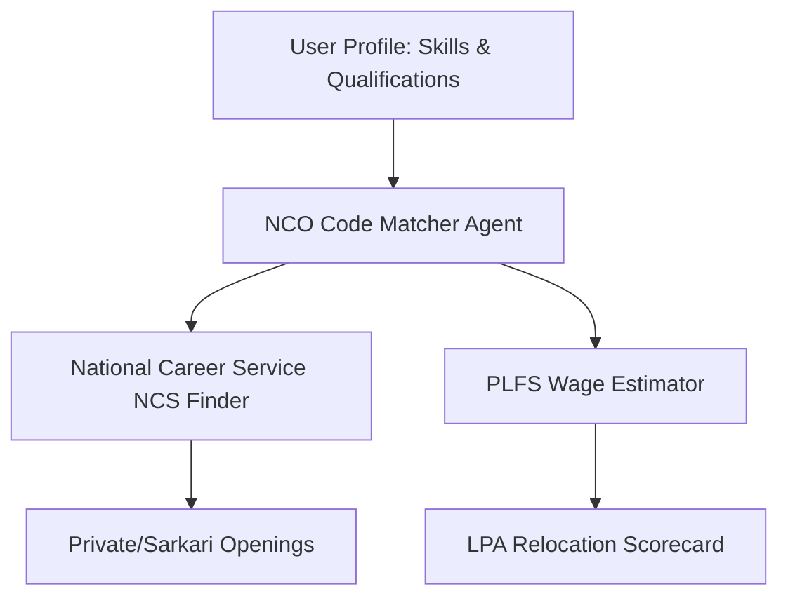

# Career Orchestrator Agents (India Edition)

LangGraph and multi-agent system architecture specifically customized for the Indian labor market, education system, cost of living, and environmental indexes.

---

### 1. Updated & Expanded Indian Knowledge Base Sources (Publicly Available)

| Platform / Source | Data Type | Ingestion Method | Update Frequency | **Official Website** |
|---|---|---|---|---|
| **National Career Service (NCS)** | Job profiles, NCO codes, state-wise trends, active job postings | API + Web Scrape | Real-time / Regular | [https://www.ncs.gov.in/](https://www.ncs.gov.in/) |
| **MoSPI PLFS (Periodic Labour Force Survey)** | Wages, employment/unemployment rates, demographic stats | Download PDF/XLSX | Quarterly / Annual | [https://mospi.gov.in/](https://mospi.gov.in/) |
| **National Classification of Occupations (NCO)** | Skill taxonomy, task breakdown, occupational classification | SQLite / PDF | Periodic | [https://www.ncs.gov.in/pages/nco.aspx](https://www.ncs.gov.in/pages/nco.aspx) |
| **Sarkari Result / Govt Portals** | Central/State Govt job notices, exams (UPSC, SSC, Banking) | Web Scrape / API | Daily | Official UPSC/SSC sites & Aggregators |
| **Naukri.com + Foundit** | Private sector job listings, active hiring trends | Scrape (ethical) / RSS | Daily | [https://www.naukri.com/](https://www.naukri.com/) • [https://www.foundit.in/](https://www.foundit.in/) |
| **AmbitionBox + Glassdoor India** | Company reviews, employee salary benchmarks in INR (LPA) | Web Scrape | Continuous | [https://www.ambitionbox.com/](https://www.ambitionbox.com/) |
| **NIRF (National Institutional Ranking Framework)** | Indian college/university rankings, placement stats, fees | Web Scrape / PDF | Annual | [https://www.nirfindia.org/](https://www.nirfindia.org/) |
| **CPCB Sameer (Central Pollution Control Board)** | City-wise Air Quality Index (AQI), PM2.5, PM10 levels | API / Web Scrape | Hourly | [https://cpcb.nic.in/](https://cpcb.nic.in/) |
| **NHB RESIDEX (National Housing Bank)** | Housing price index, rent indexes across 50+ major Indian cities | PDF / CSV | Quarterly | [https://nhb.org.in/residex/](https://nhb.org.in/residex/) |
| **RBI Database on Indian Economy** | Macroeconomic trends, inflation (CPI), salary growth indices | API / CSV | Monthly | [https://dbie.rbi.org.in/](https://dbie.rbi.org.in/) |
| **Tavily (Web Updater)** | Current hiring news, layoffs, startup funding trends | API | Real-time | [https://tavily.com/](https://tavily.com/) |

---

### 2. Detailed Agent List (India Customization)

| # | Agent / Team Name | Role & Responsibility | Data Sources Used | Priority | Tools / Capabilities |
|---|---|---|---|---|---|
| 1 | **Supervisor / Orchestrator Agent** | Query understanding, routing to appropriate Indian specialist agents | All agents + memory | Must | Planner, Router, State Manager |
| 2 | **NCO & Indian Skills Deep-Dive** | NCO-2015 codes, tasks, activities, qualification frameworks (NSQF) | NCO Database + NCS Portal | High | NCO Code Finder, Skill Mapper |
| 3 | **PLFS Economic & Wage Agent** | Indian wage percentiles, sector-wise salary data (INR LPA) | MoSPI PLFS + RBI + AmbitionBox | High | INR Salary Calculator, Percentile Tool |
| 4 | **Sarkari Exam & Govt Jobs Agent** | UPSC, SSC, Banking, PSU job schedules, syllabus, age limits | UPSC, SSC, IBPS web engines | High | Govt Exam Alert & Syllabus Parser |
| 5 | **Private Job Market & Naukri Agent** | Active IT/Non-IT private sector openings, remote trends in India | Naukri + LinkedIn India + Foundit | High | Live Job Search Tool |
| 6 | **NIRF Education & Placement Agent** | Indian colleges, placement packages, course fees, ROI analysis | NIRF + UGC + AICTE portal | High | NIRF Rank Matcher, College ROI tool |
| 7 | **India Location, Rent & AQI Agent** | City comparison, rent (NHB Residex), pollution (CPCB Sameer) | NHB Residex + CPCB API + Numbeo | High | Rent & AQI Comparator |
| 8 | **Indian Startup & VC Tracker Agent** | Startup hiring, funding rounds, ESOP benchmarks | Crunchbase + Tracxn + Entrackr | Medium | Funding & ESOP Valuer |
| 9 | **LPA Financial Switch Feasibility** | Tax calculator (New vs Old regime), relocation feasibility in India | Income Tax Dept data + Rent indices | High | Indian Tax & Savings Calculator |
| 10 | **Quality Assurance & Fact Checker** | Verify citations against MoSPI/CPCB/NCS data, avoid hallucinations | Retrospective data sources | Must | Self-Critique, Citation Verifier |

---

### 3. Advanced Complexity Features (India Production Level)

- **Tax Regime Optimizer**: Automatically calculates net take-home salary based on Old vs New Tax Regime for proposed relocation offers.
- **Metro Rent & Commute Estimator**: Uses NHB Residex paired with Google Maps/OLX data to estimate rent vs. travel time (e.g., PG vs 1BHK in Outer Ring Road Bangalore vs Noida Sector 62).
- **CPCB-Based Health Warning System**: Relocating to Delhi NCR triggers automatic pollution warnings using winter AQI averages.
- **NCO to O*NET Mapping Layer**: Converts Indian NCO codes to international SOC codes for global visa matching.

---

### 4. NCO Data Based Specialized Agents (Detailed)

Indian National Classification of Occupations (NCO) is the core standard. We detail 5 NCO-centric agents:



1. **NCO Occupation Classifier Agent**
   - **Role**: Matches user resume/skills to the closest NCO-2015 division/group/family code.
   - **Use Case**: *"I write Python scripts for biology data — what is my NCO code?"* (NCO Code: 2131.0201 - Bioinformatics Associate).

2. **NCS Job Profile Builder Agent**
   - **Role**: Details tasks, NSQF (National Skills Qualification Framework) levels, and standard licensing rules for India.
   - **Use Case**: *"What are the official licensing rules for an electrical engineer in India?"*

3. **Govt vs. Private Opportunity Agent**
   - **Role**: Computes whether the candidate's skills are in higher demand in PSUs/Govt sector or MNCs.
   - **Use Case**: *"Suggest SSC CGL post vs private IT job prospects based on current vacancies."*

4. **NIRF College Placement ROI Agent**
   - **Role**: Assesses if a college course is worth the fee based on average placement package.
   - **Use Case**: *"Is doing an MBA from Tier-2 Pune college at 15 Lakhs fees worth the 7 LPA average package?"*

---

### 5. NCO Based Agents — Query Input & Response (JSON Format)

#### Resume Parser & NCO Classifier Agent Input
```json
{
  "agent_name": "nco_classifier_agent",
  "skills": ["SQL", "Power BI", "Data Entry", "Excel"],
  "experience_years": 1.5,
  "user_location": "Delhi NCR",
  "request_id": "req_ind_001"
}
```

#### Resume Parser & NCO Classifier Agent Output
```json
{
  "agent_name": "nco_classifier_agent",
  "matched_nco_code": "2421.0101",
  "occupational_group": "Data Analysts / Business Analysts",
  "nsqf_level": 6,
  "typical_tasks": [
    "Identify data patterns and create interactive reports using Power BI",
    "Perform database queries using SQL for management reporting",
    "Maintain data integrity across spreadsheets"
  ],
  "confidence_score": 0.94,
  "sources": ["NCS NCO-2015 Directory"],
  "timestamp": "2026-07-05T03:00:00Z"
}
```

---

### 6. Personal Career Match Agent (India Example)

**Input (JSON):**
```json
{
  "agent_name": "personal_career_match_agent_india",
  "candidate_profile": {
    "user_id": "user_ind_456",
    "full_name": "Ananya Sen",
    "current_role": "Software Engineer 1",
    "current_salary_lpa": 8.5,
    "skills": ["Java", "Spring Boot", "MySQL", "Docker"],
    "preferences": {
      "preferred_locations": ["Bangalore", "Pune", "Hyderabad"],
      "minimum_salary_lpa": 14.0,
      "work_style": "Hybrid",
      "max_aqi_preference": 150
    }
  }
}
```

**Output (JSON):**
```json
{
  "agent_name": "personal_career_match_agent_india",
  "recommendations": [
    {
      "rank": 1,
      "role": "Backend Developer (SDE-2)",
      "match_score": 96,
      "nco_code": "2512.0201",
      "salary_range_lpa": {
        "p25": 12.0,
        "median": 15.5,
        "p75": 18.0
      },
      "location_metrics": {
        "city": "Bangalore",
        "average_rent_1bhk_or_pg": "INR 18,000 - 25,000 (ORR/Whitefield)",
        "annual_average_aqi": 85,
        "aqi_status": "Safe"
      },
      "tax_optimization": {
        "best_regime": "New Regime",
        "estimated_monthly_take_home": "INR 1,02,500"
      },
      "upskilling_needed": ["Kubernetes", "System Design"],
      "sources": ["AmbitionBox", "NHB Residex", "CPCB Sameer"]
    }
  ]
}
```

---

### 7. India Multi-Agent Career Advisor — 20 Questions & Answers

| No. | User Query | Sample System Response |
|---|---|---|
| 1 | What is the average package for SDE-1 in Bangalore? | AmbitionBox current index: **6 to 9 LPA** for freshers; Tier-1 product companies offer **18 to 28 LPA**. CPCB AQI: 85 (Moderate). |
| 2 | UPSC CSE Syllabus and eligibility rules? | NCS database: Age 21-32 years. Exam stages: Prelims, Mains, and Interview. Next schedule updates are pulled from UPSC site. |
| 3 | Is 12 LPA in Mumbai better than 9 LPA in Pune? | NHB Residex: Mumbai rent index is $2.4\times$ higher than Pune. 9 LPA in Pune yields ~20% higher monthly savings. |
| 4 | How to transition from manual testing to QA Automation in India? | NCS NCO transition: Master Selenium + Java/Python. AmbitionBox wage growth shows +45% increment post-transition. |
| 5 | What are the job prospects of B.Tech Biotech in India? | NCS trends: Research roles in Pune/Hyderabad biotech hubs. Average starting salary: **3.5 to 5 LPA**. |
| 6 | Gate Exam preparation syllabus for CS? | GATE CS syllabus: Algorithms, OS, DBMS, Networks, Math. Target standard PSU cut-offs (ONGC, IOCL). |
| 7 | H1B visa probability from Indian service companies? | Visa Agent: Reduced allocation; suggest direct product firms or L1 transfer routes. |
| 8 | Freelance web developer average rates in India? | Upwork/Fiverr India index: **INR 800 - INR 2,500/hour** based on portfolio size. |
| 9 | Average rent for 1BHK in Gurugram near Cyber City? | NHB Residex + MagicBricks: **INR 22,000 - INR 30,000/month**. AQI average: 180 (Poor). |
| 10 | High-growth green energy roles in India? | Solar design engineer, EV battery analyst (fastest growing). Median salary: **7 to 12 LPA**. |
| 11 | Bank PO vs Software Engineer career? | Bank PO: Job security, fixed hikes, rural postings. SE: High growth, location flexibility, market volatility. |
| 12 | Top MCA colleges in India with best placement? | NIRF: NIT Trichy, JNU, DU MCA placements average **8 to 11 LPA**. |
| 13 | Old vs New Tax regime choice for 15 LPA salary? | Savings check: If investments (80C, 80D, HRA) > 3.75 Lakhs, Old Regime is better. Else New Regime. |
| 14 | Average salary of Data Scientist with 3 YOE? | AmbitionBox: **12 to 18 LPA** in Bangalore/Gurugram. |
| 15 | AI/Automation risk for Indian BPO sector? | Risk Agent: 78% automation risk for voice roles. Reskill to Data Annotation or AI Operations. |
| 16 | Startup ESOP taxation rules in India? | Taxed as prerequisite at exercise time and Capital Gains at sale. |
| 17 | Semi-skilled wages in Maharashtra? | PLFS: State minimum wage index updated semi-annually. |
| 18 | Best certifications for AWS cloud in India? | AWS Solutions Architect Associate (adds 18% weight to resume). |
| 19 | Medical coding job requirements? | Graduate in Life Science/Pharmacy + CPC certification. |
| 20 | How to get a research fellowship (JRF) in India? | Qualify UGC-NET or CSIR-NET. Stipend: INR 37,000/month + HRA. |

---

### 8. India Relocation + Salary Comparison Datasets & Links

| Rank | Dataset / Source | What It Provides | Direct Link |
|---|---|---|---|
| 1 | **MoSPI Periodic Labour Force Survey** | Employment and salary distribution index | [https://mospi.gov.in/](https://mospi.gov.in/) |
| 2 | **NHB RESIDEX (National Housing Bank)** | Housing rent indices for Indian metros | [https://nhb.org.in/residex/](https://nhb.org.in/residex/) |
| 3 | **CPCB Sameer Air Quality** | Real-time Indian city AQI and particulate levels | [https://cpcb.nic.in/](https://cpcb.nic.in/) |
| 4 | **AmbitionBox Salary Explorer** | Crowd-sourced INR salaries by companies | [https://www.ambitionbox.com/](https://www.ambitionbox.com/) |
| 5 | **NIRF Higher Education Rankings** | Placement packages, rankings and college ROI | [https://www.nirfindia.org/](https://www.nirfindia.org/) |

---

### 9. Extended India Agent Ecosystem (30 Agents)

We scale the system into 10 specialized Teams under a Meta-Supervisor:

```
META SUPERVISOR (INDIA)
│
├── TEAM 1: ASSESSMENT & PROFILE
│   ├── Indian Resume Parser Agent
│   ├── ATS Resume Tailoring Agent
│   └── Career Fit RIASEC Agent
│
├── TEAM 2: SKILLS & CLASSIFICATION
│   ├── NCO Occupation Classifier Agent
│   ├── Skills Gap & NSQF Recommender
│   └── Task Breakdown Agent
│
├── TEAM 3: PRIVATE SECTOR JOBS
│   ├── Naukri & LinkedIn India Agent
│   ├── AmbitionBox Salary Benchmarker
│   └── Startup & VC Tracker Agent
│
├── TEAM 4: SARKARI & GOVT EXAMS
│   ├── UPSC & State PSC Schedule Agent
│   ├── SSC & Bank PO Syllabus Agent
│   └── PSU Direct Hiring Agent
│
├── TEAM 5: EDUCATION & CERTIFICATIONS
│   ├── NIRF Placement & College Agent
│   ├── Course Aggregator (Swayam / NPTEL)
│   └── Certification ROI Agent
│
├── TEAM 6: REGIONAL GEOGRAPHY & HEALTH
│   ├── Rent & NHB Residex Agent
│   ├── CPCB Pollution & Health Risk Agent
│   └── Climate & Weather Suitability Agent
│
├── TEAM 7: FINANCIAL SWITCH FEASIBILITY
│   ├── Indian Tax Regime Optimizer
│   ├── Relocation Net Savings Calculator
│   └── EPF & Gratuity Projection Agent
│
├── TEAM 8: NETWORKING & REFERRALS
│   ├── LinkedIn India Cold Outreach Agent
│   └── Alumni Network Referral Finder
│
├── TEAM 9: WELLNESS & WORKPLACE INCLUSION
│   ├── Work-Life Balance Scoring Agent
│   └── Disability Accommodation Finder
│
└── TEAM 10: QUALITY & INTEGRATION
    ├── Output Synthesizer (INR reports)
    └── Fact-Checker (MoSPI/CPCB validator)
```

---

### 10. India Data Ingestion Pipeline Architecture

```
RAW DATA INPUTS
│
├── NCO-2015 Classification ──► NCO Embedder ──► Qdrant (NCO Index)
├── PLFS Labor Survey ────────► PDF Extractor ─► Qdrant (PLFS Index)
├── AmbitionBox Scrapes ──────► CSV Parser ────► PostgreSQL (Salary Table)
├── NHB Residex Reports ──────► PDF Parser ────► PostgreSQL (Rent Index Table)
├── CPCB Sameer Feed ─────────► REST API ──────► InfluxDB (AQI Logs)
├── NIRF PDF Placements ──────► OCR Loader ────► Qdrant (Colleges Index)
└── Swayam/NPTEL Catalogs ────► Web Scrape ────► Qdrant (Courses Index)

RETRIEVAL LAYER
├── Qdrant (Semantic Search for Careers & Colleges)
├── Neo4j Knowledge Graph (Skills → NCO → Career Pathways)
└── PostgreSQL (Structured metrics — Salaries, Rents, Tax Regimes)
```

---

### 11. Sample End-to-End Query Flow (Indian Scenario)

**User Query**: *"I have 2.5 YOE in React & Node.js in Noida earning 6 LPA. Got a job offer in Bangalore for 12 LPA. Is it worth moving considering PG/rent, tax, and pollution differences?"*

```
1. [Supervisor] → Parsed goals: Noida vs Bangalore + 6 LPA to 12 LPA + Rent + Tax + AQI
2. PARALLEL RETRIEVAL:
   ├── [Rent Agent] → Fetch Noida Sector 62 rent (INR 12,000) vs Bangalore Outer Ring Road PG/1BHK rent (INR 22,000)
   ├── [Tax Agent] → Noida (6 LPA = Zero/minimal tax) vs Bangalore (12 LPA New Tax Regime = ~INR 90,000 tax)
   └── [CPCB Agent] → Noida AQI (190 average) vs Bangalore AQI (70 average)
3. CALCULATIONS:
   ├── Current Noida Savings = 6 LPA - (Rent + Food) = ~3.5 Lakhs net savings
   └── Proposed Bangalore Savings = 12 LPA - Tax (0.9L) - Rent (2.6L) - Food/COL (1.5L) = ~7 Lakhs net savings
4. COGNITIVE SYNTHESIS:
   - Financial: Net savings will double from 3.5L to 7L, fully justifying the move.
   - Health: Major upgrade in air quality (AQI drops from 190 to 70).
5. Output Generation → Side-by-side Noida vs Bangalore analysis with detailed cash flow tables.
```

---

### 12. Extended URL & Dataset Master Library (India)

#### Category A — Salary & Corporate Data
*   **MoSPI Periodic Labour Force Survey**: [https://mospi.gov.in/](https://mospi.gov.in/) (Wage distributions by state and rural/urban areas).
*   **AmbitionBox India Salaries**: [https://www.ambitionbox.com/salaries](https://www.ambitionbox.com/salaries) (Crowd-sourced salary benchmarks for 50k+ companies in India).
*   **Naukri Salary Explorer**: [https://www.naukri.com/](https://www.naukri.com/) (Hiring salary index reports).
*   **Levels.fyi India tech**: [https://www.levels.fyi/t/software-engineer/locations/india](https://www.levels.fyi/t/software-engineer/locations/india) (Engineering tier-based compensation).

#### Category B — Environmental & Living Data
*   **CPCB Sameer AQI Bulletin**: [https://cpcb.nic.in/national-air-quality-index/](https://cpcb.nic.in/national-air-quality-index/) (Hourly Air Quality Bulletin).
*   **NHB RESIDEX index**: [https://nhb.org.in/residex/](https://nhb.org.in/residex/) (Quarterly house price and rental metrics).
*   **Ministry of Consumer Affairs Price Monitoring**: [https://consumeraffairs.nic.in/](https://consumeraffairs.nic.in/) (Daily commodity price indexes).

#### Category C — Education & Placements
*   **NIRF Ranking India**: [https://www.nirfindia.org/](https://www.nirfindia.org/) (Official Higher Education Institution placements and parameter reports).
*   **Swayam Portal**: [https://swayam.gov.in/](https://swayam.gov.in/) (Free high-quality online courses by IITs and Central Universities).
*   **NPTEL Course Archive**: [https://nptel.ac.in/](https://nptel.ac.in/) (Engineering core courses lectures and cert guides).

---

### 13. Detailed Calculation of Cost of Living (COL) & Air Quality (AQI) Indexes for India

#### 1. COL Index (India Metro Weightages)

For Indian cities, standard basket calculations use weights adjusted to the local economy (lower transport weight, higher food & utility/education weight):

$$\text{COLI}_{\text{India}} = (0.35 \times \text{Rent}) + (0.32 \times \text{Groceries}) + (0.12 \times \text{Utilities}) + (0.11 \times \text{Restaurants}) + (0.10 \times \text{Transportation})$$

*Baseline City: New Delhi (assigned index value of 100).*

#### 2. Pollution (POL / AQI) Index for India

For environmental risk analysis, we map CPCB Sameer parameters (PM2.5, PM10, $NO_2$, $SO_2$) directly into the health warning index:

$$\text{Health Penalty Score} = \max(\text{PM2.5 AQI}, \text{PM10 AQI}) \times \left(1 + \frac{\text{Summer Temp Exceedance}}{100}\right)$$

*   **Score < 100**: Good / Satisfactory. No penalty to RWS.
*   **Score 100 - 200**: Moderate / Poor. Relocation warnings trigger for users specifying respiratory health preferences.
*   **Score > 300**: Severe. Relocation score penalized heavily.

---

### 14. ADDITIONAL KNOWLEDGE RESOURCES & PORTALS (INDIA)

| # | Portal / Source | Data Type | Purpose | URL |
|---|-----------------|-----------|---------|-----|
| 1 | **EPFO Payroll Statistics** | Monthly net payroll additions | Tracks hiring growth across sectors | [https://www.epfindia.gov.in/](https://www.epfindia.gov.in/) |
| 2 | **AISHE Portal** | Gross Enrollment Ratio, pupil ratios | Tracks higher education capacity & supply | [https://aishe.gov.in/](https://aishe.gov.in/) |
| 3 | **Startup India Hub** | Registered startup directory, VC schemes | Startup opportunities & compliance guides | [https://www.startupindia.gov.in/](https://www.startupindia.gov.in/) |
| 4 | **NITI Aayog SDG India** | State development index & growth metrics | Regional progress and infrastructure growth | [https://sdgindiaindex.niti.gov.in/](https://sdgindiaindex.niti.gov.in/) |
| 5 | **Skill India Digital** | Vocational courses, certification registry | PMKVY programs & trade skills database | [https://www.skillindiadigital.gov.in/](https://www.skillindiadigital.gov.in/) |
| 6 | **NCRB (National Crime Records)** | City-wise safety profiles and crime rates | Safest city recommendations for families | [https://ncrb.gov.in/](https://ncrb.gov.in/) |

---

### 15. MORE SCENARIOS & USE CASES (INDIA EDITION)

#### USE CASE 26 — Services MNC to Product Startup Transition
**Query:** *"I'm working as a Systems Engineer at Infosys earning 4.2 LPA with 3 YOE. I want to transition to a product startup for a higher package. How should I proceed and what salary can I ask?"*

| Step | Agent | Action | Output |
|------|-------|--------|--------|
| 1 | NCO Classifier | Map current profile to NCO group | System Engineer → NCO Code 2512.0201 |
| 2 | Skills Gap Agent | Match Java/Support skills vs Startup requirements | Gap identified: DSA, System Design, React/Node.js, AWS |
| 3 | AmbitionBox Agent | Benchmarks for 3 YOE Product Developer | Median Salary: **9 to 14 LPA** + ESOPs |
| 4 | Course Aggregator | Swayam & free resources roadmap | 6-month plan: NPTEL Data Structures, System Design docs, free Docker labs |
| 5 | Startup Tracker | Verify Series A/B startups hiring in Bangalore | Filter 12 matching active roles on Wellfound India |

---

#### USE CASE 27 — UPSC Aspirant Backup Career Plan
**Query:** *"I spent 3 years preparing for UPSC CSE and reached Mains twice but couldn't clear. I need a backup career in the private sector using my skills. What are my options?"*

| Step | Agent | Action | Output |
|------|-------|--------|--------|
| 1 | Profile Extractor | Extract transferable skills from UPSC prep | High capabilities in Policy Analysis, General Studies, Writing, Public Relations |
| 2 | NCO Classifier | Suggest matching corporate NCO profiles | Policy Analyst (2422.0101), Corporate Communications (2447.0201), ESG Specialist |
| 3 | Private Job Agent | Match with corporate roles on Naukri | 850+ open roles in ESG Consultation, Content Management, Policy Research |
| 4 | Education Agent | Suggest short-term bridge programs | Professional Cert in ESG (from IIMs), Technical Writing certs |
| 5 | Synthesizer | Career transition plan | 3-month transition map to Corporate ESG Consultant (starting at 6-8 LPA) |

---

#### USE CASE 28 — IT Relocation: South to North India
**Query:** *"I'm currently based in Bangalore earning 18 LPA. Got an offer of 21 LPA in Noida. Is the move worth it considering cost of living and lifestyle differences?"*

| Step | Agent | Action | Output |
|------|-------|--------|--------|
| 1 | Location Rent Agent | Fetch NHB Residex values | Bangalore rent (ORR): INR 25K/month vs Noida (Sec 62): INR 15K/month |
| 2 | Tax regime Agent | Calculate tax impact for both salaries | 18L New Regime Tax: ~1.8L vs 21L: ~2.4L |
| 3 | CPCB AQI Agent | Fetch annual average AQI index | Noida: 195 (Poor) vs Bangalore: 75 (Satisfactory) |
| 4 | Relocation Scorecard | Compute Relocation Wellness Score (RWS) | RWS drops due to severe winter pollution levels in Noida despite lower rent |
| 5 | Synthesizer | Relocation report | Recommendation: Decline unless offer is pushed to 24 LPA to offset AQI/health factor |

---

#### USE CASE 29 — Presumptive Taxation for Indian Freelancers
**Query:** *"I'm a freelance UI designer doing contracts worth 35 Lakhs/year from home. How much tax do I need to pay and under what sections?"*

| Step | Agent | Action | Output |
|------|-------|--------|--------|
| 1 | NCO Classifier | Match UI design to professional list | NCO Group: 2166 (Graphic and Multimedia Designers) |
| 2 | Tax regime Agent | Calculate tax under Section 44ADA | 44ADA allows paying tax on 50% of gross receipts (Taxable income = 17.5 Lakhs) |
| 3 | Tax regime Agent | Calculate Net Tax under New Regime | Tax on 17.5L: ~INR 1.65 Lakhs (Huge savings vs standard tax) |
| 4 | Course Aggregator | Business skills upskilling | Recommend basic bookkeeping & compliance courses on Swayam |

---

#### USE CASE 30 — Mechanical Engineer to EV / Automotive Pivot
**Query:** *"I have 4 YOE as a Mechanical Quality Engineer at Tata Motors in Pune earning 5.5 LPA. I want to shift to the Electric Vehicle (EV) division. What do I learn?"*

| Step | Agent | Action | Output |
|------|-------|--------|--------|
| 1 | NCO Classifier | Quality Engineer NCO mapping | Mechanical Engineer (2144.0101) |
| 2 | Skills Gap Agent | Match mechanical quality vs EV requirements | Gaps: Battery management system (BMS) modeling, MATLAB, EV regulations |
| 3 | Course Aggregator | EV specialized courses | IIT Madras NPTEL course in "Electric Vehicles" (free) |
| 4 | AmbitionBox Agent | EV engineer salary index in Pune | EV Engineers with 4 YOE earn **8 to 11 LPA** (High demand premium) |

---

### 16. DETAILED TAX & SAFETY CALCULATIONS (INDIA)

#### 1. Section 44ADA Presumptive Taxation Logic

For freelance and professional agents, the Net Taxable Income ($I_{\text{tax}}$) is computed automatically as:

$$I_{\text{tax}} = \begin{cases} 
      0.50 \times \text{Gross Receipts} & \text{if } \text{Gross Receipts} \le \text{INR 75,000,000} \\
      \text{Gross Receipts} - \text{Declared Expenses} & \text{if } \text{Gross Receipts} > \text{INR 75,000,000} 
   \end{cases}$$

#### 2. NCRB Safety Index Formulation

Safety parameters are integrated into the final Relocation Wellness Score using the National Crime Records Bureau (NCRB) city-wise profiles:

$$\text{Safety Index} = 100 - \left( 0.6 \times \text{Violent Crime Rate} + 0.4 \times \text{Property Crime Rate} \right) \times \text{Population Modifier}$$

*   **Safety Index > 80**: Excellent (Highly recommended for families).
*   **Safety Index < 50**: High caution flagged in final Synthesizer report.

---

## 17. MEGA EXPANSION — EXTENDED INDIA AGENT ECOSYSTEM (40+ TOTAL AGENTS)

---

### New India-Specific Agents (Additional 15 Agents)

| #  | Agent Name | Team | Role | Data Sources | Connects To |
|----|-----------|------|------|-------------|------------|
| 11 | **ATS Resume Optimizer (India)** | Profile Team | Resume optimize karna for Indian JDs — ATS score, Indian HR keywords | Naukri JDs + NCO Skills Database | Resume Parser, Naukri Job Search Agent |
| 12 | **Mock Interview India Agent** | Assessment Team | Indian tech + HR interview questions generate karna (DSA, STAR format, Case Study) | NCO Tasks + Naukri JDs + AmbitionBox review data | Career Pathway Agent |
| 13 | **Interview Feedback & Scoring Agent** | Assessment Team | Candidate answer evaluate karke STAR format feedback dena | Interview transcripts | Mock Interview Agent |
| 14 | **NIRF & Private College ROI Calculator** | Education Team | Course fee vs placement package ka ROI aur payback period | NIRF data + AISHE + AmbitionBox college reviews | Education Agent, Financial Agent |
| 15 | **Swayam/NPTEL Course Aggregator** | Education Team | Free government-certified courses by IIT/IIM find karna | Swayam API + NPTEL catalog | Skills Gap Agent, Certification ROI |
| 16 | **UGC-NET / CSIR-NET / GATE Prep Agent** | Sarkari Team | Research fellowship aur PSU exam tracking, syllabus, cutoffs | UGC, CSIR official portals + GATE notifications | Sarkari Exam Agent |
| 17 | **PSU & CPSE Direct Recruitment Agent** | Sarkari Team | BHEL, ONGC, NTPC, SAIL, ISRO recruitment tracking | Official PSU portals + UPSC special recruitment | Govt Jobs Agent |
| 18 | **Rural & Tier-3 City Career Agent** | Regional Team | PM Vishwakarma, PMEGP schemes, rural employment + MGNREGS data | Ministry of Rural Development + NSDC | Location Agent |
| 19 | **Startup ESOP & Equity Valuation Agent** | Finance Team | ESOP value estimation, dilution modeling, liquidity events | Tracxn + Entrackr + Crunchbase India | Startup Tracker Agent |
| 20 | **Income Tax Optimizer (Old vs New Regime)** | Finance Team | Exact take-home salary calculation with deductions, exemptions | Income Tax India portal + RBI CPI | Financial Feasibility Agent |
| 21 | **Housing Loan EMI & Affordability Agent** | Finance Team | Bank loan rates, EMI vs Rent comparison for metro relocation | RBI interest rates + NHB Residex + HDFC/SBI rates | Location Agent |
| 22 | **LinkedIn India Networking Agent** | Networking Team | Cold outreach templates, IIT/IIM alumni connection strategy | LinkedIn API + College alumni directory | Job Search Agent |
| 23 | **Mental Health & Burnout Risk Agent** | Wellness Team | Indian corporate culture burnout risk scoring using Glassdoor/AmbitionBox ratings | AmbitionBox + Glassdoor India reviews | Wellbeing Agent |
| 24 | **Disability & Inclusion (RPWD Act) Agent** | Inclusion Team | Disability-friendly roles, RPWD Act 2016 accommodations, central govt 4% reservation | Ministry of Social Justice + EEOC equivalent | Personal Career Match |
| 25 | **Women in Workforce Advisor Agent** | Inclusion Team | Maternity benefit tracking, POSH Act awareness, women-friendly company scoring | Ministry of Labour + AmbitionBox gender diversity filter | Wellbeing Agent |

**Grand Total: 40 Agents** across **12 Functional Teams**

---

### Complete India Agent Team Structure

```
META SUPERVISOR (INDIA)
│
├── TEAM 1: PROFILE & ASSESSMENT
│   ├── Indian Resume Parser Agent          [#R1]
│   ├── ATS Resume Optimizer India          [#11]
│   ├── Mock Interview India Agent          [#12]
│   ├── Interview Feedback & Scoring        [#13]
│   └── Personalization & User Profile      [#P1]
│
├── TEAM 2: SKILLS & NCO CLASSIFICATION
│   ├── NCO Occupation Classifier           [#2]
│   ├── Skills Gap & NSQF Recommender       [#S1]
│   ├── Task & Work Activity Breakdown      [#T1]
│   └── Career Fit RIASEC Agent             [#R2]
│
├── TEAM 3: PRIVATE SECTOR JOBS
│   ├── Naukri & LinkedIn India Agent       [#5]
│   ├── AmbitionBox Salary Benchmarker      [#3]
│   ├── Startup & VC Tracker Agent          [#8]
│   └── Remote India Opportunities Agent    [#Rm1]
│
├── TEAM 4: SARKARI & GOVT EXAMS
│   ├── UPSC & State PSC Schedule Agent     [#4]
│   ├── SSC & Bank PO Syllabus Agent        [#4b]
│   ├── PSU Direct Recruitment Agent        [#17]
│   └── UGC-NET / GATE / CSIR Agent         [#16]
│
├── TEAM 5: EDUCATION & CERTIFICATIONS
│   ├── NIRF College ROI Calculator         [#14]
│   ├── Swayam/NPTEL Course Aggregator      [#15]
│   └── Certification ROI Agent (India)     [#Cr1]
│
├── TEAM 6: REGIONAL & LOCATION
│   ├── India Rent & NHB Residex Agent      [#7]
│   ├── CPCB AQI & Pollution Agent          [#7b]
│   └── Rural & Tier-3 Career Agent         [#18]
│
├── TEAM 7: FINANCIAL & TAX
│   ├── Income Tax Optimizer Agent          [#20]
│   ├── LPA Financial Feasibility Agent     [#9]
│   ├── Housing Loan EMI Agent              [#21]
│   └── Startup ESOP Valuation Agent        [#19]
│
├── TEAM 8: NETWORKING & REFERRALS
│   ├── LinkedIn India Networking Agent     [#22]
│   └── Alumni Referral Finder             [#Net1]
│
├── TEAM 9: COMPANY & CULTURE
│   ├── AmbitionBox Culture & Review Agent  [#Co1]
│   └── Salary Negotiation (INR) Agent      [#Neg1]
│
├── TEAM 10: WELLNESS & INCLUSION
│   ├── Mental Health & Burnout Risk Agent  [#23]
│   ├── Disability & RPWD Act Agent         [#24]
│   └── Women in Workforce Advisor          [#25]
│
├── TEAM 11: TRENDS & GLOBAL MOBILITY
│   ├── India Automation Risk Agent         [#Tr1]
│   ├── International Career (India → Abroad) [#Gl1]
│   └── Live Data Updater (Tavily India)    [#Tv1]
│
└── TEAM 12: QUALITY & SYNTHESIS
    ├── Output Synthesizer (INR Reports)    [#Syn1]
    └── Fact-Checker (MoSPI/CPCB Validator) [#QA1]
```

---

### Full India Inter-Agent Connection Map

```
[User Input]
     │
     ▼
[Meta Supervisor (India)]
     │
     ├────────────────────────────────────────────┐
     │                                            │
     ▼                                            ▼
[Resume Parser]                         [NCO Classifier #2]
     │                                            │
     ├──► [ATS Optimizer #11]                     ├──► [RIASEC Agent]
     │         │                                  │         │
     │         └──► [Naukri Job Search #5]        │         └──► [Skills Gap Agent]
     │                    │                       │                    │
     │                    ▼                       │                    ▼
     │         [AmbitionBox Salary #3]            │         [Swayam/NPTEL Aggregator #15]
     │                    │                       │                    │
     │                    ▼                       │                    ▼
     │         [Salary Negotiation (INR)]         │         [NIRF College ROI #14]
     │                                            │
     ▼                                            ▼
[Mock Interview India #12]            [Income Tax Optimizer #20]
     │                                            │
     ▼                                            ▼
[Interview Feedback #13]              [LPA Financial Feasibility #9]
                                                  │
                                    ┌─────────────┤
                                    │             │
                                    ▼             ▼
                          [NHB Residex #7]  [CPCB AQI #7b]
                                    │
                                    ▼
                          [Relocation Wellness Score]
                                    │
                                    ▼
                          [OUTPUT SYNTHESIZER]
                                    │
                                    ▼
                          [FACT CHECKER (MoSPI/CPCB)]
                                    │
                                    ▼
                          [FINAL REPORT TO USER (INR)]
```

---

## 18. EXTENDED URL & DATASET MASTER LIBRARY (INDIA) — ALL CATEGORIES

### Category A — Salary, Compensation & Corporate Data

| # | Source | URL | What It Provides | Format | Agent(s) |
|---|--------|-----|-----------------|--------|---------|
| 1 | AmbitionBox Salaries | https://www.ambitionbox.com/salaries | Crowd-sourced INR LPA by company, role, YOE | Web Scrape | Salary Benchmarker |
| 2 | Naukri Salary Report | https://www.naukri.com/career-trends | Annual salary trend reports by sector | PDF/Web | Salary Benchmarker |
| 3 | Foundit India (Monster) | https://www.foundit.in/career-advice/salary-guide/ | Salary guide by experience + domain | Web | Salary Benchmarker |
| 4 | LinkedIn Salary India | https://www.linkedin.com/salary/ | Member-reported salaries in INR by company | Web | Negotiation Agent |
| 5 | Levels.fyi India | https://www.levels.fyi/t/software-engineer/locations/india | Compensation levels at Tier-1 MNCs in India | Web/JSON | Negotiation Agent |
| 6 | PLFS Annual Reports | https://mospi.gov.in/sites/default/files/publication_reports | Wage distribution quarterly PDF | PDF Download | PLFS Agent |
| 7 | RBI DBIE Wage Index | https://dbie.rbi.org.in/ | CPI wage deflator, macro salary trends | API/CSV | Financial Agent |
| 8 | Glassdoor India | https://www.glassdoor.co.in/Salaries/ | Salary, reviews, CEO ratings for India offices | Web Scrape | Culture Agent |
| 9 | PayScale India | https://www.payscale.com/research/IN/Country=India/Salary | Market-rate comparisons in INR | Web | Salary Benchmarker |
| 10 | H1B India Employer Data | https://h1bdata.info/ | Top Indian IT firms' H-1B salary certifications | CSV | Visa/Global Agent |

---

### Category B — Job Postings & Labor Demand (India)

| # | Source | URL | What It Provides | Format | Agent(s) |
|---|--------|-----|-----------------|--------|---------|
| 11 | Naukri.com | https://www.naukri.com/ | 100,000+ active Indian job postings | Web Scrape | Naukri Job Search |
| 12 | Foundit (Monster India) | https://www.foundit.in/ | IT + Non-IT job listings | Web Scrape | Naukri Job Search |
| 13 | Shine.com | https://www.shine.com/ | Specialized domain job listings | Web Scrape | Naukri Job Search |
| 14 | Hirist Tech Jobs | https://www.hirist.tech/ | Tech and developer specific India jobs | Web/API | Naukri Job Search |
| 15 | Instahyre | https://www.instahyre.com/ | AI-matched tech hiring India | Web | Naukri Job Search |
| 16 | Wellfound India | https://wellfound.com/india | Startup jobs + equity data | Web | Startup Tracker |
| 17 | NCS Job Portal | https://www.ncs.gov.in/Pages/JobSeeker.aspx | Government-registered job seeker portal | REST API | Sarkari + Private Agent |
| 18 | iimjobs.com | https://www.iimjobs.com/ | MBA & senior management roles | Web | Networking Agent |

---

### Category C — Government Exams & Public Sector Data

| # | Source | URL | What It Provides | Format | Agent(s) |
|---|--------|-----|-----------------|--------|---------|
| 19 | UPSC Official | https://www.upsc.gov.in/ | UPSC CSE, CDS, NDA exam notifications | Web Scrape | Sarkari Exam Agent |
| 20 | SSC Official | https://ssc.nic.in/ | SSC CGL, CHSL, JE examination schedules | Web Scrape | Sarkari Exam Agent |
| 21 | IBPS Official | https://www.ibps.in/ | Bank PO, Clerk, SO exam dates/syllabus | Web Scrape | Sarkari Exam Agent |
| 22 | RBI Grade B | https://opportunities.rbi.org.in/ | RBI direct recruitment notifications | Web Scrape | Sarkari Exam Agent |
| 23 | GATE IIT | https://gate2026.iitroorkee.ac.in/ | GATE schedule, syllabus, PSU cutoffs | Web/PDF | GATE Agent |
| 24 | UGC-NET Portal | https://ugcnet.nta.nic.in/ | JRF/Assistant Professor eligibility schedules | Web | Research Fellowship Agent |
| 25 | CSIR-NET | https://csirhrdg.res.in/ | CSIR research fellowship exam dates | Web | Research Fellowship Agent |
| 26 | PSU Vacancies | https://www.sarkariresult.com/psuvacancy/ | Aggregated PSU recruitment | Web Scrape | PSU Recruitment Agent |
| 27 | ISRO Careers | https://www.isro.gov.in/Careers.html | Space technology role recruitment | Web Scrape | PSU Recruitment Agent |

---

### Category D — Education, Colleges & Training (India)

| # | Source | URL | What It Provides | Format | Agent(s) |
|---|--------|-----|-----------------|--------|---------|
| 28 | NIRF Rankings | https://www.nirfindia.org/Rankings/2024/EngineeringRanking.html | Ranked institution placement outcomes | Web/PDF | NIRF ROI Agent |
| 29 | AISHE Data Portal | https://aishe.gov.in/aishe/home | Enrollment, faculty, discipline-wise stats | CSV | Education Agent |
| 30 | Swayam Government Courses | https://swayam.gov.in/ | Free certified MOOCs by IITs, IIMs | Web Scrape | Course Aggregator |
| 31 | NPTEL Course Library | https://nptel.ac.in/courses | 1500+ engineering and professional courses | Web | Course Aggregator |
| 32 | Skill India Digital | https://www.skillindiadigital.gov.in/ | PMKVY vocational certs + digital skills | Web | Vocational Skills Agent |
| 33 | NIOS Open Schooling | https://www.nios.ac.in/ | Secondary/Senior Secondary open learning | Web | Adult Education Agent |
| 34 | IIT Bombay Coursera | https://www.coursera.org/partners/iit-bombay | IIT partner courses on Coursera | REST API | Course Aggregator |
| 35 | edX India Courses | https://www.edx.org/learn/india | India-specific subject courses | REST API | Course Aggregator |

---

### Category E — Housing, Rent & Cost of Living (India)

| # | Source | URL | What It Provides | Format | Agent(s) |
|---|--------|-----|-----------------|--------|---------|
| 36 | NHB RESIDEX | https://nhb.org.in/residex/ | Quarterly housing price index 50+ cities | PDF/CSV | Location Agent |
| 37 | MagicBricks Rent Index | https://www.magicbricks.com/property-for-rent | Actual rental listings by city + locality | Web Scrape | Rent Agent |
| 38 | 99acres Rent Data | https://www.99acres.com/rent-property-in-india-ffid | Locality-wise rent comparison | Web Scrape | Rent Agent |
| 39 | Numbeo India Cities | https://www.numbeo.com/cost-of-living/country_result.jsp?country=India | COL index for 50+ Indian cities | JSON API | COL Calculator |
| 40 | Ministry of Consumer Affairs | https://consumeraffairs.nic.in/price-monitoring | Daily essential commodity prices | Web Scrape | COL Calculator |
| 41 | DIPP Cost of Living Reports | https://dipp.gov.in/ | Industrial zone living cost data | PDF | Regional COL Agent |

---

### Category F — Environment & Health (India)

| # | Source | URL | What It Provides | Format | Agent(s) |
|---|--------|-----|-----------------|--------|---------|
| 42 | CPCB Sameer App API | https://api.cpcb.nic.in | Real-time AQI, PM2.5 for 400+ Indian cities | REST API | AQI Agent |
| 43 | CPCB NAQI Bulletin | https://cpcb.nic.in/national-air-quality-index/ | Daily AQI summary reports | Web/PDF | AQI Agent |
| 44 | NCRB Annual Report | https://ncrb.gov.in/en/crime-in-india-year-2022-0 | City-wise crime rates + safety index | PDF/CSV | Safety Agent |
| 45 | WHO India Air Quality | https://www.who.int/india | Health guidelines + pollution health burden | PDF | Pollution Risk Agent |
| 46 | India Meteorological Dept | https://mausam.imd.gov.in/ | City climate + seasonal data | API | Climate Suitability Agent |
| 47 | Ministry of Jal Shakti | https://jalshakti-dowr.gov.in/ | Water quality standards by district | PDF | Environmental Risk Agent |

---

### Category G — Financial, Tax & Regulatory Data (India)

| # | Source | URL | What It Provides | Format | Agent(s) |
|---|--------|-----|-----------------|--------|---------|
| 48 | Income Tax India Portal | https://www.incometax.gov.in/ | Official tax calculator, section details | Web | Tax Optimizer Agent |
| 49 | RBI Repo Rate Tracker | https://www.rbi.org.in/scripts/BS_PressReleaseDisplay.aspx | Home loan base rate decisions | Web/PDF | EMI Calculator Agent |
| 50 | EPFO UAN Portal | https://unifiedportal-mem.epfindia.gov.in/ | EPF balance, withdrawal rules, interest rate | Web | EPF Projection Agent |
| 51 | PFRDA NPS Calculator | https://www.npstrust.org.in/ | NPS tier 1/2 returns projection | Web | Retirement Planning Agent |
| 52 | Gratuity & Bonus Rules | https://www.indiacode.nic.in/ | Payment of Gratuity Act provisions | PDF/Legal | Financial Feasibility Agent |
| 53 | GST Council Data | https://www.gst.gov.in/ | GST rates for services used by freelancers | Web | Freelance Tax Agent |

---

### Category H — Startups & Business (India)

| # | Source | URL | What It Provides | Format | Agent(s) |
|---|--------|-----|-----------------|--------|---------|
| 54 | Startup India DPIIT | https://www.startupindia.gov.in/ | DPIIT-registered startup directory | API/Web | Startup Tracker Agent |
| 55 | Tracxn India | https://tracxn.com/d/countries/startups-in-india | Funded Indian startup intelligence | Web | Startup Tracker Agent |
| 56 | Entrackr | https://entrackr.com/ | Indian startup news, funding rounds | Web | Startup Tracker Agent |
| 57 | SEBI BSE Listed Companies | https://www.bseindia.com/corporates/List_Scrips.aspx | Listed companies data for PSU/MNC tracking | CSV/API | Company Culture Agent |
| 58 | SBI MSME Data | https://sbi.co.in/web/business/msme | MSME loan rates, business scheme eligibility | Web | Entrepreneurship Agent |
| 59 | Invest India Database | https://www.investindia.gov.in/ | FDI sectors, industry opportunities | Web | Startup/Business Agent |

---

### Category I — Workforce Trends & India Labor Analytics

| # | Source | URL | What It Provides | Format | Agent(s) |
|---|--------|-----|-----------------|--------|---------|
| 60 | EPFO Payroll Statistics | https://www.epfindia.gov.in/site_en/Annual_Reports.php | Monthly formal employment trends | PDF | Trends Agent |
| 61 | CMIE CPHS India | https://www.cmie.com/kommon/bin/sr.php?kall=wsidisplaybulletin | India Consumer Pyramids Household Survey | Paid API | Trends Agent |
| 62 | TeamLease Employment Outlook | https://www.teamlease.com/business-outlook-salary-guide/ | Quarterly sector hiring forecasts | PDF | Trends Agent |
| 63 | NASSCOM Tech Talent Report | https://nasscom.in/ | India IT workforce stats, digital talent gap | PDF | Trends + Skills Gap |
| 64 | LinkedIn Workforce Insights India | https://economicgraph.linkedin.com/ | In-demand India skills from job postings | Reports | Trends Agent |
| 65 | Deloitte India Salary Survey | https://www2.deloitte.com/in/en.html | Annual compensation benchmarks | PDF | Salary Benchmarker |

---

### Category J — Wellness & Inclusion (India)

| # | Source | URL | What It Provides | Format | Agent(s) |
|---|--------|-----|-----------------|--------|---------|
| 66 | Ministry of Social Justice RPWD | https://socialjustice.gov.in/ | Disability reservation, RPWD Act 2016 | Web/PDF | Inclusion Agent |
| 67 | NALSA (Legal Services) | https://nalsa.gov.in/ | Free legal aid for underprivileged workers | Web | Inclusion Agent |
| 68 | Ministry of Women & Child Dev | https://wcd.nic.in/ | Maternity benefit policy, POSH guidelines | Web/PDF | Women Advisor Agent |
| 69 | Vandrevala Foundation | https://www.vandrevalafoundation.com/ | Mental health hotline data for employees | Web | Burnout Risk Agent |
| 70 | iCall (TISS) | https://icallhelpline.org/ | India workplace mental health counselling | Web | Burnout Risk Agent |

---

## 19. EXTENDED USE CASES — INDIA EDITION (20 MORE SCENARIOS)

### USE CASE 31 — Fresh B.Tech Graduate Career Direction (India)
**Query:** *"I just completed B.Tech in CSE from a Tier-2 college in Jaipur. No campus placement happened. I have Python and Java skills. What should I do next?"*

| Step | Agent | Action | Output |
|------|-------|--------|--------|
| 1 | Resume Parser | Parse skills + graduation profile | Python, Java, 0 YOE, Tier-2 college tag |
| 2 | NCO Classifier | Match skills to NCO entry-level roles | NCO 2512.0201 — Junior Software Developer |
| 3 | NIRF ROI Agent | Check Tier-2 college placements | Avg Jaipur Tier-2 placement: 3-4 LPA; product companies rare |
| 4 | Skills Gap Agent | DSA + System Design gaps identified | Requires LeetCode-level DSA, SQL, REST APIs |
| 5 | Swayam/NPTEL Agent | Build learning roadmap | NPTEL Java Certification + GATE prep if PSU interest |
| 6 | Naukri Job Search | Filter job portals for 0-1 YOE roles | Naukri: 3,400+ fresher Java/Python roles |
| 7 | Synthesizer | Comprehensive 6-month action plan | Month-by-month skill → apply → interview roadmap |

---

### USE CASE 32 — Data Analyst Career Growth in India
**Query:** *"I'm a Data Analyst with 2 YOE in Hyderabad earning 5.5 LPA. I want to switch to a product company and negotiate 10 LPA. Is it feasible?"*

| Step | Agent | Action | Output |
|------|-------|--------|--------|
| 1 | AmbitionBox Agent | Market rate for 2 YOE Data Analyst | Product companies offer 9-14 LPA in Hyderabad |
| 2 | Skills Gap Agent | Service vs product skill requirements | Need: Advanced SQL, Python ML libraries, Tableau/Power BI mastery |
| 3 | Naukri Job Search | Filter product company data analyst openings | 650+ product company openings in Hyderabad |
| 4 | ATS Optimizer | Rewrite resume for product JDs | ATS score 48/100 → 79/100 after optimization |
| 5 | Mock Interview | Generate product company analytical questions | Python + SQL + case study questions |
| 6 | Negotiation Agent | INR-based negotiation script | Counter from offered 8 LPA to 10 LPA with market data |

---

### USE CASE 33 — MBA Fresher vs. Work Experience Decision
**Query:** *"I have 2 YOE in finance. Should I do an MBA now from an IIM (20L fees) or work for 2 more years and then try for IIM? What is the better ROI?"*

| Step | Agent | Action | Output |
|------|-------|--------|--------|
| 1 | NIRF ROI Agent | IIM placement vs fees | IIM-A median salary: 33 LPA. Payback period: ~8 months |
| 2 | Financial Agent | 2-year work option income | 2 more years at 6 LPA = 12 LPA earned + experience premium |
| 3 | NIRF ROI Agent | Work experience impact on IIM admissions | 2+ YOE candidates score higher in PI rounds for top IIMs |
| 4 | Tax Agent | Post-MBA take-home comparison | 33 LPA new regime take-home: INR 2.1L/month |
| 5 | Synthesizer | Decision framework | Work 2 years → IIM with stronger profile → 26% better average package |

---

### USE CASE 34 — GATE to PSU Salary Comparison
**Query:** *"I scored GATE rank 850 in EC. Should I join BSNL/ONGC/BHEL or target Infosys/TCS instead? Which gives better life quality?"*

| Step | Agent | Action | Output |
|------|-------|--------|--------|
| 1 | GATE Agent | GATE rank 850 EC eligible PSUs | BHEL cutoff EC: ~800. ONGC: ~500. BSNL: may accept |
| 2 | PSU Recruitment Agent | PSU starting salary vs IT companies | BHEL starting: 8-9 LPA (with DA/HRA). TCS: 3.5-6 LPA |
| 3 | Financial Agent | PSU perks vs private salary comparison | PSU: housing allotment, medical, pension. Total = 12 LPA equivalent |
| 4 | Wellbeing Agent | Work-life balance score | PSU: 8/10. TCS: 5/10 (project dependent) |
| 5 | Synthesizer | Comparative report | For work-life balance + long-term security: PSU recommended |

---

### USE CASE 35 — Remote Work Career from Tier-3 City
**Query:** *"I live in Ranchi and can't relocate. I have React.js skills. Can I earn 8-10 LPA remotely from home?"*

| Step | Agent | Action | Output |
|------|-------|--------|--------|
| 1 | Skills Gap Agent | React.js skill level evaluation | Core skills OK; need TypeScript, Next.js, REST API skills |
| 2 | Naukri Job Search | Remote-only React.js jobs | Naukri: 1,200+ remote React positions; median remote React salary: 7-12 LPA |
| 3 | COL Calculator | Ranchi COL vs Bangalore | Ranchi COL index ~60 vs Bangalore ~100; 8 LPA in Ranchi = 14 LPA equivalent purchasing power |
| 4 | Freelance Agent | Alternative: Freelance path | Upwork React.js rate: $25-60/hr = INR 2.5-6 Lakhs/month at 40hr/week |
| 5 | Synthesizer | Remote career plan | 6-month roadmap: skills + portfolio + remote job applications |

---

### USE CASE 36 — Career Change: Teacher to EdTech
**Query:** *"I'm a school Mathematics teacher with 6 years experience earning INR 35,000/month. I want to join an EdTech company in a content or academic role. How?"*

| Step | Agent | Action | Output |
|------|-------|--------|--------|
| 1 | NCO Classifier | Teacher NCO mapping | Secondary Teacher → NCO 2321.0101 |
| 2 | Skills Matcher | Teaching skills → EdTech corporate roles | Curriculum Design, Content Writing, Academic Operations |
| 3 | Naukri Job Search | EdTech content roles | Byju's, Unacademy, PW hiring: 4-7 LPA academic content managers |
| 4 | ATS Optimizer | Reframe teaching resume for EdTech JD | "Curriculum design for 500+ students" → "Content development at scale" |
| 5 | Skills Gap Agent | Missing skills for EdTech | Articulate 360 / basic LMS tools, data analytics basics |
| 6 | Swayam Agent | Free courses to bridge gap | Swayam: Educational Technology & Instructional Design course |

---

### USE CASE 37 — NRI Return to India Career Planning
**Query:** *"I've been working in the UK as a Product Manager for 4 years. I want to return to India. What should I expect in terms of salary and career scope?"*

| Step | Agent | Action | Output |
|------|-------|--------|--------|
| 1 | AmbitionBox Agent | India PM salary for 4 YOE | Senior PM in Bangalore/Mumbai: 22-35 LPA |
| 2 | NIRF/MNC Agent | Top India product companies hiring PMs | Meesho, Razorpay, Zepto, Swiggy, Amazon India active hiring |
| 3 | COL Calculator | UK salary vs India equivalent | £70K UK = INR 75 Lakhs. India equivalent purchasing power at 25 LPA |
| 4 | Tax Agent | NRI return taxation rules | RNOR status 2 years = overseas income tax-exempt in India |
| 5 | Location Agent | Best Indian city for PM roles | Bangalore: highest PM demand + good startup culture + AQI manageable |

---

### USE CASE 38 — India Salary Negotiation Strategy
**Query:** *"I have an offer of 12 LPA from a mid-size fintech in Pune. My current CTC is 8 LPA. I have 3 YOE in backend engineering. How do I negotiate to 15 LPA?"*

| Step | Agent | Action | Output |
|------|-------|--------|--------|
| 1 | AmbitionBox Agent | Fintech backend engineer 3 YOE Pune | Median: 13-16 LPA. Offer of 12 LPA is below market |
| 2 | Negotiation Agent | Gap analysis | 12 LPA vs 13 LPA median = ₹1 Lakh below midpoint — strong negotiation case |
| 3 | Tax Agent | Take-home comparison 12L vs 15L | Net monthly take-home difference: INR ~19,000/month |
| 4 | Negotiation Agent | INR negotiation script | "Based on my research on AmbitionBox for Pune fintech backend engineers with 3 YOE, the market rate is 14-16 LPA. I'd like to discuss 15 LPA." |
| 5 | Negotiation Agent | Alternative asks | Variable pay increase, WFH 3 days/week, faster appraisal cycle |

---

### USE CASE 39 — Freelancer → Full-Time: Tax & Career Shift
**Query:** *"I've been freelancing as a content writer for 3 years earning INR 6 Lakhs/year. I want to join a full-time company. What package should I expect and how do taxes change?"*

| Step | Agent | Action | Output |
|------|-------|--------|--------|
| 1 | NCO Classifier | Freelance content writer NCO | NCO 2641.0102 — Content Writer / Technical Author |
| 2 | AmbitionBox Agent | Full-time content writer salary | 3 YOE: 4-7 LPA in editorial/content roles. Senior = 7-10 LPA |
| 3 | Tax Agent | Compare freelance 44ADA vs salaried | Freelance 44ADA: Tax on 3L = ~20K. Salaried 6 LPA = same range. No major tax shock |
| 4 | Financial Agent | Benefits gained in full-time | PF (12% employer contribution), HRA benefit, health insurance (~INR 1.5L extra value) |
| 5 | Synthesizer | Decision matrix | Full-time at 7 LPA + benefits = ~9 LPA equivalent total compensation |

---

### USE CASE 40 — EV Market Career Planning
**Query:** *"I'm an Electronics Engineer (3 YOE at Bosch) interested in the Electric Vehicle boom in India. What roles should I target and what is the growth trajectory?"*

| Step | Agent | Action | Output |
|------|-------|--------|--------|
| 1 | NCO Classifier | Electronics Engineer NCO | NCO 2151.0101 — Electronics and Telecom Engineer |
| 2 | Trends Agent | India EV sector growth | India EV market growing 49% CAGR. Tata, Ola Electric, Ather hiring aggressively |
| 3 | Skills Gap Agent | Bosch skills vs EV requirements | Need: BMS (Battery Management Systems), CAN Bus protocols, AUTOSAR |
| 4 | NPTEL Agent | EV-specific free courses | NPTEL "Electric Vehicles and its Technology" by IIT Delhi |
| 5 | AmbitionBox Agent | EV engineer salary trajectory | EV Engineer 3 YOE: 8-12 LPA. With BMS skills: 12-18 LPA |
| 6 | Synthesizer | 1-year EV career pivot plan | Certification path + target companies (Ola Electric, Tata Motors EV, Ather Energy) |

---

### USE CASE 41 — First Job Abroad from India (H-1B Planning)
**Query:** *"I'm a 5 YOE software engineer at Wipro. I want to go to the USA. What are realistic options and what is the path?"*

| Step | Agent | Action | Output |
|------|-------|--------|--------|
| 1 | NCO Classifier | Wipro engineer → SOC mapping | Software Developer — SOC Code 15-1252.00 |
| 2 | Visa Agent | H-1B sponsorship probability | Service companies: 30-40% lottery odds. Product companies: Higher internal transfer (L-1) success |
| 3 | Skills Gap Agent | Wipro service to US product gap | Need: System design, DSA level, cloud architecture (AWS/GCP) |
| 4 | Negotiation Agent | USA salary benchmarking | US entry SDE-2: $130-160K. Wipro equivalent US bench: $90-110K |
| 5 | Synthesizer | USA transition roadmap | Path 1: Internal L-1 transfer (3-5 years). Path 2: Product company direct H-1B (skills upgrade needed) |

---

### USE CASE 42 — Career After Defense Services (Ex-Serviceman)
**Query:** *"I retired as an Army Major after 20 years. I'm 44 years old. What are my corporate career options and government benefits?"*

| Step | Agent | Action | Output |
|------|-------|--------|--------|
| 1 | NCO Classifier | Army Major civilian skill map | Leadership, Operations Management, Crisis Management, Logistics — NCO 1120 |
| 2 | PSU Recruitment | Ex-serviceman reservation in PSUs | SAIL, BEL, DRDO ex-serviceman horizontal quota opportunities |
| 3 | Private Job Agent | Corporate equivalent roles | Supply Chain Manager, Operations Head, Security Consultant, Corporate Trainer |
| 4 | Education Agent | Bridge programs for defense professionals | IIM Executive Programs for Defence Officers (subsidized via ministry) |
| 5 | Financial Agent | Pension + Corporate salary optimization | Army pension + 12 LPA corporate = effective 20 LPA equivalent |

---

### USE CASE 43 — Women Returning to Workforce Post Maternity
**Query:** *"I took 3 years off for maternity and childcare. I was a Marketing Manager before. How do I re-enter and negotiate equal pay?"*

| Step | Agent | Action | Output |
|------|-------|--------|--------|
| 1 | Resume Parser | Parse pre-gap marketing resume | Identify 7 YOE: Digital campaigns, brand management, SEO/SEM |
| 2 | Women Advisor Agent | Maternity benefit rights, returnship programs | Tata Group, Accenture, Deloitte India have formal returnship programs |
| 3 | Skills Gap Agent | Marketing tool evolution during 3-year gap | GA4, Meta Ads Manager v2, AI content tools (ChatGPT for marketing) |
| 4 | ATS Optimizer | Frame maternity gap positively | "Strategic career pause to develop family leadership skills" framing |
| 5 | Negotiation Agent | Equal pay rights under Equal Remuneration Act | Reference Equal Remuneration Act + AmbitionBox market data for 7 YOE marketing |

---

### USE CASE 44 — AI Automation Risk for Indian BPO Worker
**Query:** *"I work in a voice BPO earning INR 20,000/month. I hear AI is going to replace our jobs. What should I do?"*

| Step | Agent | Action | Output |
|------|-------|--------|--------|
| 1 | Trends Agent | BPO voice role automation risk | 85% automation risk within 5 years for basic voice support |
| 2 | Skills Gap Agent | Safe adjacent skills in BPO domain | Data Annotation, AI Operations, Quality Assurance Testing, Tech Support (Tier 2) |
| 3 | Swayam Agent | Free reskilling resources | Skill India Digital: Free AI fundamentals certificate (NSQF Level 4) |
| 4 | Naukri Agent | New adjacent roles salary | Data Annotator: INR 25,000-40,000/month. AI Trainer: INR 35,000-55,000/month |
| 5 | Synthesizer | 6-month reskilling + transition plan | Week-by-week action steps with free learning + job application targets |

---

### USE CASE 45 — India IT → Core Engineering Re-entry
**Query:** *"I am a Mechanical Engineer who joined TCS for 4 years (IT). Now I want to go back to core mechanical. Is it possible and what is the salary penalty?"*

| Step | Agent | Action | Output |
|------|-------|--------|--------|
| 1 | NCO Classifier | TCS IT vs core mechanical NCO | IT: NCO 2512. Mechanical core: NCO 2144 |
| 2 | Skills Gap Agent | Core mechanical technical freshness | CAD/CAM, GD&T, FMEA, Lean Six Sigma — likely dulled over 4 IT years |
| 3 | AmbitionBox Agent | Core mechanical 4 YOE salary | Core mfg sector: 5-8 LPA vs IT: 8-12 LPA |
| 4 | NPTEL Agent | Bridge courses for core mechanical | NPTEL: Advanced Manufacturing Processes, Finite Element Analysis (free) |
| 5 | Synthesizer | Decision framework | 20-30% salary drop initially but long-term trajectory can surpass IT for managerial tracks |

---

## 20. INDIA-SPECIFIC COMPLETE SYSTEM SUMMARY

| Dimension | Count / Detail |
|-----------|---------------|
| **Total India Agents** | 40 (1 Meta-Supervisor + 39 Specialists) |
| **Agent Teams** | 12 Functional Teams |
| **Data Sources** | 70+ URLs across 10 India categories |
| **Core Knowledge Databases** | NCO-2015, PLFS, NHB RESIDEX, CPCB, NIRF, Swayam, NPTEL |
| **Vector Stores** | 8 (NCO, PLFS, Jobs, Colleges, Salary, Culture, AQI, Govt Exams) |
| **Structured DBs** | PostgreSQL (Salary-INR, Rent Index, Tax Data), InfluxDB (AQI time series), Redis (cache) |
| **LLMs Supported** | Groq (LLaMA 3), Gemini 2.5 Flash, Anthropic Claude |
| **Use Cases Documented** | 20 India-specific scenarios (UC26 to UC45) |
| **Output Currency** | Always INR (Lakhs Per Annum / Per Month) |
| **Regulatory Frameworks** | RPWD Act, Equal Remuneration Act, Maternity Benefit Act, IT Act |
| **Deployment Stack** | FastAPI + LangGraph + Docker + AWS Mumbai region |


