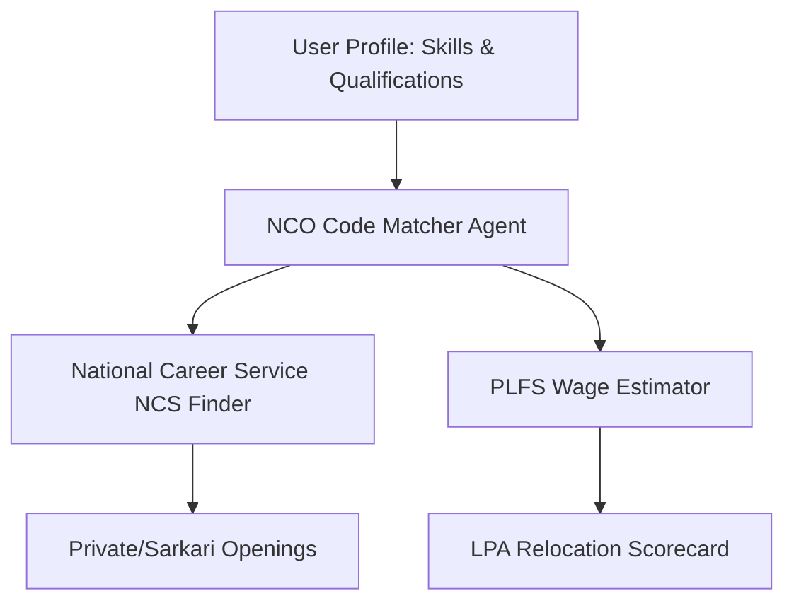

# Career Orchestrator Agents (India Edition)

LangGraph and multi-agent system architecture specifically customized for the Indian labor market, education system, cost of living, and environmental indexes.

---

### 1. Updated & Expanded Indian Knowledge Base Sources (Publicly Available)

| Platform / Source | Data Type | Ingestion Method | Update Frequency | **Official Website** |
|---|---|---|---|---|
| **National Career Service (NCS)** | Job profiles, NCO codes, state-wise trends, active job postings | API + Web Scrape | Real-time / Regular | [https://www.ncs.gov.in/](https://www.ncs.gov.in/) |
| **MoSPI PLFS (Periodic Labour Force Survey)** | Wages, employment/unemployment rates, demographic stats | Download PDF/XLSX | Quarterly / Annual | [https://mospi.gov.in/](https://mospi.gov.in/) |
| **National Classification of Occupations (NCO)** | Skill taxonomy, task breakdown, occupational classification | SQLite / PDF | Periodic | [https://www.ncs.gov.in/pages/nco.aspx](https://www.ncs.gov.in/pages/nco.aspx) |
| **Sarkari Result / Govt Portals** | Central/State Govt job notices, exams (UPSC, SSC, Banking) | Web Scrape / API | Daily | Official UPSC/SSC sites & Aggregators |
| **Naukri.com + Foundit** | Private sector job listings, active hiring trends | Scrape (ethical) / RSS | Daily | [https://www.naukri.com/](https://www.naukri.com/) • [https://www.foundit.in/](https://www.foundit.in/) |
| **AmbitionBox + Glassdoor India** | Company reviews, employee salary benchmarks in INR (LPA) | Web Scrape | Continuous | [https://www.ambitionbox.com/](https://www.ambitionbox.com/) |
| **NIRF (National Institutional Ranking Framework)** | Indian college/university rankings, placement stats, fees | Web Scrape / PDF | Annual | [https://www.nirfindia.org/](https://www.nirfindia.org/) |
| **CPCB Sameer (Central Pollution Control Board)** | City-wise Air Quality Index (AQI), PM2.5, PM10 levels | API / Web Scrape | Hourly | [https://cpcb.nic.in/](https://cpcb.nic.in/) |
| **NHB RESIDEX (National Housing Bank)** | Housing price index, rent indexes across 50+ major Indian cities | PDF / CSV | Quarterly | [https://nhb.org.in/residex/](https://nhb.org.in/residex/) |
| **RBI Database on Indian Economy** | Macroeconomic trends, inflation (CPI), salary growth indices | API / CSV | Monthly | [https://dbie.rbi.org.in/](https://dbie.rbi.org.in/) |
| **Tavily (Web Updater)** | Current hiring news, layoffs, startup funding trends | API | Real-time | [https://tavily.com/](https://tavily.com/) |

---

### 2. Detailed Agent List (India Customization)

| # | Agent / Team Name | Role & Responsibility | Data Sources Used | Priority | Tools / Capabilities |
|---|---|---|---|---|---|
| 1 | **Supervisor / Orchestrator Agent** | Query understanding, routing to appropriate Indian specialist agents | All agents + memory | Must | Planner, Router, State Manager |
| 2 | **NCO & Indian Skills Deep-Dive** | NCO-2015 codes, tasks, activities, qualification frameworks (NSQF) | NCO Database + NCS Portal | High | NCO Code Finder, Skill Mapper |
| 3 | **PLFS Economic & Wage Agent** | Indian wage percentiles, sector-wise salary data (INR LPA) | MoSPI PLFS + RBI + AmbitionBox | High | INR Salary Calculator, Percentile Tool |
| 4 | **Sarkari Exam & Govt Jobs Agent** | UPSC, SSC, Banking, PSU job schedules, syllabus, age limits | UPSC, SSC, IBPS web engines | High | Govt Exam Alert & Syllabus Parser |
| 5 | **Private Job Market & Naukri Agent** | Active IT/Non-IT private sector openings, remote trends in India | Naukri + LinkedIn India + Foundit | High | Live Job Search Tool |
| 6 | **NIRF Education & Placement Agent** | Indian colleges, placement packages, course fees, ROI analysis | NIRF + UGC + AICTE portal | High | NIRF Rank Matcher, College ROI tool |
| 7 | **India Location, Rent & AQI Agent** | City comparison, rent (NHB Residex), pollution (CPCB Sameer) | NHB Residex + CPCB API + Numbeo | High | Rent & AQI Comparator |
| 8 | **Indian Startup & VC Tracker Agent** | Startup hiring, funding rounds, ESOP benchmarks | Crunchbase + Tracxn + Entrackr | Medium | Funding & ESOP Valuer |
| 9 | **LPA Financial Switch Feasibility** | Tax calculator (New vs Old regime), relocation feasibility in India | Income Tax Dept data + Rent indices | High | Indian Tax & Savings Calculator |
| 10 | **Quality Assurance & Fact Checker** | Verify citations against MoSPI/CPCB/NCS data, avoid hallucinations | Retrospective data sources | Must | Self-Critique, Citation Verifier |

---

### 3. Advanced Complexity Features (India Production Level)

- **Tax Regime Optimizer**: Automatically calculates net take-home salary based on Old vs New Tax Regime for proposed relocation offers.
- **Metro Rent & Commute Estimator**: Uses NHB Residex paired with Google Maps/OLX data to estimate rent vs. travel time (e.g., PG vs 1BHK in Outer Ring Road Bangalore vs Noida Sector 62).
- **CPCB-Based Health Warning System**: Relocating to Delhi NCR triggers automatic pollution warnings using winter AQI averages.
- **NCO to O*NET Mapping Layer**: Converts Indian NCO codes to international SOC codes for global visa matching.

---

### 4. NCO Data Based Specialized Agents (Detailed)

Indian National Classification of Occupations (NCO) is the core standard. We detail 5 NCO-centric agents:



1. **NCO Occupation Classifier Agent**
   - **Role**: Matches user resume/skills to the closest NCO-2015 division/group/family code.
   - **Use Case**: *"I write Python scripts for biology data — what is my NCO code?"* (NCO Code: 2131.0201 - Bioinformatics Associate).

2. **NCS Job Profile Builder Agent**
   - **Role**: Details tasks, NSQF (National Skills Qualification Framework) levels, and standard licensing rules for India.
   - **Use Case**: *"What are the official licensing rules for an electrical engineer in India?"*

3. **Govt vs. Private Opportunity Agent**
   - **Role**: Computes whether the candidate's skills are in higher demand in PSUs/Govt sector or MNCs.
   - **Use Case**: *"Suggest SSC CGL post vs private IT job prospects based on current vacancies."*

4. **NIRF College Placement ROI Agent**
   - **Role**: Assesses if a college course is worth the fee based on average placement package.
   - **Use Case**: *"Is doing an MBA from Tier-2 Pune college at 15 Lakhs fees worth the 7 LPA average package?"*

---

### 5. NCO Based Agents — Query Input & Response (JSON Format)

#### Resume Parser & NCO Classifier Agent Input
```json
{
  "agent_name": "nco_classifier_agent",
  "skills": ["SQL", "Power BI", "Data Entry", "Excel"],
  "experience_years": 1.5,
  "user_location": "Delhi NCR",
  "request_id": "req_ind_001"
}
```

#### Resume Parser & NCO Classifier Agent Output
```json
{
  "agent_name": "nco_classifier_agent",
  "matched_nco_code": "2421.0101",
  "occupational_group": "Data Analysts / Business Analysts",
  "nsqf_level": 6,
  "typical_tasks": [
    "Identify data patterns and create interactive reports using Power BI",
    "Perform database queries using SQL for management reporting",
    "Maintain data integrity across spreadsheets"
  ],
  "confidence_score": 0.94,
  "sources": ["NCS NCO-2015 Directory"],
  "timestamp": "2026-07-05T03:00:00Z"
}
```

---

### 6. Personal Career Match Agent (India Example)

**Input (JSON):**
```json
{
  "agent_name": "personal_career_match_agent_india",
  "candidate_profile": {
    "user_id": "user_ind_456",
    "full_name": "Ananya Sen",
    "current_role": "Software Engineer 1",
    "current_salary_lpa": 8.5,
    "skills": ["Java", "Spring Boot", "MySQL", "Docker"],
    "preferences": {
      "preferred_locations": ["Bangalore", "Pune", "Hyderabad"],
      "minimum_salary_lpa": 14.0,
      "work_style": "Hybrid",
      "max_aqi_preference": 150
    }
  }
}
```

**Output (JSON):**
```json
{
  "agent_name": "personal_career_match_agent_india",
  "recommendations": [
    {
      "rank": 1,
      "role": "Backend Developer (SDE-2)",
      "match_score": 96,
      "nco_code": "2512.0201",
      "salary_range_lpa": {
        "p25": 12.0,
        "median": 15.5,
        "p75": 18.0
      },
      "location_metrics": {
        "city": "Bangalore",
        "average_rent_1bhk_or_pg": "INR 18,000 - 25,000 (ORR/Whitefield)",
        "annual_average_aqi": 85,
        "aqi_status": "Safe"
      },
      "tax_optimization": {
        "best_regime": "New Regime",
        "estimated_monthly_take_home": "INR 1,02,500"
      },
      "upskilling_needed": ["Kubernetes", "System Design"],
      "sources": ["AmbitionBox", "NHB Residex", "CPCB Sameer"]
    }
  ]
}
```

---

### 7. India Multi-Agent Career Advisor — 20 Questions & Answers

| No. | User Query | Sample System Response |
|---|---|---|
| 1 | What is the average package for SDE-1 in Bangalore? | AmbitionBox current index: **6 to 9 LPA** for freshers; Tier-1 product companies offer **18 to 28 LPA**. CPCB AQI: 85 (Moderate). |
| 2 | UPSC CSE Syllabus and eligibility rules? | NCS database: Age 21-32 years. Exam stages: Prelims, Mains, and Interview. Next schedule updates are pulled from UPSC site. |
| 3 | Is 12 LPA in Mumbai better than 9 LPA in Pune? | NHB Residex: Mumbai rent index is $2.4\times$ higher than Pune. 9 LPA in Pune yields ~20% higher monthly savings. |
| 4 | How to transition from manual testing to QA Automation in India? | NCS NCO transition: Master Selenium + Java/Python. AmbitionBox wage growth shows +45% increment post-transition. |
| 5 | What are the job prospects of B.Tech Biotech in India? | NCS trends: Research roles in Pune/Hyderabad biotech hubs. Average starting salary: **3.5 to 5 LPA**. |
| 6 | Gate Exam preparation syllabus for CS? | GATE CS syllabus: Algorithms, OS, DBMS, Networks, Math. Target standard PSU cut-offs (ONGC, IOCL). |
| 7 | H1B visa probability from Indian service companies? | Visa Agent: Reduced allocation; suggest direct product firms or L1 transfer routes. |
| 8 | Freelance web developer average rates in India? | Upwork/Fiverr India index: **INR 800 - INR 2,500/hour** based on portfolio size. |
| 9 | Average rent for 1BHK in Gurugram near Cyber City? | NHB Residex + MagicBricks: **INR 22,000 - INR 30,000/month**. AQI average: 180 (Poor). |
| 10 | High-growth green energy roles in India? | Solar design engineer, EV battery analyst (fastest growing). Median salary: **7 to 12 LPA**. |
| 11 | Bank PO vs Software Engineer career? | Bank PO: Job security, fixed hikes, rural postings. SE: High growth, location flexibility, market volatility. |
| 12 | Top MCA colleges in India with best placement? | NIRF: NIT Trichy, JNU, DU MCA placements average **8 to 11 LPA**. |
| 13 | Old vs New Tax regime choice for 15 LPA salary? | Savings check: If investments (80C, 80D, HRA) > 3.75 Lakhs, Old Regime is better. Else New Regime. |
| 14 | Average salary of Data Scientist with 3 YOE? | AmbitionBox: **12 to 18 LPA** in Bangalore/Gurugram. |
| 15 | AI/Automation risk for Indian BPO sector? | Risk Agent: 78% automation risk for voice roles. Reskill to Data Annotation or AI Operations. |
| 16 | Startup ESOP taxation rules in India? | Taxed as prerequisite at exercise time and Capital Gains at sale. |
| 17 | Semi-skilled wages in Maharashtra? | PLFS: State minimum wage index updated semi-annually. |
| 18 | Best certifications for AWS cloud in India? | AWS Solutions Architect Associate (adds 18% weight to resume). |
| 19 | Medical coding job requirements? | Graduate in Life Science/Pharmacy + CPC certification. |
| 20 | How to get a research fellowship (JRF) in India? | Qualify UGC-NET or CSIR-NET. Stipend: INR 37,000/month + HRA. |

---

### 8. India Relocation + Salary Comparison Datasets & Links

| Rank | Dataset / Source | What It Provides | Direct Link |
|---|---|---|---|
| 1 | **MoSPI Periodic Labour Force Survey** | Employment and salary distribution index | [https://mospi.gov.in/](https://mospi.gov.in/) |
| 2 | **NHB RESIDEX (National Housing Bank)** | Housing rent indices for Indian metros | [https://nhb.org.in/residex/](https://nhb.org.in/residex/) |
| 3 | **CPCB Sameer Air Quality** | Real-time Indian city AQI and particulate levels | [https://cpcb.nic.in/](https://cpcb.nic.in/) |
| 4 | **AmbitionBox Salary Explorer** | Crowd-sourced INR salaries by companies | [https://www.ambitionbox.com/](https://www.ambitionbox.com/) |
| 5 | **NIRF Higher Education Rankings** | Placement packages, rankings and college ROI | [https://www.nirfindia.org/](https://www.nirfindia.org/) |

---

### 9. Extended India Agent Ecosystem (30 Agents)

We scale the system into 10 specialized Teams under a Meta-Supervisor:

```
META SUPERVISOR (INDIA)
│
├── TEAM 1: ASSESSMENT & PROFILE
│   ├── Indian Resume Parser Agent
│   ├── ATS Resume Tailoring Agent
│   └── Career Fit RIASEC Agent
│
├── TEAM 2: SKILLS & CLASSIFICATION
│   ├── NCO Occupation Classifier Agent
│   ├── Skills Gap & NSQF Recommender
│   └── Task Breakdown Agent
│
├── TEAM 3: PRIVATE SECTOR JOBS
│   ├── Naukri & LinkedIn India Agent
│   ├── AmbitionBox Salary Benchmarker
│   └── Startup & VC Tracker Agent
│
├── TEAM 4: SARKARI & GOVT EXAMS
│   ├── UPSC & State PSC Schedule Agent
│   ├── SSC & Bank PO Syllabus Agent
│   └── PSU Direct Hiring Agent
│
├── TEAM 5: EDUCATION & CERTIFICATIONS
│   ├── NIRF Placement & College Agent
│   ├── Course Aggregator (Swayam / NPTEL)
│   └── Certification ROI Agent
│
├── TEAM 6: REGIONAL GEOGRAPHY & HEALTH
│   ├── Rent & NHB Residex Agent
│   ├── CPCB Pollution & Health Risk Agent
│   └── Climate & Weather Suitability Agent
│
├── TEAM 7: FINANCIAL SWITCH FEASIBILITY
│   ├── Indian Tax Regime Optimizer
│   ├── Relocation Net Savings Calculator
│   └── EPF & Gratuity Projection Agent
│
├── TEAM 8: NETWORKING & REFERRALS
│   ├── LinkedIn India Cold Outreach Agent
│   └── Alumni Network Referral Finder
│
├── TEAM 9: WELLNESS & WORKPLACE INCLUSION
│   ├── Work-Life Balance Scoring Agent
│   └── Disability Accommodation Finder
│
└── TEAM 10: QUALITY & INTEGRATION
    ├── Output Synthesizer (INR reports)
    └── Fact-Checker (MoSPI/CPCB validator)
```

---

### 10. India Data Ingestion Pipeline Architecture

```
RAW DATA INPUTS
│
├── NCO-2015 Classification ──► NCO Embedder ──► Qdrant (NCO Index)
├── PLFS Labor Survey ────────► PDF Extractor ─► Qdrant (PLFS Index)
├── AmbitionBox Scrapes ──────► CSV Parser ────► PostgreSQL (Salary Table)
├── NHB Residex Reports ──────► PDF Parser ────► PostgreSQL (Rent Index Table)
├── CPCB Sameer Feed ─────────► REST API ──────► InfluxDB (AQI Logs)
├── NIRF PDF Placements ──────► OCR Loader ────► Qdrant (Colleges Index)
└── Swayam/NPTEL Catalogs ────► Web Scrape ────► Qdrant (Courses Index)

RETRIEVAL LAYER
├── Qdrant (Semantic Search for Careers & Colleges)
├── Neo4j Knowledge Graph (Skills → NCO → Career Pathways)
└── PostgreSQL (Structured metrics — Salaries, Rents, Tax Regimes)
```

---

### 11. Sample End-to-End Query Flow (Indian Scenario)

**User Query**: *"I have 2.5 YOE in React & Node.js in Noida earning 6 LPA. Got a job offer in Bangalore for 12 LPA. Is it worth moving considering PG/rent, tax, and pollution differences?"*

```
1. [Supervisor] → Parsed goals: Noida vs Bangalore + 6 LPA to 12 LPA + Rent + Tax + AQI
2. PARALLEL RETRIEVAL:
   ├── [Rent Agent] → Fetch Noida Sector 62 rent (INR 12,000) vs Bangalore Outer Ring Road PG/1BHK rent (INR 22,000)
   ├── [Tax Agent] → Noida (6 LPA = Zero/minimal tax) vs Bangalore (12 LPA New Tax Regime = ~INR 90,000 tax)
   └── [CPCB Agent] → Noida AQI (190 average) vs Bangalore AQI (70 average)
3. CALCULATIONS:
   ├── Current Noida Savings = 6 LPA - (Rent + Food) = ~3.5 Lakhs net savings
   └── Proposed Bangalore Savings = 12 LPA - Tax (0.9L) - Rent (2.6L) - Food/COL (1.5L) = ~7 Lakhs net savings
4. COGNITIVE SYNTHESIS:
   - Financial: Net savings will double from 3.5L to 7L, fully justifying the move.
   - Health: Major upgrade in air quality (AQI drops from 190 to 70).
5. Output Generation → Side-by-side Noida vs Bangalore analysis with detailed cash flow tables.
```

---

### 12. Extended URL & Dataset Master Library (India)

#### Category A — Salary & Corporate Data
*   **MoSPI Periodic Labour Force Survey**: [https://mospi.gov.in/](https://mospi.gov.in/) (Wage distributions by state and rural/urban areas).
*   **AmbitionBox India Salaries**: [https://www.ambitionbox.com/salaries](https://www.ambitionbox.com/salaries) (Crowd-sourced salary benchmarks for 50k+ companies in India).
*   **Naukri Salary Explorer**: [https://www.naukri.com/](https://www.naukri.com/) (Hiring salary index reports).
*   **Levels.fyi India tech**: [https://www.levels.fyi/t/software-engineer/locations/india](https://www.levels.fyi/t/software-engineer/locations/india) (Engineering tier-based compensation).

#### Category B — Environmental & Living Data
*   **CPCB Sameer AQI Bulletin**: [https://cpcb.nic.in/national-air-quality-index/](https://cpcb.nic.in/national-air-quality-index/) (Hourly Air Quality Bulletin).
*   **NHB RESIDEX index**: [https://nhb.org.in/residex/](https://nhb.org.in/residex/) (Quarterly house price and rental metrics).
*   **Ministry of Consumer Affairs Price Monitoring**: [https://consumeraffairs.nic.in/](https://consumeraffairs.nic.in/) (Daily commodity price indexes).

#### Category C — Education & Placements
*   **NIRF Ranking India**: [https://www.nirfindia.org/](https://www.nirfindia.org/) (Official Higher Education Institution placements and parameter reports).
*   **Swayam Portal**: [https://swayam.gov.in/](https://swayam.gov.in/) (Free high-quality online courses by IITs and Central Universities).
*   **NPTEL Course Archive**: [https://nptel.ac.in/](https://nptel.ac.in/) (Engineering core courses lectures and cert guides).

---

### 13. Detailed Calculation of Cost of Living (COL) & Air Quality (AQI) Indexes for India

#### 1. COL Index (India Metro Weightages)

For Indian cities, standard basket calculations use weights adjusted to the local economy (lower transport weight, higher food & utility/education weight):

$$\text{COLI}_{\text{India}} = (0.35 \times \text{Rent}) + (0.32 \times \text{Groceries}) + (0.12 \times \text{Utilities}) + (0.11 \times \text{Restaurants}) + (0.10 \times \text{Transportation})$$

*Baseline City: New Delhi (assigned index value of 100).*

#### 2. Pollution (POL / AQI) Index for India

For environmental risk analysis, we map CPCB Sameer parameters (PM2.5, PM10, $NO_2$, $SO_2$) directly into the health warning index:

$$\text{Health Penalty Score} = \max(\text{PM2.5 AQI}, \text{PM10 AQI}) \times \left(1 + \frac{\text{Summer Temp Exceedance}}{100}\right)$$

*   **Score < 100**: Good / Satisfactory. No penalty to RWS.
*   **Score 100 - 200**: Moderate / Poor. Relocation warnings trigger for users specifying respiratory health preferences.
*   **Score > 300**: Severe. Relocation score penalized heavily.

---

### 14. ADDITIONAL KNOWLEDGE RESOURCES & PORTALS (INDIA)

| # | Portal / Source | Data Type | Purpose | URL |
|---|-----------------|-----------|---------|-----|
| 1 | **EPFO Payroll Statistics** | Monthly net payroll additions | Tracks hiring growth across sectors | [https://www.epfindia.gov.in/](https://www.epfindia.gov.in/) |
| 2 | **AISHE Portal** | Gross Enrollment Ratio, pupil ratios | Tracks higher education capacity & supply | [https://aishe.gov.in/](https://aishe.gov.in/) |
| 3 | **Startup India Hub** | Registered startup directory, VC schemes | Startup opportunities & compliance guides | [https://www.startupindia.gov.in/](https://www.startupindia.gov.in/) |
| 4 | **NITI Aayog SDG India** | State development index & growth metrics | Regional progress and infrastructure growth | [https://sdgindiaindex.niti.gov.in/](https://sdgindiaindex.niti.gov.in/) |
| 5 | **Skill India Digital** | Vocational courses, certification registry | PMKVY programs & trade skills database | [https://www.skillindiadigital.gov.in/](https://www.skillindiadigital.gov.in/) |
| 6 | **NCRB (National Crime Records)** | City-wise safety profiles and crime rates | Safest city recommendations for families | [https://ncrb.gov.in/](https://ncrb.gov.in/) |

---

### 15. MORE SCENARIOS & USE CASES (INDIA EDITION)

#### USE CASE 26 — Services MNC to Product Startup Transition
**Query:** *"I'm working as a Systems Engineer at Infosys earning 4.2 LPA with 3 YOE. I want to transition to a product startup for a higher package. How should I proceed and what salary can I ask?"*

| Step | Agent | Action | Output |
|------|-------|--------|--------|
| 1 | NCO Classifier | Map current profile to NCO group | System Engineer → NCO Code 2512.0201 |
| 2 | Skills Gap Agent | Match Java/Support skills vs Startup requirements | Gap identified: DSA, System Design, React/Node.js, AWS |
| 3 | AmbitionBox Agent | Benchmarks for 3 YOE Product Developer | Median Salary: **9 to 14 LPA** + ESOPs |
| 4 | Course Aggregator | Swayam & free resources roadmap | 6-month plan: NPTEL Data Structures, System Design docs, free Docker labs |
| 5 | Startup Tracker | Verify Series A/B startups hiring in Bangalore | Filter 12 matching active roles on Wellfound India |

---

#### USE CASE 27 — UPSC Aspirant Backup Career Plan
**Query:** *"I spent 3 years preparing for UPSC CSE and reached Mains twice but couldn't clear. I need a backup career in the private sector using my skills. What are my options?"*

| Step | Agent | Action | Output |
|------|-------|--------|--------|
| 1 | Profile Extractor | Extract transferable skills from UPSC prep | High capabilities in Policy Analysis, General Studies, Writing, Public Relations |
| 2 | NCO Classifier | Suggest matching corporate NCO profiles | Policy Analyst (2422.0101), Corporate Communications (2447.0201), ESG Specialist |
| 3 | Private Job Agent | Match with corporate roles on Naukri | 850+ open roles in ESG Consultation, Content Management, Policy Research |
| 4 | Education Agent | Suggest short-term bridge programs | Professional Cert in ESG (from IIMs), Technical Writing certs |
| 5 | Synthesizer | Career transition plan | 3-month transition map to Corporate ESG Consultant (starting at 6-8 LPA) |

---

#### USE CASE 28 — IT Relocation: South to North India
**Query:** *"I'm currently based in Bangalore earning 18 LPA. Got an offer of 21 LPA in Noida. Is the move worth it considering cost of living and lifestyle differences?"*

| Step | Agent | Action | Output |
|------|-------|--------|--------|
| 1 | Location Rent Agent | Fetch NHB Residex values | Bangalore rent (ORR): INR 25K/month vs Noida (Sec 62): INR 15K/month |
| 2 | Tax regime Agent | Calculate tax impact for both salaries | 18L New Regime Tax: ~1.8L vs 21L: ~2.4L |
| 3 | CPCB AQI Agent | Fetch annual average AQI index | Noida: 195 (Poor) vs Bangalore: 75 (Satisfactory) |
| 4 | Relocation Scorecard | Compute Relocation Wellness Score (RWS) | RWS drops due to severe winter pollution levels in Noida despite lower rent |
| 5 | Synthesizer | Relocation report | Recommendation: Decline unless offer is pushed to 24 LPA to offset AQI/health factor |

---

#### USE CASE 29 — Presumptive Taxation for Indian Freelancers
**Query:** *"I'm a freelance UI designer doing contracts worth 35 Lakhs/year from home. How much tax do I need to pay and under what sections?"*

| Step | Agent | Action | Output |
|------|-------|--------|--------|
| 1 | NCO Classifier | Match UI design to professional list | NCO Group: 2166 (Graphic and Multimedia Designers) |
| 2 | Tax regime Agent | Calculate tax under Section 44ADA | 44ADA allows paying tax on 50% of gross receipts (Taxable income = 17.5 Lakhs) |
| 3 | Tax regime Agent | Calculate Net Tax under New Regime | Tax on 17.5L: ~INR 1.65 Lakhs (Huge savings vs standard tax) |
| 4 | Course Aggregator | Business skills upskilling | Recommend basic bookkeeping & compliance courses on Swayam |

---

#### USE CASE 30 — Mechanical Engineer to EV / Automotive Pivot
**Query:** *"I have 4 YOE as a Mechanical Quality Engineer at Tata Motors in Pune earning 5.5 LPA. I want to shift to the Electric Vehicle (EV) division. What do I learn?"*

| Step | Agent | Action | Output |
|------|-------|--------|--------|
| 1 | NCO Classifier | Quality Engineer NCO mapping | Mechanical Engineer (2144.0101) |
| 2 | Skills Gap Agent | Match mechanical quality vs EV requirements | Gaps: Battery management system (BMS) modeling, MATLAB, EV regulations |
| 3 | Course Aggregator | EV specialized courses | IIT Madras NPTEL course in "Electric Vehicles" (free) |
| 4 | AmbitionBox Agent | EV engineer salary index in Pune | EV Engineers with 4 YOE earn **8 to 11 LPA** (High demand premium) |

---

### 16. DETAILED TAX & SAFETY CALCULATIONS (INDIA)

#### 1. Section 44ADA Presumptive Taxation Logic

For freelance and professional agents, the Net Taxable Income ($I_{\text{tax}}$) is computed automatically as:

$$I_{\text{tax}} = \begin{cases} 
      0.50 \times \text{Gross Receipts} & \text{if } \text{Gross Receipts} \le \text{INR 75,000,000} \\
      \text{Gross Receipts} - \text{Declared Expenses} & \text{if } \text{Gross Receipts} > \text{INR 75,000,000} 
   \end{cases}$$

#### 2. NCRB Safety Index Formulation

Safety parameters are integrated into the final Relocation Wellness Score using the National Crime Records Bureau (NCRB) city-wise profiles:

$$\text{Safety Index} = 100 - \left( 0.6 \times \text{Violent Crime Rate} + 0.4 \times \text{Property Crime Rate} \right) \times \text{Population Modifier}$$

*   **Safety Index > 80**: Excellent (Highly recommended for families).
*   **Safety Index < 50**: High caution flagged in final Synthesizer report.

