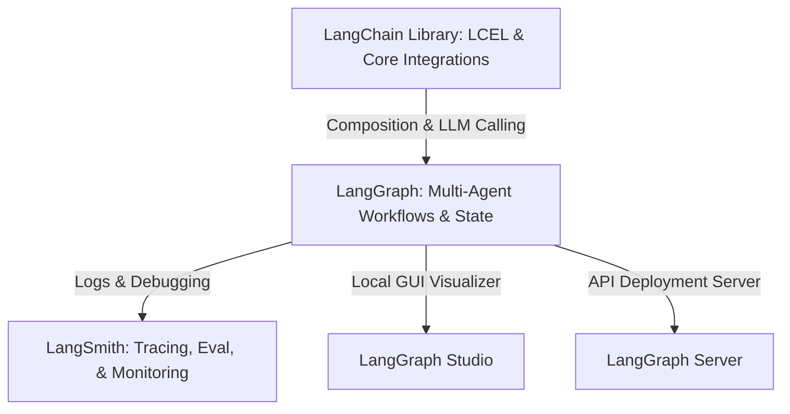

# The Ultimate Guide to LangChain and LangGraph (v1.0+ & 2026 Updates)

This guide provides a comprehensive breakdown of all key concepts, architectures, and topics within the modern **LangChain** and **LangGraph** ecosystem. It incorporates the latest updates from **LangChain v0.3 / v1.0+**, **LangGraph v1.2+**, and platform developments up to mid-2026.

---

## 1. The Modern AI Agent Ecosystem
In 2025–2026, the ecosystem evolved to draw clear boundaries between linear application composition, stateful agentic graphs, and production monitoring:



*   **LangChain (Core)**: The modular foundation used to load documents, split text, retrieve data, define prompt templates, write tools, and compose single-run calls using LCEL (LangChain Expression Language).
*   **LangGraph**: The orchestration framework specifically designed for building stateful, cyclic, multi-agent workflows. It supports robust short-term/long-term memory, human-in-the-loop interventions, and resilience.
*   **LangSmith**: The SaaS platform used for production tracing, debugging prompt templates, managing evaluations (evals), and tracking LLM call costs.

---

## 2. LangChain: Core Topics & Architecture

LangChain simplifies chaining together models, prompts, tools, and retrievers.

### A. Chat Models and Model Abstraction
*   **Unified Interface**: Consistent Python API (`invoke`, `ainvoke`, `stream`, `astream`, `batch`, `abatch`) across all LLM providers (OpenAI, Anthropic, Gemini, Groq, local models).
*   **Tool Binding (`.bind_tools`)**: Standardized way to supply Python functions/tools to models so they generate arguments in structured JSON formats matching the tools.
*   **Structured Outputs (`.with_structured_output`)**: Guarantees that the LLM's response strictly adheres to a Pydantic schema or JSON schema using native API schema enforcement (like OpenAI's structured outputs or Gemini's response schema).

```python
from pydantic import BaseModel, Field
from langchain_openai import ChatOpenAI

class UserProfile(BaseModel):
    name: str = Field(description="Name of the person")
    age: int = Field(description="Age of the person")

model = ChatOpenAI(model="gpt-4o")
structured_model = model.with_structured_output(UserProfile)
profile = structured_model.invoke("Satyam is 25 years old.")
```

### B. Prompt Templates
*   **Message Templates**: Dynamic assembly of chat histories using helper classes like `ChatPromptTemplate`, `SystemMessagePromptTemplate`, and `HumanMessagePromptTemplate`.
*   **Few-Shot Prompts**: In-context learning by passing system/user dialogue examples to shape the model's behavior.
*   **Dynamic Variable Insertion**: Automatic placeholder evaluation using brackets `{variable_name}` at run time.

### C. LCEL (LangChain Expression Language)
LCEL is a declarative, streaming-first language used to chain runnables together using the pipe operator (`|`).
*   **`RunnableParallel`**: Runs multiple steps concurrently (e.g., retrieving context and formatting prompts at the same time).
*   **`RunnablePassthrough`**: Passes input data unchanged to the next step, allowing you to build inputs dynamically.
*   **`RunnableLambda`**: Converts raw Python functions into LangChain-compatible steps.
*   **`RunnableBranch`**: Enables conditional routing between paths depending on upstream values (largely replaced by LangGraph's dynamic routing for complex logic).

```python
# Simple LCEL Chain
chain = prompt | model | StrOutputParser()
```

### D. RAG (Retrieval-Augmented Generation) Components
*   **Document Loaders**: Load text and metadata from sources (PDFs, Notion, SQL Databases, S3, Youtube).
*   **Text Splitters**: Recursively chunk text (e.g., `RecursiveCharacterTextSplitter`) based on separators to maintain semantic context within LLM tokens limits.
*   **Embeddings**: Numerical vector representations of semantic meaning (e.g., `OpenAIEmbeddings`, `HuggingFaceEmbeddings`).
*   **Vector Stores**: Specialized databases storing text vectors for semantic similarity searches (Qdrant, Chroma, PGVector, Pinecone).
*   **Retrievers**: Interfaces that wrap vector stores to return relevant documents. Examples:
    *   *Parent Document Retriever*: Chunks documents into small parts for retrieval, but returns the larger parent document context to the LLM.
    *   *Multi-Vector Retriever*: Generates summaries or questions for chunks and searches against those summaries, returning the full chunk.
    *   *Self-Querying Retriever*: Extracts query parameters and filters metadata dynamically using the LLM.
    *   *Hybrid Search*: Combines BM25 keyword matching with dense vector retrieval.

### E. Tools and Function Calling
*   **`@tool` Decorator**: Converts standard python docstrings and type hints into structural tool definitions for the LLM.
*   **StructuredTool**: Enables advanced configurations, input schema verification via Pydantic, and error handling behaviors.

---

## 3. LangGraph: Stateful Multi-Agent Orchestration

LangGraph is built on a **Stateful Graph** architecture. It is designed to run cyclic workflows (loops), which are difficult to model in LCEL.

```
                  ┌─────────┐
                  │  START  │
                  └────┬────┘
                       │
                       ▼
               ┌───────────────┐
      ┌───────►│  Agent Node   │
      │        └───────┬───────┘
      │                │ (Conditional Edge)
      │                ▼
      │        /===============\
      │       /   Is tool call  \
      │      /   requested?     \
      │      \                  /
      │       \===============/
      │          /          \
      │     YES /            \ NO
      │        /              \
      │       ▼                ▼
┌─────────────┴──┐        ┌─────────┐
│   Tools Node   │        │   END   │
└────────────────┘        └─────────┘
```

### A. Core Abstractions (Graph API)
1.  **State**: A shared data structure (e.g., `TypedDict`, Pydantic model) acting as the whiteboard. Every node reads from and writes to this state.
2.  **Reducers**: Custom functions determining how node updates merge into the state.
    *   *Example*: `Annotated[list, add]` appends new messages to the existing list rather than overwriting it.
3.  **Nodes**: Standard python functions (or Runnables) containing LLM calls or tool execution. They receive the current `State` and return a dictionary of updates.
4.  **Edges**:
    *   *Fixed Edges*: Point from Node A straight to Node B.
    *   *Conditional Edges*: Evaluate state properties at run time (e.g., check LLM's last message to determine whether to call a tool or finish) and branch the flow accordingly.
5.  **START and END Nodes**: Markers that define the entry point and terminal state of the graph.

### B. State Persistence & Checkpointers
Checkpointers write snapshots of the graph state to a storage database after every step.
*   **Short-Term Memory (Threads)**: Maintains the session history (e.g., chat history) within a unique conversation thread.
*   **Supported Checkpointers**:
    *   `MemorySaver` (in-memory, ideal for local testing).
    *   `SqliteSaver` / `PostgresSaver` (production relational database state storage).
    *   `UpstashRedisSaver` / `RedisSaver` (low-latency distributed cache).
*   **Fault Tolerance**: If a node fails, the graph can resume execution from the last successful node checkpoint without repeating past steps.

### C. Human-in-the-Loop & Time Travel
By pairing checkpoints with graph interrupts, LangGraph allows human agents to inspect and modify executions.
*   **Interrupt Before/After**: Pauses execution before entering a specific node (e.g., an `approve_action` node) or after it finishes.
*   **State Modification**: Allows a user to edit the state during an interrupt, then call the resume command.
*   **Time Travel (Rewinding)**: Allows querying history, picking a prior checkpoint (e.g., step 3), and re-forking the conversation path from that exact point.

### D. Streaming Modes in LangGraph
LangGraph supports real-time updates via streaming:
*   **`values` Mode**: Streams the entire state of the graph after every node execution.
*   **`updates` Mode**: Streams only the specific updates returned by the active node.
*   **`debug` Mode**: Streams granular debug information (metadata, input, output, errors) for every step.
*   **Token-by-Token Streaming**: Leveraging `astream_events` to stream LLM tokens word-by-word even inside nested multi-node setups.

### E. Multi-Agent Topologies
LangGraph excels at coordinating multiple LLMs.

| Architecture | Description | Visual Structure |
| :--- | :--- | :--- |
| **Network (P2P)** | Agents communicate dynamically, transferring tasks directly to other agents as needed. | Agent A ⇄ Agent B ⇄ Agent C |
| **Supervisor** | A central supervisor LLM reviews state and delegates work to specialized sub-agents, receiving reports back. | Supervisor ➔ Workers |
| **Hierarchical** | Nested supervisors coordinate large teams of sub-agents, handling complex enterprise routing. | Supervisor ➔ Sub-Supervisors ➔ Agents |

---

## 4. The LangGraph Functional API (New Paradigm)

Introduced as an alternative to `StateGraph`, the **Functional API** allows developers to build stateful agent workflows using standard Python imperative code decorated with tasks.

```python
from langgraph.func import entrypoint, task

@task
def research_topic(topic: str) -> str:
    # Perform research calling LLM...
    return f"Research notes on {topic}"

@task
def write_draft(notes: str) -> str:
    # Write draft using notes...
    return f"Draft based on: {notes}"

@entrypoint()
def assistant_workflow(topic: str) -> str:
    # Run tasks sequentially or concurrently using standard python calls
    notes = research_topic(topic).result()
    draft = write_draft(notes).result()
    return draft
```

### Key Differences: Graph API vs. Functional API

| Dimension | Graph API (`StateGraph`) | Functional API (`@entrypoint`) |
| :--- | :--- | :--- |
| **Workflow Style** | Declarative (Explicit nodes, edges, routing) | Imperative (Python control flow: loops, `if` statements) |
| **Complex Cycles** | Native and visual (Easy to handle state loops) | Implemented via standard Python recursion/loops |
| **State Definition**| Strict `TypedDict` or Pydantic state schemas | Standard Python function arguments and variables |
| **Best Used For** | Multi-agent collaboration, complex routing | Fast prototyping, sequential steps, simple scripts |

---

## 5. Latest Updates (Late 2024 – 2026)

### A. LangChain v0.3 / v1.0+ Transition
*   **Full Pydantic v2 Migration**: Internally rebuilt on Pydantic v2 for faster serialization. Support for legacy Pydantic v1 has been completely removed.
*   **Integration Decoupling**: Provider integrations (e.g., `langchain-openai`, `langchain-anthropic`, `langchain-groq`) are fully decoupled from the core library. `langchain-community` remains as a lightweight contribution package.
*   **Python Version Drops**: Dropped support for Python 3.8. The minimum required version is now Python 3.9.
*   **Non-Blocking Callbacks**: Event callbacks run in background tasks by default, reducing agent loop latencies.

### B. LangGraph v1.2+ Features
*   **DeltaChannel Optimization**: Minimizes memory usage for checkpoints during long-running agent threads by storing only state mutations rather than full duplication.
*   **Node-Level Retry Policies**: You can attach custom retry settings and fallback handlers directly to nodes using Pydantic configuration schemas.
*   **Per-Node Timeouts**: Built-in timeout settings to abort runaways and trigger fallback paths.

### C. Developer Tooling & Production Deployment
*   **LangGraph Server**: A lightweight deployment server (replaces LangGraph Cloud backend) to host your agents as secure HTTP/WebSocket endpoints with built-in queueing, authentication, and background task runners.
*   **LangGraph Studio**: A desktop application that connects to local projects or LangGraph Server instances. It provides a visual canvas of the graph, interactive message builders, thread inspectors, and real-time step debugger triggers.
*   **LangSmith Enhancements**:
    *   *Pairwise Annotation*: Compares outputs of different versions of prompts or models Side-by-Side (A/B testing).
    *   *Online Evaluators*: Automated agents scoring production logs for hallucination, prompt leakage, and correctness in real-time.
